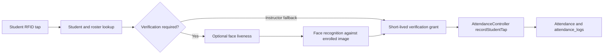
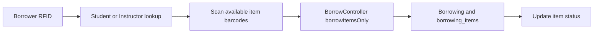
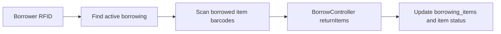
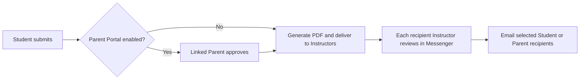

# Feature Index

## Table of Contents

- [How to find a feature](#how-to-find-a-feature)
- [Admin](#admin)
- [Root Admin](#root-admin)
- [Registrar](#registrar)
- [Clinic](#clinic)
- [Instructor](#instructor)
- [Student](#student)
- [Parent](#parent)
- [Shared / Core](#shared--core)
- [Flow Diagrams](#flow-diagrams)

## How to find a feature

Piliin ang actor at feature sa ibaba, buksan ang Main files, o gamitin ang `grep -RnF "FEATURE:<slug>" app routes resources` para makita ang connected code. Ang `@feature` block sa main entry point ang may flow, dependencies, at disable steps. Sundin ang current routes at code kung may lumang demo notes na iba ang sinasabi.

Sa bawat named function, ang `@function` ang maikling purpose at ang `@useIn` ang route, template event, caller, o framework lifecycle na gumagamit nito. Ang `TODO(verify)` ay nangangahulugang walang direktang caller na napatunayan sa static search; huwag itong ituring na siguradong unused nang walang runtime check.

## Admin

| Feature | Slug (grep tag) | What it does | Main files | How to disable |
| --- | --- | --- | --- | --- |
| User and Role Management | `FEATURE:user-management` | Dito minamanage ang staff accounts, roles, at password resets. | `app/Http/Controllers/Admin/UserManagement/AdminUserController.php`, `resources/js/pages/Admin/UserManagement/UserManagementPage.vue` | Tingnan ang `@disable` sa `app/Http/Controllers/Admin/UserManagement/AdminUserController.php`. |
| Student and Parent Management | `FEATURE:student-management` | Dito ginagawa ang student records, enrollment, at linked Parent accounts. | `app/Http/Controllers/Shared/Students/StudentsController.php`, `resources/js/pages/Shared/Students/StudentsPage.vue` | Tingnan ang `@disable` sa `app/Http/Controllers/Shared/Students/StudentsController.php`. |
| Instructor Management | `FEATURE:instructor-management` | Dito minamanage ang Instructor records at account recovery. | `app/Http/Controllers/Admin/Instructors/InstructorsController.php`, `resources/js/pages/Admin/Instructors/InstructorsPage.vue` | Tingnan ang `@disable` sa `app/Http/Controllers/Admin/Instructors/InstructorsController.php`. |
| Academic Year Lifecycle and Rollover | `FEATURE:academic-year-rollover` | Dito ina-activate, kino-close, at niro-rollover ang academic year. | `app/Http/Controllers/Admin/AcademicYears/AcademicYearController.php`, `resources/js/pages/Admin/AcademicYears/AcademicYearsPage.vue` | Tingnan ang `@disable` sa `app/Http/Controllers/Admin/AcademicYears/AcademicYearController.php`. |
| Academic Structure and Scheduling | `FEATURE:academic-scheduling` | Dito binubuo ang strands, sections, subjects, offerings, at class schedules. | `app/Http/Controllers/Shared/Schedules/ScheduleController.php`, `app/Http/Controllers/Admin/Sections/SectionController.php`, `app/Http/Controllers/Admin/Subjects/SubjectController.php`, `app/Http/Controllers/Admin/Strands/StrandController.php`, `resources/js/pages/Shared/Schedules/SchedulesPage.vue` | Tingnan ang `@disable` sa `app/Http/Controllers/Shared/Schedules/ScheduleController.php`. |
| Laboratories and Devices | `FEATURE:device-management` | Dito kino-configure ang rooms, panel devices, PIN, at remote logout. | `app/Http/Controllers/Admin/ActiveDevices/ActiveDeviceController.php`, `app/Http/Controllers/Admin/Laboratories/LaboratoryController.php`, `resources/js/pages/Admin/ActiveDevices/ActiveDevicesPage.vue` | Tingnan ang `@disable` sa `app/Http/Controllers/Admin/ActiveDevices/ActiveDeviceController.php`. |
| System Settings | `FEATURE:system-settings` | Dito sine-set ang feature switches, attendance rules, SMS, at emergency sounds. | `app/Http/Controllers/Shared/SystemSettings/SystemSettingsController.php`, `resources/js/pages/Admin/SystemSettings/SystemSettingsPage.vue` | Tingnan ang `@disable` sa `app/Http/Controllers/Shared/SystemSettings/SystemSettingsController.php`. |
| Inventory Management | `FEATURE:inventory-management` | Dito nililista at ina-update ang inventory records at item status. | `app/Http/Controllers/Admin/Inventory/InventoryController.php`, `resources/js/pages/Admin/Inventory/InventoryPage.vue` | Tingnan ang `@disable` sa `app/Http/Controllers/Admin/Inventory/InventoryController.php`. |
| Borrowing Oversight and Returns | `FEATURE:borrowing-management` | Dito tinitingnan ang borrowing history at pinoproseso ang returns. | `app/Http/Controllers/Shared/Borrowing/BorrowController.php`, `resources/js/pages/Admin/Borrow/BorrowPage.vue` | Tingnan ang `@disable` sa `app/Http/Controllers/Shared/Borrowing/BorrowController.php`. |
| Activity and Online Class Logs | `FEATURE:admin-logs` | Dito nire-review at ine-export ang system activity; may hiwalay ding online-class logs. | `app/Http/Controllers/Admin/ActivityLogs/ActivityLogController.php`, `app/Http/Controllers/Shared/OnlineClasses/OnlineClassController.php`, `resources/js/pages/Admin/ActivityLogs/ActivityLogsPage.vue`, `resources/js/pages/Admin/OnlineClassLogs/OnlineClassLogsPage.vue` | Tingnan ang `@disable` sa `app/Http/Controllers/Admin/ActivityLogs/ActivityLogController.php`. |

## Root Admin

| Feature | Slug (grep tag) | What it does | Main files | How to disable |
| --- | --- | --- | --- | --- |
| Ownership Transfer and Override | `FEATURE:root-ownership` | Dito sinisimulan o kina-cancel ang Root ownership transfer at emergency override. | `app/Http/Controllers/Shared/RootOwnership/RootOwnershipController.php`, `resources/js/pages/Admin/UserManagement/components/RootOwnershipPanel.vue` | Tingnan ang `@disable` sa `app/Http/Controllers/Shared/RootOwnership/RootOwnershipController.php`. |

## Registrar

| Feature | Slug (grep tag) | What it does | Main files | How to disable |
| --- | --- | --- | --- | --- |
| Student RFID Enrollment | `FEATURE:student-rfid-enrollment` | Dito nililink ang scanned RFID tag sa student record. | `app/Http/Controllers/Registrar/Enrollment/RegistrarController.php`, `resources/js/pages/Registrar/BiometricEnrollment/BiometricEnrollmentPage.vue` | Tingnan ang `@disable` sa `app/Http/Controllers/Registrar/Enrollment/RegistrarController.php`. |
| Student Face Enrollment | `FEATURE:student-face-enrollment` | Dito sine-save at tinatanggal ang enrolled student face images. | `app/Http/Controllers/Registrar/Enrollment/RegistrarController.php`, `resources/js/pages/Registrar/BiometricEnrollment/BiometricEnrollmentPage.vue` | Tingnan ang `@disable` sa `app/Http/Controllers/Registrar/Enrollment/RegistrarController.php`. |
| Instructor RFID and Face Enrollment | `FEATURE:instructor-biometric-enrollment` | Dito nililink ang Instructor RFID at face images sa account. | `app/Http/Controllers/Registrar/Enrollment/RegistrarController.php`, `resources/js/pages/Registrar/InstructorFaceEnrollment/InstructorFaceEnrollmentPage.vue` | Tingnan ang `@disable` sa `app/Http/Controllers/Registrar/Enrollment/RegistrarController.php`. |

## Clinic

| Feature | Slug (grep tag) | What it does | Main files | How to disable |
| --- | --- | --- | --- | --- |
| Emergency Alert Response and Dispatch | `FEATURE:clinic-dispatch` | Dito ina-assign ang Clinic responder at gumagawa ng linked case. | `app/Http/Controllers/Shared/Emergency/EmergencyController.php`, `resources/js/pages/Clinic/Dashboard/DashboardPage.vue` | Tingnan ang `@disable` sa `app/Http/Controllers/Shared/Emergency/EmergencyController.php`. |
| Emergency Types and Hotlines | `FEATURE:emergency-configuration` | Dito sine-set ang emergency types at matching hotlines. | `app/Http/Controllers/Shared/Emergency/EmergencyController.php`, `resources/js/pages/Clinic/EmergencyHotlines/EmergencyHotlinesPage.vue` | Tingnan ang `@disable` sa `app/Http/Controllers/Shared/Emergency/EmergencyController.php`. |
| Case Logs and Patient History | `FEATURE:clinic-records` | Dito ini-record ang clinic cases at patient history. | `app/Http/Controllers/Clinic/Records/ClinicController.php`, `resources/js/pages/Clinic/CaseLogs/CaseLogsPage.vue`, `resources/js/pages/Clinic/PatientHistory/PatientHistoryPage.vue` | Tingnan ang `@disable` sa `app/Http/Controllers/Clinic/Records/ClinicController.php`. |
| Clinic Reports | `FEATURE:clinic-reports` | Dito fina-filter at ine-export ang clinic activity. | `app/Http/Controllers/Clinic/Records/ClinicController.php`, `resources/js/pages/Clinic/Reports/ReportsPage.vue` | Tingnan ang `@disable` sa `app/Http/Controllers/Clinic/Records/ClinicController.php`. |

## Instructor

| Feature | Slug (grep tag) | What it does | Main files | How to disable |
| --- | --- | --- | --- | --- |
| Login Verification | `FEATURE:instructor-verification` | Pagkatapos ng login, dito kinukumpleto ang face, email OTP, o security-question check. | `app/Http/Controllers/Instructor/Verification/InstructorVerificationController.php`, `resources/js/pages/Instructor/Verification/InstructorVerifyPage.vue` | Tingnan ang `@disable` sa `app/Http/Controllers/Instructor/Verification/InstructorVerificationController.php`. |
| Assigned Attendance and Corrections | `FEATURE:attendance-review` | Dito nire-review ang assigned attendance at nilolog ang allowed manual corrections. | `app/Http/Controllers/Shared/Attendance/AttendanceManagementController.php`, `resources/js/pages/Shared/Attendance/SessionDetails/SessionDetailsPage.vue` | Tingnan ang `@disable` sa `app/Http/Controllers/Shared/Attendance/AttendanceManagementController.php`. |
| Online Class Management | `FEATURE:online-class-management` | Dito ginagawa, ina-update, at kina-cancel ang assigned online classes. | `app/Http/Controllers/Shared/OnlineClasses/OnlineClassController.php`, `resources/js/pages/Shared/OnlineClasses/OnlineClassesPage.vue` | Tingnan ang `@disable` sa `app/Http/Controllers/Shared/OnlineClasses/OnlineClassController.php`. |
| Excuse Letter Review | `FEATURE:excuse-letter-review` | Dito nagde-decide ang recipient Instructor sa delivered letter at nagpapadala ng email. | `app/Http/Controllers/Shared/Messages/MessageController.php`, `resources/js/pages/Shared/Messages/Index/IndexPage.vue` | Tingnan ang `@disable` sa `app/Http/Controllers/Shared/Messages/MessageController.php`. |

## Student

| Feature | Slug (grep tag) | What it does | Main files | How to disable |
| --- | --- | --- | --- | --- |
| Attendance History | `FEATURE:student-attendance-history` | Dito nakikita ng student ang sariling physical at online attendance. | `app/Http/Controllers/Shared/Students/StudentsController.php`, `resources/js/pages/StudentParent/Attendance/AttendancePage.vue` | Tingnan ang `@disable` sa `app/Http/Controllers/Shared/Students/StudentsController.php`. |
| Online Class Viewing and Joining | `FEATURE:online-class-join` | Dito sumasali ang eligible student sa class at nalolog ang attendance. | `app/Http/Controllers/Shared/OnlineClasses/OnlineClassController.php`, `resources/js/pages/StudentParent/OnlineClasses/OnlineClassesPage.vue` | Tingnan ang `@disable` sa `app/Http/Controllers/Shared/OnlineClasses/OnlineClassController.php`. |
| Excuse Letter Submission | `FEATURE:excuse-letter-submission` | Dito nagsusubmit ng letter ang student; Parent approval muna kung enabled. | `app/Http/Controllers/Shared/Students/StudentsController.php`, `resources/js/pages/StudentParent/ExcuseLetters/ExcuseLettersPage.vue` | Tingnan ang `@disable` sa `app/Http/Controllers/Shared/Students/StudentsController.php`. |

## Parent

| Feature | Slug (grep tag) | What it does | Main files | How to disable |
| --- | --- | --- | --- | --- |
| Linked Student Dashboard and Attendance | `FEATURE:parent-student-view` | Dito nakikita ng Parent ang dashboard ng linked student. | `app/Http/Controllers/Shared/Students/StudentsController.php`, `resources/js/pages/StudentParent/Dashboard/DashboardPage.vue` | Tingnan ang `@disable` sa `app/Http/Controllers/Shared/Students/StudentsController.php`. |
| Excuse Letter Approval | `FEATURE:excuse-letter-approval` | Dito pinipirmahan at ina-approve ng Parent ang pending letter. | `app/Http/Controllers/Shared/Students/StudentsController.php`, `resources/js/pages/StudentParent/ExcuseLetters/ExcuseLettersPage.vue` | Tingnan ang `@disable` sa `app/Http/Controllers/Shared/Students/StudentsController.php`. |
| Online Class Notifications | `FEATURE:online-class-notifications` | Dito nakikita at minamark read ang class-change notices ng linked student. | `app/Http/Controllers/Shared/Students/StudentsController.php`, `resources/js/pages/StudentParent/Notifications/NotificationsPage.vue` | Tingnan ang `@disable` sa `app/Http/Controllers/Shared/Students/StudentsController.php`. |

## Shared / Core

| Feature | Slug (grep tag) | What it does | Main files | How to disable |
| --- | --- | --- | --- | --- |
| Role-Based Login and Session Protection | `FEATURE:authentication` | Dito nilolog in ang staff at binabantayan ang role at browser session. | `app/Http/Controllers/Shared/Auth/StaffLogin/StaffLoginController.php`, `resources/js/pages/Shared/Auth/StaffLogin/StaffLoginPage.vue` | Tingnan ang `@disable` sa `app/Http/Controllers/Shared/Auth/StaffLogin/StaffLoginController.php`. |
| Admin Login Email OTP | `FEATURE:admin-login-otp` | Bawat tunay na Admin password login ay may bagong email OTP challenge. | `app/Http/Controllers/Admin/LoginVerification/AdminLoginVerificationController.php`, `resources/js/pages/Admin/LoginVerification/AdminLoginVerificationPage.vue` | Tingnan ang `@disable` sa `app/Http/Controllers/Admin/LoginVerification/AdminLoginVerificationController.php`. |
| First-Login Password Setup | `FEATURE:first-login-password` | Dito pinapalitan ang temporary password bago buksan ang ibang page. | `app/Http/Controllers/Shared/Auth/FirstLoginPassword/FirstLoginPasswordController.php`, `resources/js/pages/Shared/Auth/FirstLoginPassword/FirstLoginPasswordPage.vue` | Tingnan ang `@disable` sa `app/Http/Controllers/Shared/Auth/FirstLoginPassword/FirstLoginPasswordController.php`. |
| Messenger and Attachments | `FEATURE:messenger` | Dito nagpapalitan ng private messages at authorized attachments ang users. | `app/Http/Controllers/Shared/Messages/MessageController.php`, `resources/js/pages/Shared/Messages/Index/IndexPage.vue` | Tingnan ang `@disable` sa `app/Http/Controllers/Shared/Messages/MessageController.php`. |
| Reports and Exports | `FEATURE:reports` | Dito fina-filter at ine-export ang role-scoped reports. | `app/Http/Controllers/Shared/Reports/ReportController.php`, `resources/js/pages/Shared/Reports/Index/IndexPage.vue` | Tingnan ang `@disable` sa `app/Http/Controllers/Shared/Reports/ReportController.php`. |
| RFID Attendance Console | `FEATURE:rfid-attendance` | Dito kino-convert ang verified RFID tap sa attendance event at official row. | `app/Http/Controllers/Shared/Attendance/AttendanceController.php`, `resources/js/pages/AttendanceConsole/AttendanceControlPanel/AttendanceControlPanelPage.vue` | Tingnan ang `@disable` sa `app/Http/Controllers/Shared/Attendance/AttendanceController.php`. |
| Face Recognition | `FEATURE:face-recognition` | Dito kino-compare ang captured face at stored face gamit ang AWS similarity threshold. | `app/Services/AwsFaceRecognitionService.php`, `resources/js/components/CameraCapture.vue` | Tingnan ang `@disable` sa `app/Services/AwsFaceRecognitionService.php`. |
| Face Liveness | `FEATURE:face-liveness` | Dito chine-check ang AWS liveness confidence bago gamitin ang reference image. | `app/Services/AwsFaceLivenessService.php`, `resources/js/lib/faceLiveness.tsx` | Tingnan ang `@disable` sa `app/Services/AwsFaceLivenessService.php`. |
| Console Borrowing | `FEATURE:console-borrowing` | Dito nililink ang borrower RFID at scanned item sa borrowing records. | `app/Http/Controllers/Shared/Borrowing/BorrowController.php`, `resources/js/pages/AttendanceConsole/AttendanceControlPanel/AttendanceControlPanelPage.vue` | Tingnan ang `@disable` sa `app/Http/Controllers/Shared/Borrowing/BorrowController.php`. |
| Emergency Alerts and Delivery | `FEATURE:emergency-alerts` | Dito sine-save ang emergency alert at ina-attempt ang hotline at Parent notifications. | `app/Http/Controllers/Shared/Emergency/EmergencyController.php`, `resources/js/pages/AttendanceConsole/AttendanceControlPanel/AttendanceControlPanelPage.vue` | Tingnan ang `@disable` sa `app/Http/Controllers/Shared/Emergency/EmergencyController.php`. |
| Audit Logging | `FEATURE:audit-logging` | Dito nilolog ang mutating requests at selected exports kahit may audit storage error. | `app/Http/Middleware/RecordSystemActivity.php`, `resources/js/pages/Admin/ActivityLogs/ActivityLogsPage.vue` | Tingnan ang `@disable` sa `app/Http/Middleware/RecordSystemActivity.php`. |

## Flow Diagrams

### Physical attendance

### Borrowing

### Return

### Excuse letter

Excuse letter approval at Instructor review ay hindi awtomatikong nagpapalit ng official attendance status.

## Current implementation notes

- Ang Student at Parent portal ay walang sariling borrowing page o face enrollment action. Sa Console ginagawa ang borrowing; Registrar ang nag-e-enroll ng face.
- Ang `/admin/inventory` ay may duplicate GET declarations sa `routes/web.php`; gamitin ang runtime route list para malaman ang aktibong handler.
- May online-class enrollment queries na naghahanap ng `active` habang karaniwang `enrolled` ang normalized status. I-verify ang deployed data bago umasa sa automatic online attendance.
- Ang Online Classes switch ay nagtatago ng menu links pero hindi lahat ng direct routes. Suriin ang server routes bago ituring itong full disable control.
