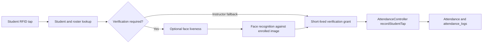
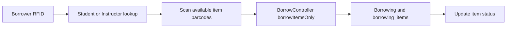
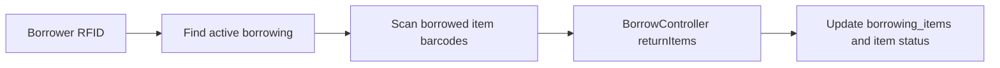
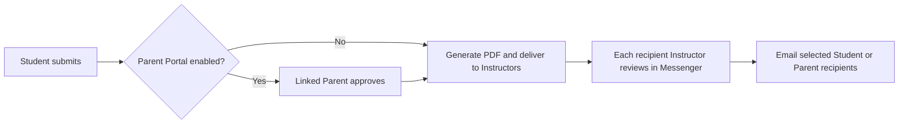

# Feature Index

## Table of Contents

- [How to find a feature](#how-to-find-a-feature)
- [Admin](#admin)
- [Root Admin](#root-admin)
- [Registrar](#registrar)
- [Clinic](#clinic)
- [Instructor](#instructor)
- [Student](#student)
- [Parent](#parent)
- [Shared / Core](#shared--core)
- [Flow Diagrams](#flow-diagrams)
- [Plain-language guide](#plain-language-guide)
- [Feature operation reference](#feature-operation-reference)

## How to find a feature

Piliin ang role at feature sa ibaba, pagkatapos buksan ang nakalistang Main files. Ang simpleng comments na `WHAT IT DOES`, `WHO USES IT`, `WHAT HAPPENS`, at optional na `WARNING` ang nagpapaliwanag ng pangunahing gamit nito.

Sa bawat named function, ang `@function` ang maikling purpose at ang `@useIn` ang route, template event, caller, o framework lifecycle na gumagamit nito. Ang `TODO(verify)` ay nangangahulugang walang direktang caller na napatunayan sa static search; huwag itong ituring na siguradong unused nang walang runtime check.

## Admin

| Feature                              | Slug (grep tag)                  | What it does                                                                            | Main files                                                                                                                                                                                                                                                                                                   | How to disable                                                                                       |
| ------------------------------------ | -------------------------------- | --------------------------------------------------------------------------------------- | ------------------------------------------------------------------------------------------------------------------------------------------------------------------------------------------------------------------------------------------------------------------------------------------------------------ | ---------------------------------------------------------------------------------------------------- |
| User and Role Management             | `FEATURE:user-management`        | Dito minamanage ang staff accounts, roles, at password resets.                          | `app/Http/Controllers/Admin/UserManagement/AdminUserController.php`, `resources/js/pages/Admin/UserManagement/UserManagementPage.vue`                                                                                                                                                                        | Basahin ang simple comment sa main file; Needs developer check bago baguhin o alisin. |
| Student and Parent Management        | `FEATURE:student-management`     | Dito ginagawa ang student records, enrollment, at linked Parent accounts.               | `app/Http/Controllers/Shared/Students/StudentsController.php`, `resources/js/pages/Shared/Students/StudentsPage.vue`                                                                                                                                                                                         | Basahin ang simple comment sa main file; Needs developer check bago baguhin o alisin. |
| Instructor Management                | `FEATURE:instructor-management`  | Dito minamanage ang Instructor records at account recovery.                             | `app/Http/Controllers/Admin/Instructors/InstructorsController.php`, `resources/js/pages/Admin/Instructors/InstructorsPage.vue`                                                                                                                                                                               | Basahin ang simple comment sa main file; Needs developer check bago baguhin o alisin. |
| Academic Year Lifecycle and Rollover | `FEATURE:academic-year-rollover` | Dito ina-activate, kino-close, at niro-rollover ang academic year.                      | `app/Http/Controllers/Admin/AcademicYears/AcademicYearController.php`, `resources/js/pages/Admin/AcademicYears/AcademicYearsPage.vue`                                                                                                                                                                        | Basahin ang simple comment sa main file; Needs developer check bago baguhin o alisin. |
| Academic Structure and Scheduling    | `FEATURE:academic-scheduling`    | Dito binubuo ang strands, sections, subjects, offerings, at class schedules.            | `app/Http/Controllers/Shared/Schedules/ScheduleController.php`, `app/Http/Controllers/Admin/Sections/SectionController.php`, `app/Http/Controllers/Admin/Subjects/SubjectController.php`, `app/Http/Controllers/Admin/Strands/StrandController.php`, `resources/js/pages/Shared/Schedules/SchedulesPage.vue` | Basahin ang simple comment sa main file; Needs developer check bago baguhin o alisin. |
| Laboratories and Devices             | `FEATURE:device-management`      | Dito kino-configure ang rooms, panel devices, PIN, at remote logout.                    | `app/Http/Controllers/Admin/ActiveDevices/ActiveDeviceController.php`, `app/Http/Controllers/Admin/Laboratories/LaboratoryController.php`, `resources/js/pages/Admin/ActiveDevices/ActiveDevicesPage.vue`                                                                                                    | Basahin ang simple comment sa main file; Needs developer check bago baguhin o alisin. |
| System Settings                      | `FEATURE:system-settings`        | Dito sine-set ang feature switches, attendance rules, SMS, at emergency sounds.         | `app/Http/Controllers/Shared/SystemSettings/SystemSettingsController.php`, `resources/js/pages/Admin/SystemSettings/SystemSettingsPage.vue`                                                                                                                                                                  | Basahin ang simple comment sa main file; Needs developer check bago baguhin o alisin. |
| Inventory Management (INACTIVE)      | `FEATURE:inventory-management`   | Hindi na ginagamit sa kasalukuyang school workflow.                                     | `app/Http/Controllers/Admin/Inventory/InventoryController.php`, `resources/js/pages/Admin/Inventory/InventoryPage.vue`                                                                                                                                                                                       | Huwag muling buksan nang walang developer check.                                                     |
| Borrowing Oversight and Returns (INACTIVE) | `FEATURE:borrowing-management` | Hindi na ginagamit sa kasalukuyang school workflow.                                     | `app/Http/Controllers/Shared/Borrowing/BorrowController.php`, `resources/js/pages/Admin/Borrow/BorrowPage.vue`                                                                                                                                                                                               | Huwag muling buksan nang walang developer check.                                                     |
| Activity and Online Class Logs       | `FEATURE:admin-logs`             | Dito nire-review at ine-export ang system activity; may hiwalay ding online-class logs. | `app/Http/Controllers/Admin/ActivityLogs/ActivityLogController.php`, `app/Http/Controllers/Shared/OnlineClasses/OnlineClassController.php`, `resources/js/pages/Admin/ActivityLogs/ActivityLogsPage.vue`, `resources/js/pages/Admin/OnlineClassLogs/OnlineClassLogsPage.vue`                                 | Basahin ang simple comment sa main file; Needs developer check bago baguhin o alisin. |

## Root Admin

| Feature                         | Slug (grep tag)          | What it does                                                                      | Main files                                                                                                                                           | How to disable                                                                                     |
| ------------------------------- | ------------------------ | --------------------------------------------------------------------------------- | ---------------------------------------------------------------------------------------------------------------------------------------------------- | -------------------------------------------------------------------------------------------------- |
| Ownership Transfer and Override | `FEATURE:root-ownership` | Dito sinisimulan o kina-cancel ang Root ownership transfer at emergency override. | `app/Http/Controllers/Shared/RootOwnership/RootOwnershipController.php`, `resources/js/pages/Admin/UserManagement/components/RootOwnershipPanel.vue` | Basahin ang simple comment sa main file; Needs developer check bago baguhin o alisin. |

## Registrar

| Feature                             | Slug (grep tag)                           | What it does                                                    | Main files                                                                                                                                                    | How to disable                                                                                 |
| ----------------------------------- | ----------------------------------------- | --------------------------------------------------------------- | ------------------------------------------------------------------------------------------------------------------------------------------------------------- | ---------------------------------------------------------------------------------------------- |
| Student RFID Enrollment             | `FEATURE:student-rfid-enrollment`         | Dito nililink ang scanned RFID tag sa student record.           | `app/Http/Controllers/Registrar/Enrollment/RegistrarController.php`, `resources/js/pages/Registrar/BiometricEnrollment/BiometricEnrollmentPage.vue`           | Basahin ang simple comment sa main file; Needs developer check bago baguhin o alisin. |
| Student Face Enrollment             | `FEATURE:student-face-enrollment`         | Dito sine-save at tinatanggal ang enrolled student face images. | `app/Http/Controllers/Registrar/Enrollment/RegistrarController.php`, `resources/js/pages/Registrar/BiometricEnrollment/BiometricEnrollmentPage.vue`           | Basahin ang simple comment sa main file; Needs developer check bago baguhin o alisin. |
| Instructor RFID and Face Enrollment | `FEATURE:instructor-biometric-enrollment` | Dito nililink ang Instructor RFID at face images sa account.    | `app/Http/Controllers/Registrar/Enrollment/RegistrarController.php`, `resources/js/pages/Registrar/InstructorFaceEnrollment/InstructorFaceEnrollmentPage.vue` | Basahin ang simple comment sa main file; Needs developer check bago baguhin o alisin. |

## Clinic

| Feature                               | Slug (grep tag)                   | What it does                                                     | Main files                                                                                                                                                                           | How to disable                                                                             |
| ------------------------------------- | --------------------------------- | ---------------------------------------------------------------- | ------------------------------------------------------------------------------------------------------------------------------------------------------------------------------------ | ------------------------------------------------------------------------------------------ |
| Emergency Alert Response and Dispatch | `FEATURE:clinic-dispatch`         | Dito ina-assign ang Clinic responder at gumagawa ng linked case. | `app/Http/Controllers/Shared/Emergency/EmergencyController.php`, `resources/js/pages/Clinic/Dashboard/DashboardPage.vue`                                                             | Basahin ang simple comment sa main file; Needs developer check bago baguhin o alisin. |
| Emergency Types and Hotlines          | `FEATURE:emergency-configuration` | Dito sine-set ang emergency types at matching hotlines.          | `app/Http/Controllers/Shared/Emergency/EmergencyController.php`, `resources/js/pages/Clinic/EmergencyHotlines/EmergencyHotlinesPage.vue`                                             | Basahin ang simple comment sa main file; Needs developer check bago baguhin o alisin. |
| Case Logs and Patient History         | `FEATURE:clinic-records`          | Dito ini-record ang clinic cases at patient history.             | `app/Http/Controllers/Clinic/Records/ClinicController.php`, `resources/js/pages/Clinic/CaseLogs/CaseLogsPage.vue`, `resources/js/pages/Clinic/PatientHistory/PatientHistoryPage.vue` | Basahin ang simple comment sa main file; Needs developer check bago baguhin o alisin. |
| Clinic Reports                        | `FEATURE:clinic-reports`          | Dito fina-filter at ine-export ang clinic activity.              | `app/Http/Controllers/Clinic/Records/ClinicController.php`, `resources/js/pages/Clinic/Reports/ReportsPage.vue`                                                                      | Basahin ang simple comment sa main file; Needs developer check bago baguhin o alisin. |

## Instructor

| Feature                             | Slug (grep tag)                   | What it does                                                                            | Main files                                                                                                                                                 | How to disable                                                                                                 |
| ----------------------------------- | --------------------------------- | --------------------------------------------------------------------------------------- | ---------------------------------------------------------------------------------------------------------------------------------------------------------- | -------------------------------------------------------------------------------------------------------------- |
| Login Verification                  | `FEATURE:instructor-verification` | Pagkatapos ng login, dito kinukumpleto ang face, email OTP, o security-question check.  | `app/Http/Controllers/Instructor/Verification/InstructorVerificationController.php`, `resources/js/pages/Instructor/Verification/InstructorVerifyPage.vue` | Basahin ang simple comment sa main file; Needs developer check bago baguhin o alisin. |
| Assigned Attendance and Corrections | `FEATURE:attendance-review`       | Dito nire-review ang assigned attendance at nilolog ang allowed manual corrections.     | `app/Http/Controllers/Shared/Attendance/AttendanceManagementController.php`, `resources/js/pages/Shared/Attendance/SessionDetails/SessionDetailsPage.vue`  | Basahin ang simple comment sa main file; Needs developer check bago baguhin o alisin. |
| Online Class Management             | `FEATURE:online-class-management` | Dito ginagawa, ina-update, at kina-cancel ang assigned online classes.                  | `app/Http/Controllers/Shared/OnlineClasses/OnlineClassController.php`, `resources/js/pages/Shared/OnlineClasses/OnlineClassesPage.vue`                     | Basahin ang simple comment sa main file; Needs developer check bago baguhin o alisin. |
| Excuse Letter Review                | `FEATURE:excuse-letter-review`    | Dito nagde-decide ang recipient Instructor sa delivered letter at nagpapadala ng email. | `app/Http/Controllers/Shared/Messages/MessageController.php`, `resources/js/pages/Shared/Messages/Index/IndexPage.vue`                                     | Basahin ang simple comment sa main file; Needs developer check bago baguhin o alisin. |

## Student

| Feature                          | Slug (grep tag)                      | What it does                                                               | Main files                                                                                                                                    | How to disable                                                                                   |
| -------------------------------- | ------------------------------------ | -------------------------------------------------------------------------- | --------------------------------------------------------------------------------------------------------------------------------------------- | ------------------------------------------------------------------------------------------------ |
| Attendance History               | `FEATURE:student-attendance-history` | Dito nakikita ng student ang sariling physical at online attendance.       | `app/Http/Controllers/Shared/Students/StudentsController.php`, `resources/js/pages/StudentParent/Attendance/AttendancePage.vue`               | Basahin ang simple comment sa main file; Needs developer check bago baguhin o alisin. |
| Online Class Viewing and Joining | `FEATURE:online-class-join`          | Dito sumasali ang eligible student sa class at nalolog ang attendance.     | `app/Http/Controllers/Shared/OnlineClasses/OnlineClassController.php`, `resources/js/pages/StudentParent/OnlineClasses/OnlineClassesPage.vue` | Basahin ang simple comment sa main file; Needs developer check bago baguhin o alisin. |
| Excuse Letter Submission         | `FEATURE:excuse-letter-submission`   | Dito nagsusubmit ng letter ang student; Parent approval muna kung enabled. | `app/Http/Controllers/Shared/Students/StudentsController.php`, `resources/js/pages/StudentParent/ExcuseLetters/ExcuseLettersPage.vue`         | Basahin ang simple comment sa main file; Needs developer check bago baguhin o alisin. |

## Parent

| Feature                                 | Slug (grep tag)                      | What it does                                                               | Main files                                                                                                                            | How to disable                                                                           |
| --------------------------------------- | ------------------------------------ | -------------------------------------------------------------------------- | ------------------------------------------------------------------------------------------------------------------------------------- | ---------------------------------------------------------------------------------------- |
| Linked Student Dashboard and Attendance | `FEATURE:parent-student-view`        | Dito nakikita ng Parent ang dashboard ng linked student.                   | `app/Http/Controllers/Shared/Students/StudentsController.php`, `resources/js/pages/StudentParent/Dashboard/DashboardPage.vue`         | Basahin ang simple comment sa main file; Needs developer check bago baguhin o alisin. |
| Excuse Letter Approval                  | `FEATURE:excuse-letter-approval`     | Dito pinipirmahan at ina-approve ng Parent ang pending letter.             | `app/Http/Controllers/Shared/Students/StudentsController.php`, `resources/js/pages/StudentParent/ExcuseLetters/ExcuseLettersPage.vue` | Basahin ang simple comment sa main file; Needs developer check bago baguhin o alisin. |
| Parent Excuse-Letter Approval Request Email | `FEATURE:parent-excuse-letter-approval-email` | Pagka-save ng Student letter, ini-email ang linked Parent para mag-review at pumirma. | `app/Http/Controllers/Shared/Students/StudentsController.php` | Basahin ang simple comment sa main file; Needs developer check bago baguhin o alisin. |
| Online Class Notifications              | `FEATURE:online-class-notifications` | Dito nakikita at minamark read ang class-change notices ng linked student. | `app/Http/Controllers/Shared/Students/StudentsController.php`, `resources/js/pages/StudentParent/Notifications/NotificationsPage.vue` | Basahin ang simple comment sa main file; Needs developer check bago baguhin o alisin. |

## Shared / Core

| Feature                                 | Slug (grep tag)                | What it does                                                                           | Main files                                                                                                                                                             | How to disable                                                                                                    |
| --------------------------------------- | ------------------------------ | -------------------------------------------------------------------------------------- | ---------------------------------------------------------------------------------------------------------------------------------------------------------------------- | ----------------------------------------------------------------------------------------------------------------- |
| Role-Based Login and Session Protection | `FEATURE:authentication`       | Dito nilolog in ang staff at binabantayan ang role at browser session.                 | `app/Http/Controllers/Shared/Auth/StaffLogin/StaffLoginController.php`, `resources/js/pages/Shared/Auth/StaffLogin/StaffLoginPage.vue`                                 | Basahin ang simple comment sa main file; Needs developer check bago baguhin o alisin. |
| Admin Login Email OTP                   | `FEATURE:admin-login-otp`      | Bawat tunay na Admin password login ay may bagong email OTP challenge.                 | `app/Http/Controllers/Admin/LoginVerification/AdminLoginVerificationController.php`, `resources/js/pages/Admin/LoginVerification/AdminLoginVerificationPage.vue`       | Basahin ang simple comment sa main file; Needs developer check bago baguhin o alisin. |
| First-Login Password Setup              | `FEATURE:first-login-password` | Dito pinapalitan ang temporary password bago buksan ang ibang page.                    | `app/Http/Controllers/Shared/Auth/FirstLoginPassword/FirstLoginPasswordController.php`, `resources/js/pages/Shared/Auth/FirstLoginPassword/FirstLoginPasswordPage.vue` | Basahin ang simple comment sa main file; Needs developer check bago baguhin o alisin. |
| Messenger and Attachments               | `FEATURE:messenger`            | Dito nagpapalitan ng private messages at authorized attachments ang users.             | `app/Http/Controllers/Shared/Messages/MessageController.php`, `resources/js/pages/Shared/Messages/Index/IndexPage.vue`                                                 | Basahin ang simple comment sa main file; Needs developer check bago baguhin o alisin. |
| Reports and Exports                     | `FEATURE:reports`              | Dito fina-filter at ine-export ang role-scoped reports.                                | `app/Http/Controllers/Shared/Reports/ReportController.php`, `resources/js/pages/Shared/Reports/Index/IndexPage.vue`                                                    | Basahin ang simple comment sa main file; Needs developer check bago baguhin o alisin. |
| RFID Attendance Console                 | `FEATURE:rfid-attendance`      | Dito kino-convert ang verified RFID tap sa attendance event at official row.           | `app/Http/Controllers/Shared/Attendance/AttendanceController.php`, `resources/js/pages/AttendanceConsole/AttendanceControlPanel/AttendanceControlPanelPage.vue`        | Basahin ang simple comment sa main file; Needs developer check bago baguhin o alisin. |
| Face Recognition                        | `FEATURE:face-recognition`     | Dito kino-compare ang captured face at stored face gamit ang AWS similarity threshold. | `app/Services/AwsFaceRecognitionService.php`, `resources/js/components/CameraCapture.vue`                                                                              | Basahin ang simple comment sa main file; Needs developer check bago baguhin o alisin. |
| Face Liveness                           | `FEATURE:face-liveness`        | Dito chine-check ang AWS liveness confidence bago gamitin ang reference image.         | `app/Services/AwsFaceLivenessService.php`, `resources/js/lib/faceLiveness.tsx`                                                                                         | Basahin ang simple comment sa main file; Needs developer check bago baguhin o alisin. |
| Console Borrowing (INACTIVE)            | `FEATURE:console-borrowing`    | Hindi na ginagamit sa kasalukuyang school workflow.                                    | `app/Http/Controllers/Shared/Borrowing/BorrowController.php`, `resources/js/pages/AttendanceConsole/AttendanceControlPanel/AttendanceControlPanelPage.vue`             | Huwag muling buksan nang walang developer check.                                                                  |
| Emergency Alerts and Delivery           | `FEATURE:emergency-alerts`     | Dito sine-save ang emergency alert at ina-attempt ang hotline at Parent notifications. | `app/Http/Controllers/Shared/Emergency/EmergencyController.php`, `resources/js/pages/AttendanceConsole/AttendanceControlPanel/AttendanceControlPanelPage.vue`          | Basahin ang simple comment sa main file; Needs developer check bago baguhin o alisin. |
| Audit Logging                           | `FEATURE:audit-logging`        | Dito nilolog ang mutating requests at selected exports kahit may audit storage error.  | `app/Http/Middleware/RecordSystemActivity.php`, `resources/js/pages/Admin/ActivityLogs/ActivityLogsPage.vue`                                                           | Basahin ang simple comment sa main file; Needs developer check bago baguhin o alisin. |

## Flow Diagrams

### Physical attendance

### Borrowing

> **INACTIVE:** Hindi na ginagamit ang Inventory at Borrowing sa kasalukuyang school workflow. Ang diagram sa ibaba ay lumang reference lamang.

### Return

> **INACTIVE:** Hindi na ginagamit ang return flow na ito. Ang diagram sa ibaba ay lumang reference lamang.

### Excuse letter

Excuse letter approval at Instructor review ay hindi awtomatikong nagpapalit ng official attendance status.

## Current implementation notes

- **Inactive:** Hindi na ginagamit ang Inventory, Admin Borrowing, Console Borrowing, at Return flow. Nananatili lamang ang lumang code at records bilang reference.
- May online-class enrollment queries na naghahanap ng `active` habang karaniwang `enrolled` ang normalized status. I-verify ang deployed data bago umasa sa automatic online attendance.
- Ang Online Classes switch ay nagtatago ng menu links pero hindi lahat ng direct routes. Suriin ang server routes bago ituring itong full disable control.

## Plain-language guide

This guide explains the features in the index for school staff and owners. Inventory and Borrowing are marked inactive and are not part of the current school workflow.

### 1. WHAT IT DOES

This system helps a school manage people, classes, attendance, emergency alerts, clinic records, and reports. Admins set up the school, while registrars, instructors, students, parents, and clinic staff use the parts relevant to them.

### 2. HOW IT WORKS

1. **Admins set up the school.** They manage staff roles, students and parents, instructors, academic years, subjects, sections, schedules, laboratories, devices, and system settings.
2. **A registrar links cards and faces to people.** Student and instructor RFID cards can then be recognized by the attendance console. Stored face images support face checks.
3. **People sign in.** The system checks their role and browser session. Admins complete an email code check after a password login; instructors complete their configured verification; people with temporary passwords must change them first.
4. **The attendance console records a student's visit.** It reads the card, checks the student and current class list, obtains the required face check or instructor approval, then records check-in, movement, or check-out.
5. **Instructors review attendance.** They see assigned classes and can make allowed corrections. Students and linked parents can view attendance history.
6. **Instructors manage online classes.** Eligible students view and join them; the system records online attendance. Parents can see class-change notices.
7. **Students submit excuse letters.** If parent approval is enabled, a linked parent approves first. The approved letter goes to relevant instructors through Messenger. An instructor can then record a decision and email selected recipients. That decision does not automatically change official attendance.
8. **The console handles emergencies.** It can save an emergency alert and send notifications. Clinic staff respond to alerts and maintain cases, patient history, hotlines, and reports.
9. **Permitted users review results.** Reports, exports, activity logs, and online class logs show records available to their roles. The system also writes an automatic activity trail for selected actions.

### 3. WHERE IT FITS

These are all the entries in the feature index. A connection means the feature uses that earlier setup or action; it does not prove that either feature is safe to remove.

| Group | Features and connections |
| --- | --- |
| **Admin** | **User and Role Management** supplies staff accounts for sign-in. **Student and Parent Management** supplies students, enrollment, and parent links for attendance and the portal. **Instructor Management** supplies instructors for assigned classes and reviews. **Academic Year Lifecycle and Rollover** and **Academic Structure and Scheduling** supply the school year, class lists, and schedules. **Laboratories and Devices** configures console access. **System Settings** holds switches and rules used elsewhere. **Activity and Online Class Logs** displays recorded activity. Inventory and Borrowing are inactive. |
| **Root Admin** | **Ownership Transfer and Override** manages Root Admin ownership and emergency override. Its scheduled processing is part of the feature. |
| **Registrar** | **Student RFID Enrollment**, **Student Face Enrollment**, and **Instructor RFID and Face Enrollment** provide card and face records used by verification and the console. |
| **Clinic** | **Emergency Types and Hotlines** configures alert handling. **Emergency Alert Response and Dispatch** handles alerts and creates linked cases. **Case Logs and Patient History** keeps clinic records. **Clinic Reports** reads clinic activity. |
| **Instructor** | **Login Verification** protects instructor access. **Assigned Attendance and Corrections** reads and adjusts permitted attendance. **Online Class Management** supplies classes for student joining. **Excuse Letter Review** follows approved letter delivery through Messenger. |
| **Student** | **Attendance History** reads recorded attendance. **Online Class Viewing and Joining** follows class creation and records participation. **Excuse Letter Submission** starts the parent approval and instructor review flow. |
| **Parent** | **Linked Student Dashboard and Attendance** uses the parent-student link. **Excuse Letter Approval** follows student submission. **Parent Excuse-Letter Approval Request Email** asks a linked Parent to review a newly submitted letter. **Online Class Notifications** shows notices about linked students' classes. |
| **Shared / Core** | **Role-Based Login and Session Protection**, **Admin Login Email OTP**, and **First-Login Password Setup** guard access. **Messenger and Attachments** carries private messages and approved excuse letters. **Reports and Exports** reads school records. **RFID Attendance Console** writes physical attendance, using **Face Recognition** and, where required, **Face Liveness**. **Emergency Alerts and Delivery** creates alerts and attempts notifications. **Audit Logging** records selected system activity. Console Borrowing is inactive. |

### 4. HOW TO DISABLE IT (safe version)

**Needs developer check before disabling any feature in a live school.** The annotations describe steps, but do not prove that every other screen, scheduled task, notification, and existing record will still work. Several annotations point to one route file, while current routes are spread across role-specific files.

Bago baguhin o alisin ang isang aktibong feature, ipa-check muna sa developer ang ibang pages at records na maaaring maapektuhan:

1. Check callers, pending work, and features that share the action.
2. Add and test a feature-specific server guard for the named action; then hide its controls. Keep shared routes and methods available to other features.
3. Verify the affected journey, reports, pending jobs, and historical read access. Keep existing records and files.

To re-enable, restore the guarded action and controls, then test actor access, dependencies, pending work, and historical data. Sending-only features have their own ordered steps in the operation reference below.

| Feature | What disappears or stops; checks needed before using the standard order |
| --- | --- |
| User and Role Management | Staff management screen; creating, changing, deleting, and resetting staff accounts stop. Check how remaining accounts will be maintained. |
| Student and Parent Management | Student and parent management screen; enrollment and parent-link changes stop. Attendance and parent access rely on those records. |
| Instructor Management | Instructor management screen; account changes and recovery stop. Check who maintains instructor access. |
| Academic Year Lifecycle and Rollover | Academic year screen; activation, closing, reopening, and rollover stop. Check the next school year and all current-year processes. |
| Academic Structure and Scheduling | Schedules, sections, subjects, and strands screens; their setup stops. Attendance and online classes use this structure. |
| Laboratories and Devices | Devices and laboratories screens; room, panel, PIN, and remote logout management stop. Check console access first. |
| System Settings | Settings screen; changes to feature switches, attendance rules, SMS settings, and emergency sounds stop. Existing setting values continue to matter. |
| Inventory Management | **Inactive:** Hindi na ginagamit sa kasalukuyang school workflow. |
| Borrowing Oversight and Returns | **Inactive:** Hindi na ginagamit sa kasalukuyang school workflow. |
| Activity and Online Class Logs | Both log screens and their exports disappear. Audit writing continues. |
| Ownership Transfer and Override | Transfer and override controls stop. Check pending transfers, overrides, queued mail, and the ownership processor before guarding an action. The existing Root owner remains. |
| Student RFID Enrollment | Registrar's student card action stops. Existing linked cards are not deleted by these steps, but replacing a card becomes unavailable. |
| Student Face Enrollment | Registrar's student face actions stop. Check stored images and any face-required attendance flow. |
| Instructor RFID and Face Enrollment | Registrar's instructor card and face actions stop. Check how instructors will complete verification. |
| Emergency Alert Response and Dispatch | Clinic dispatch and status controls stop. Check open alerts and linked case creation. |
| Emergency Types and Hotlines | Clinic configuration screen stops accepting type and hotline changes. Check alert delivery before removing its configuration access. |
| Case Logs and Patient History | Clinic case and patient-history screens and editing stop. Check whether dispatch still creates cases and how they will be viewed. |
| Clinic Reports | Clinic report screen and export stop. Existing clinic records are not deleted by the listed steps. |
| Login Verification | Instructor verification screen and actions stop. **Needs developer check:** a separate access check still redirects instructors there and could lock them out. |
| Assigned Attendance and Corrections | Instructor attendance views, exports, and permitted online attendance corrections stop. Check who will review and correct records. |
| Online Class Management | Class creation, editing, cancellation, and its screen stop. Review existing classes and the automatic absence finalizer before guarding the management actions. |
| Excuse Letter Review | Instructor decision action in Messenger stops. Check pending letters and result emails. |
| Attendance History | Student attendance screen stops. **Needs developer check:** its server action is shared with the parent attendance feature. |
| Online Class Viewing and Joining | Student online class screen and joining stop. Check existing classes and the automatic absence process before doing this. |
| Excuse Letter Submission | Student submission screen and action stop. **Needs developer check:** the listed screen address is shared with parent letter activity; removing it may also block approvals. |
| Linked Student Dashboard and Attendance | Parent dashboard and attendance access stop. **Needs developer check:** the listed attendance action is shared with students. |
| Excuse Letter Approval | Parent approval button stops. Check pending letters; this is not a way to disable only email. |
| Online Class Notifications | Parent notification screen and “mark read” action stop. Check whether notices still get created and accumulate. |
| Role-Based Login and Session Protection | Staff and portal sign-in actions stop, so new logins stop. Keep the role check while protected pages remain. Check existing signed-in sessions. |
| Admin Login Email OTP | Admin code screen and actions stop. **Needs developer check:** a separate access check still sends Admins there and could lock them out. |
| First-Login Password Setup | Temporary-password change screen and action stop. **Needs developer check:** a separate access check still sends affected users there and could lock them out. |
| Messenger and Attachments | Inbox, sending, read status, and attachment download stop. Check excuse-letter delivery and review, which use Messenger. |
| Reports and Exports | General reports screen and exports stop. Check any separate reports or exports before promising all reporting has stopped. |
| RFID Attendance Console | Panel access, card lookup, session controls, taps, and snapshots stop. New physical attendance through the console stops; check other attendance flows. |
| Face Recognition | Check the permitted fallback for each face-required flow before changing the face-recognition setting or guarding calls in attendance, instructor verification, and online joining. |
| Face Liveness | Check each caller and the permitted still-image fallback before changing its server setting or guarding liveness calls. |
| Console Borrowing | **Inactive:** Hindi na ginagamit sa kasalukuyang school workflow. |
| Emergency Alerts and Delivery | Delivery-only order: identify hotline SMS and specific-student Parent email/SMS calls; guard only those sending calls; verify alert save, Console action, Clinic response, logs, and reports. Alerts continue to be saved. |
| Parent Excuse-Letter Approval Request Email | Delivery-only order: guard its `Mail::raw` call; preserve Student letter save and Parent approval; test both without sending, then check sent count and activity text. Only the approval-request email stops. |
| Audit Logging | Check record-keeping requirements and any alternative audit before guarding or removing the automatic activity recorder. Module-specific logs may remain. |

- **Performance impact:** Hiding screens and removing their addresses alone offers no confirmed performance improvement. Turning off email/SMS or face-provider calls or scheduled work may reduce that work, but the amount is not established in the annotations.
- **Process impact:** The table names known connected processes. For every proposed disable, a developer must also check current server addresses, other callers, scheduled work, notifications, pending work, and a representative user journey before calling it safe.
- **Existing data:** The listed route and screen steps do not instruct anyone to delete database records or stored files. Data retention still needs a check against any accompanying cleanup or deployment change. Keeping records does not guarantee users can still reach them.

### 5. WHAT CAN BE EDITED WITHOUT CODING

| Who and where | Can change | Do not touch for the stated purpose |
| --- | --- | --- |
| Admin, **System Settings** | Available feature switches, attendance rules, SMS provider settings, and emergency sounds. | Do not switch off Parent Portal or Parent Excuse Letters just to stop one email; those switches affect the letter process itself. |
| Admin, **Student and Parent Management** | Parent contact email and student-parent links. | Do not remove a link merely to stop mail; it also affects parent access and approval. |
| Clinic staff, **Emergency Types and Hotlines** | Emergency types and matching hotlines. | Do not remove a hotline just to hide an alert button. |
| Instructor, **Messenger excuse-letter review** | Subject, body, and Student/Parent recipient choice for **that review-result email**. | Do not confuse this with the earlier parent approval-request email. |
| Admin or instructor, **forward-letter action** | Body of a separately forwarded excuse-letter message. | Its generated subject is not shown as an editable field. |

The parent approval-request email's subject and body are fixed in code. Its sender name comes from the server's mail configuration. No admin screen for editing these three items was found.

### 6. EXAMPLE: Send Excuse Letter Confirmation to Parent

The code does not show an automatic email named “Send Excuse Letter Confirmation to Parent.” It shows two different email moments:

- **After a student submits a letter:** the system saves it as awaiting parent approval, then emails linked parents who have valid email addresses. This is an **approval request**, with the subject **“Excuse Letter Awaiting Parent Signature.”**
- **After an instructor reviews a delivered letter:** the instructor can choose Student and/or Parent recipients and edit that result email's subject and body.

To disable **only the parent approval-request email** while preserving submission and approval, a developer needs to add a narrow switch around that email-sending call. Keep the save action, pending approval state, parent approval action, and later instructor delivery in place. Do not use the Parent Portal switch, Parent Excuse Letters switch, or system-wide mail setting for this purpose. No email-only switch is shown in the current code.

- **Subject and body:** require a code change for the approval request. The instructor's later review-result email is editable in Messenger.
- **Sender name:** requires a server mail-configuration change; no admin edit screen is shown.
- **Values inserted into the approval request:** parent name, student name, letter subject, start date, end date, and approval link. These are inserted by code, not exposed as editable template placeholders. The reason is **not** included in that email. Removing the approval link would leave the parent without the intended way to reach approval.
- **Saving and approval:** the letter is saved before the approval-request email is attempted, and that email's failure is caught and logged. This supports a narrow email-only change without blocking submission. Parent approval is a separate action. **Needs developer check:** implement the switch and test both submission and approval before claiming the new switch is safe. The instructor's later result email currently happens before its decision is saved, so that separate email cannot be assumed safe to disable the same way.

### Technical reference

- [Feature index and flow diagrams](#feature-index)
- [Student and parent letter actions](app/Http/Controllers/Shared/Students/StudentsController.php)
- [Instructor review and result email](app/Http/Controllers/Shared/Messages/MessageController.php)
- [Current route loading](routes/web.php)
- [Server sender-name setting](config/mail.php)

Removing server access, hiding controls, and checking other callers before retiring shared code is a standard maintainable approach. A dedicated feature switch is a narrower alternative when only one behavior, such as an email, must stop. That switch adds a setting to maintain. A common mistake is hiding a button while its server action or scheduled work still runs; exact checks depend on this project's current routes and Laravel version.

## Feature operation reference

Ang mga entry sa ibaba ay dagdag na reference para sa bawat feature. Ang simpleng comments sa main files ang mabilis na paliwanag para sa school staff.

### User and Role Management

- **Actor:** Admin
- **Description:** Dito minamanage ang staff accounts, roles, at password resets.
- **Related / depends on:** Staff sign-in, role access, at account recovery.
- **How to disable:** 1) Suriin ang callers, pending work, at dependencies. Needs developer check: exact shared routes at background consumers. 2) Magdagdag at subukan ng feature-specific server guard; saka itago ang UI controls. 3) I-verify ang related flows, reports, at historical access.
- **What stops:** Bagong user and role management action sa guarded entry points; Needs developer check: ibang caller na maaaring manatili.
- **Process / performance impact:** Nagbabago ang users, password hashes/session access, at activity logs. Needs developer check: sukatin ang request/provider/worker cost; UI hide lang ay walang nakumpirmang speed gain.
- **Data impact:** Walang deletion sa disable steps; existing records/files ay mananatili ngunit maaaring hindi mabuksan sa hidden UI.
- **Re-enable:** 1) Ibalik ang server guard/action. 2) Ibalik ang UI controls. 3) I-test ang actor access, dependencies, pending work, at historical data.
- **Editable without coding:** Admin User Management: account fields at temporary password; walang no-code role-rule editor na nakumpirma.

### Student and Parent Management

- **Actor:** Admin
- **Description:** Dito ginagawa ang student records, enrollment, at linked Parent accounts.
- **Related / depends on:** Attendance rosters, Student/Parent portal, Parent notifications, at reports.
- **How to disable:** 1) Suriin ang callers, pending work, at dependencies. Needs developer check: exact shared routes at background consumers. 2) Magdagdag at subukan ng feature-specific server guard; saka itago ang UI controls. 3) I-verify ang related flows, reports, at historical access.
- **What stops:** Bagong student and parent management action sa guarded entry points; Needs developer check: ibang caller na maaaring manatili.
- **Process / performance impact:** Nagbabago ang students, student_enrollments, users, parent_student_links, at audit logs. Needs developer check: sukatin ang request/provider/worker cost; UI hide lang ay walang nakumpirmang speed gain.
- **Data impact:** Walang deletion sa disable steps; existing records/files ay mananatili ngunit maaaring hindi mabuksan sa hidden UI.
- **Re-enable:** 1) Ibalik ang server guard/action. 2) Ibalik ang UI controls. 3) I-test ang actor access, dependencies, pending work, at historical data.
- **Editable without coding:** Admin Student Management: student details, enrollment, at Parent contact/link.

### Instructor Management

- **Actor:** Admin
- **Description:** Dito minamanage ang Instructor records at account recovery.
- **Related / depends on:** Schedules, Instructor verification, attendance review, at online classes.
- **How to disable:** 1) Suriin ang callers, pending work, at dependencies. Needs developer check: exact shared routes at background consumers. 2) Magdagdag at subukan ng feature-specific server guard; saka itago ang UI controls. 3) I-verify ang related flows, reports, at historical access.
- **What stops:** Bagong instructor management action sa guarded entry points; Needs developer check: ibang caller na maaaring manatili.
- **Process / performance impact:** Nagbabago ang Instructor at linked User records; reset ay nagtatapos ng sessions. Needs developer check: sukatin ang request/provider/worker cost; UI hide lang ay walang nakumpirmang speed gain.
- **Data impact:** Walang deletion sa disable steps; existing records/files ay mananatili ngunit maaaring hindi mabuksan sa hidden UI.
- **Re-enable:** 1) Ibalik ang server guard/action. 2) Ibalik ang UI controls. 3) I-test ang actor access, dependencies, pending work, at historical data.
- **Editable without coding:** Admin Instructor Management: profile at recovery actions.

### Academic Year Lifecycle and Rollover

- **Actor:** Admin
- **Description:** Dito ina-activate, kino-close, at niro-rollover ang academic year.
- **Related / depends on:** Current-year schedules, attendance, reports, at historical views.
- **How to disable:** 1) Suriin ang callers, pending work, at dependencies. Needs developer check: exact shared routes at background consumers. 2) Magdagdag at subukan ng feature-specific server guard; saka itago ang UI controls. 3) I-verify ang related flows, reports, at historical access.
- **What stops:** Bagong academic year lifecycle and rollover action sa guarded entry points; Needs developer check: ibang caller na maaaring manatili.
- **Process / performance impact:** Nagbabago ang academic years, destination sections/offerings/enrollments, at rollover audit. Needs developer check: sukatin ang request/provider/worker cost; UI hide lang ay walang nakumpirmang speed gain.
- **Data impact:** Walang deletion sa disable steps; existing records/files ay mananatili ngunit maaaring hindi mabuksan sa hidden UI.
- **Re-enable:** 1) Ibalik ang server guard/action. 2) Ibalik ang UI controls. 3) I-test ang actor access, dependencies, pending work, at historical data.
- **Editable without coding:** Academic Years page: dates, active semester, at reviewed rollover mapping.

### Academic Structure and Scheduling

- **Actor:** Admin
- **Description:** Dito binubuo ang strands, sections, subjects, offerings, at class schedules.
- **Related / depends on:** Attendance roster, online classes, at reports.
- **How to disable:** 1) Suriin ang callers, pending work, at dependencies. Needs developer check: exact shared routes at background consumers. 2) Magdagdag at subukan ng feature-specific server guard; saka itago ang UI controls. 3) I-verify ang related flows, reports, at historical access.
- **What stops:** Bagong academic structure and scheduling action sa guarded entry points; Needs developer check: ibang caller na maaaring manatili.
- **Process / performance impact:** Nagbabago ang strands, sections, subjects, offerings, schedules, at audit logs. Needs developer check: sukatin ang request/provider/worker cost; UI hide lang ay walang nakumpirmang speed gain.
- **Data impact:** Walang deletion sa disable steps; existing records/files ay mananatili ngunit maaaring hindi mabuksan sa hidden UI.
- **Re-enable:** 1) Ibalik ang server guard/action. 2) Ibalik ang UI controls. 3) I-test ang actor access, dependencies, pending work, at historical data.
- **Editable without coding:** Admin academic pages: names, offerings, Instructor assignment, at schedule times.

### Laboratories and Devices

- **Actor:** Admin
- **Description:** Dito kino-configure ang rooms, panel devices, PIN, at remote logout.
- **Related / depends on:** Console sign-in, room schedule matching, at attendance.
- **How to disable:** 1) Suriin ang callers, pending work, at dependencies. Needs developer check: exact shared routes at background consumers. 2) Magdagdag at subukan ng feature-specific server guard; saka itago ang UI controls. 3) I-verify ang related flows, reports, at historical access.
- **What stops:** Bagong laboratories and devices action sa guarded entry points; Needs developer check: ibang caller na maaaring manatili.
- **Process / performance impact:** Nagbabago ang laboratories, panel_devices, PIN hashes, at panel-session state. Needs developer check: sukatin ang request/provider/worker cost; UI hide lang ay walang nakumpirmang speed gain.
- **Data impact:** Walang deletion sa disable steps; existing records/files ay mananatili ngunit maaaring hindi mabuksan sa hidden UI.
- **Re-enable:** 1) Ibalik ang server guard/action. 2) Ibalik ang UI controls. 3) I-test ang actor access, dependencies, pending work, at historical data.
- **Editable without coding:** Laboratories & Devices page: room, device assignment, enable state, at PIN.

### System Settings

- **Actor:** Admin
- **Description:** Dito sine-set ang feature switches, attendance rules, SMS, at emergency sounds.
- **Related / depends on:** Feature visibility, attendance rules, face checks, SMS, at emergency sound.
- **How to disable:** 1) Suriin ang callers, pending work, at dependencies. Needs developer check: exact shared routes at background consumers. 2) Magdagdag at subukan ng feature-specific server guard; saka itago ang UI controls. 3) I-verify ang related flows, reports, at historical access.
- **What stops:** Bagong system settings action sa guarded entry points; Needs developer check: ibang caller na maaaring manatili.
- **Process / performance impact:** Nagbabago ang system_settings at maaaring magdagdag/magtanggal ng emergency-sound files. Needs developer check: sukatin ang request/provider/worker cost; UI hide lang ay walang nakumpirmang speed gain.
- **Data impact:** Walang deletion sa disable steps; existing records/files ay mananatili ngunit maaaring hindi mabuksan sa hidden UI.
- **Re-enable:** 1) Ibalik ang server guard/action. 2) Ibalik ang UI controls. 3) I-test ang actor access, dependencies, pending work, at historical data.
- **Editable without coding:** Admin System Settings: available switches, thresholds, provider selection, at sounds.

### Inventory Management

- **Status:** Inactive; hindi na ginagamit sa kasalukuyang school workflow.
- **Existing data:** Nananatili ang lumang inventory records.
- **Warning:** Needs developer check bago muling buksan o gamitin.

### Borrowing Oversight and Returns

- **Status:** Inactive; hindi na ginagamit sa kasalukuyang school workflow.
- **Existing data:** Nananatili ang lumang borrowing at return records.
- **Warning:** Needs developer check bago muling buksan o gamitin.

### Activity and Online Class Logs

- **Actor:** Admin
- **Description:** Dito nire-review at ine-export ang system activity; may hiwalay ding online-class logs.
- **Related / depends on:** Admin investigation; automatic audit writing ay hiwalay.
- **How to disable:** 1) Suriin ang callers, pending work, at dependencies. Needs developer check: exact shared routes at background consumers. 2) Magdagdag at subukan ng feature-specific server guard; saka itago ang UI controls. 3) I-verify ang related flows, reports, at historical access.
- **What stops:** Bagong activity and online class logs action sa guarded entry points; Needs developer check: ibang caller na maaaring manatili.
- **Process / performance impact:** Nagbabasa at nag-e-export ng existing logs; ang pag-open/export ay maaaring ma-audit. Needs developer check: sukatin ang request/provider/worker cost; UI hide lang ay walang nakumpirmang speed gain.
- **Data impact:** Walang deletion sa disable steps; existing records/files ay mananatili ngunit maaaring hindi mabuksan sa hidden UI.
- **Re-enable:** 1) Ibalik ang server guard/action. 2) Ibalik ang UI controls. 3) I-test ang actor access, dependencies, pending work, at historical data.
- **Editable without coding:** Admin log screens: filters lamang; walang no-code log-template editor na nakumpirma.

### Ownership Transfer and Override

- **Actor:** Root Admin
- **Description:** Dito sinisimulan o kina-cancel ang Root ownership transfer at emergency override.
- **Related / depends on:** Root Admin ownership at account access revocation.
- **How to disable:** 1) Suriin ang callers, pending work, at dependencies. Needs developer check: i-resolve muna ang pending transfer/override at queued mail bago ihinto ang root-ownership:process; huwag iwan ang accepted request na walang processor. 2) Magdagdag at subukan ng feature-specific server guard; saka itago ang UI controls. 3) I-verify ang related flows, reports, at historical access.
- **What stops:** Bagong ownership transfer and override action sa guarded entry points; Needs developer check: ibang caller na maaaring manatili.
- **Process / performance impact:** Gumagawa/nag-a-update ng transfer/override at immutable root audit; scheduler at queued mail ang kasunod. Needs developer check: sukatin ang request/provider/worker cost; UI hide lang ay walang nakumpirmang speed gain.
- **Data impact:** Walang deletion sa disable steps; existing records/files ay mananatili ngunit maaaring hindi mabuksan sa hidden UI.
- **Re-enable:** 1) Ibalik ang server guard/action. 2) Ibalik ang UI controls. 3) I-test ang actor access, dependencies, pending work, at historical data.
- **Editable without coding:** Needs developer check: alin sa delay/approval settings ang may Admin UI; huwag baguhin ang pending records bilang template.

### Student RFID Enrollment

- **Actor:** Registrar
- **Description:** Dito nililink ang scanned RFID tag sa student record.
- **Related / depends on:** Console Student lookup at attendance.
- **How to disable:** 1) Suriin ang callers, pending work, at dependencies. Needs developer check: exact shared routes at background consumers. 2) Magdagdag at subukan ng feature-specific server guard; saka itago ang UI controls. 3) I-verify ang related flows, reports, at historical access.
- **What stops:** Bagong student rfid enrollment action sa guarded entry points; Needs developer check: ibang caller na maaaring manatili.
- **Process / performance impact:** Ina-update ang Student RFID at Registrar enrollment audit. Needs developer check: sukatin ang request/provider/worker cost; UI hide lang ay walang nakumpirmang speed gain.
- **Data impact:** Walang deletion sa disable steps; existing records/files ay mananatili ngunit maaaring hindi mabuksan sa hidden UI.
- **Re-enable:** 1) Ibalik ang server guard/action. 2) Ibalik ang UI controls. 3) I-test ang actor access, dependencies, pending work, at historical data.
- **Editable without coding:** Registrar Student Biometric Enrollment: RFID assignment.

### Student Face Enrollment

- **Actor:** Registrar
- **Description:** Dito sine-save at tinatanggal ang enrolled student face images.
- **Related / depends on:** Attendance face comparison at optional liveness follow-up.
- **How to disable:** 1) Suriin ang callers, pending work, at dependencies. Needs developer check: exact shared routes at background consumers. 2) Magdagdag at subukan ng feature-specific server guard; saka itago ang UI controls. 3) I-verify ang related flows, reports, at historical access.
- **What stops:** Bagong student face enrollment action sa guarded entry points; Needs developer check: ibang caller na maaaring manatili.
- **Process / performance impact:** Ina-update ang Student face-image paths/files at Registrar enrollment audit. Needs developer check: sukatin ang request/provider/worker cost; UI hide lang ay walang nakumpirmang speed gain.
- **Data impact:** Walang deletion sa disable steps; existing records/files ay mananatili ngunit maaaring hindi mabuksan sa hidden UI.
- **Re-enable:** 1) Ibalik ang server guard/action. 2) Ibalik ang UI controls. 3) I-test ang actor access, dependencies, pending work, at historical data.
- **Editable without coding:** Registrar Student Biometric Enrollment: face capture/upload/remove.

### Instructor RFID and Face Enrollment

- **Actor:** Registrar
- **Description:** Dito nililink ang Instructor RFID at face images sa account.
- **Related / depends on:** Instructor verification at Console class/movement actions.
- **How to disable:** 1) Suriin ang callers, pending work, at dependencies. Needs developer check: exact shared routes at background consumers. 2) Magdagdag at subukan ng feature-specific server guard; saka itago ang UI controls. 3) I-verify ang related flows, reports, at historical access.
- **What stops:** Bagong instructor rfid and face enrollment action sa guarded entry points; Needs developer check: ibang caller na maaaring manatili.
- **Process / performance impact:** Ina-update ang Instructor RFID/face records at Registrar enrollment audit. Needs developer check: sukatin ang request/provider/worker cost; UI hide lang ay walang nakumpirmang speed gain.
- **Data impact:** Walang deletion sa disable steps; existing records/files ay mananatili ngunit maaaring hindi mabuksan sa hidden UI.
- **Re-enable:** 1) Ibalik ang server guard/action. 2) Ibalik ang UI controls. 3) I-test ang actor access, dependencies, pending work, at historical data.
- **Editable without coding:** Registrar Instructor Faces: RFID at face capture/upload/remove.

### Emergency Alert Response and Dispatch

- **Actor:** Clinic
- **Description:** Dito ina-assign ang Clinic responder at gumagawa ng linked case.
- **Related / depends on:** Open-alert queue, Clinic assignments, cases, at reports.
- **How to disable:** 1) Suriin ang callers, pending work, at dependencies. Needs developer check: exact shared routes at background consumers. 2) Magdagdag at subukan ng feature-specific server guard; saka itago ang UI controls. 3) I-verify ang related flows, reports, at historical access.
- **What stops:** Bagong emergency alert response and dispatch action sa guarded entry points; Needs developer check: ibang caller na maaaring manatili.
- **Process / performance impact:** Ina-update ang emergency_alerts, clinic_cases, activity logs, at responder email attempt. Needs developer check: sukatin ang request/provider/worker cost; UI hide lang ay walang nakumpirmang speed gain.
- **Data impact:** Walang deletion sa disable steps; existing records/files ay mananatili ngunit maaaring hindi mabuksan sa hidden UI.
- **Re-enable:** 1) Ibalik ang server guard/action. 2) Ibalik ang UI controls. 3) I-test ang actor access, dependencies, pending work, at historical data.
- **Editable without coding:** Clinic dashboard: responder selection at alert status.

### Emergency Types and Hotlines

- **Actor:** Clinic
- **Description:** Dito sine-set ang emergency types at matching hotlines.
- **Related / depends on:** Console emergency choices, hotline SMS routing, at Clinic dashboard.
- **How to disable:** 1) Suriin ang callers, pending work, at dependencies. Needs developer check: exact shared routes at background consumers. 2) Magdagdag at subukan ng feature-specific server guard; saka itago ang UI controls. 3) I-verify ang related flows, reports, at historical access.
- **What stops:** Bagong emergency types and hotlines action sa guarded entry points; Needs developer check: ibang caller na maaaring manatili.
- **Process / performance impact:** Nagbabago ang emergency_types at emergency_hotlines. Needs developer check: sukatin ang request/provider/worker cost; UI hide lang ay walang nakumpirmang speed gain.
- **Data impact:** Walang deletion sa disable steps; existing records/files ay mananatili ngunit maaaring hindi mabuksan sa hidden UI.
- **Re-enable:** 1) Ibalik ang server guard/action. 2) Ibalik ang UI controls. 3) I-test ang actor access, dependencies, pending work, at historical data.
- **Editable without coding:** Clinic Emergency Types/Hotlines: name, category, number, SMS at active flags.

### Case Logs and Patient History

- **Actor:** Clinic
- **Description:** Dito ini-record ang clinic cases at patient history.
- **Related / depends on:** Clinic dispatch follow-up at Clinic reports.
- **How to disable:** 1) Suriin ang callers, pending work, at dependencies. Needs developer check: exact shared routes at background consumers. 2) Magdagdag at subukan ng feature-specific server guard; saka itago ang UI controls. 3) I-verify ang related flows, reports, at historical access.
- **What stops:** Bagong case logs and patient history action sa guarded entry points; Needs developer check: ibang caller na maaaring manatili.
- **Process / performance impact:** Nagbabago ang clinic_cases, patient_histories, at activity logs. Needs developer check: sukatin ang request/provider/worker cost; UI hide lang ay walang nakumpirmang speed gain.
- **Data impact:** Walang deletion sa disable steps; existing records/files ay mananatili ngunit maaaring hindi mabuksan sa hidden UI.
- **Re-enable:** 1) Ibalik ang server guard/action. 2) Ibalik ang UI controls. 3) I-test ang actor access, dependencies, pending work, at historical data.
- **Editable without coding:** Clinic Case Logs/Patient History: case, summary, notes, at status.

### Clinic Reports

- **Actor:** Clinic
- **Description:** Dito fina-filter at ine-export ang clinic activity.
- **Related / depends on:** Clinic monitoring and review.
- **How to disable:** 1) Suriin ang callers, pending work, at dependencies. Needs developer check: exact shared routes at background consumers. 2) Magdagdag at subukan ng feature-specific server guard; saka itago ang UI controls. 3) I-verify ang related flows, reports, at historical access.
- **What stops:** Bagong clinic reports action sa guarded entry points; Needs developer check: ibang caller na maaaring manatili.
- **Process / performance impact:** Nagbabasa ng Clinic records at nag-e-export ng CSV; maaaring ma-audit ang export. Needs developer check: sukatin ang request/provider/worker cost; UI hide lang ay walang nakumpirmang speed gain.
- **Data impact:** Walang deletion sa disable steps; existing records/files ay mananatili ngunit maaaring hindi mabuksan sa hidden UI.
- **Re-enable:** 1) Ibalik ang server guard/action. 2) Ibalik ang UI controls. 3) I-test ang actor access, dependencies, pending work, at historical data.
- **Editable without coding:** Clinic Reports: filters; walang no-code report-formula editor na nakumpirma.

### Login Verification

- **Actor:** Instructor
- **Description:** Pagkatapos ng login, dito kinukumpleto ang face, email OTP, o security-question check.
- **Related / depends on:** Instructor protected pages.
- **How to disable:** 1) Suriin ang callers, pending work, at dependencies. Needs developer check: huwag alisin ang verification routes habang EnsureInstructorVerified ay nagre-redirect dito; i-test muna ang kapalit na access policy. 2) Magdagdag at subukan ng feature-specific server guard; saka itago ang UI controls. 3) I-verify ang related flows, reports, at historical access.
- **What stops:** Bagong login verification action sa guarded entry points; Needs developer check: ibang caller na maaaring manatili.
- **Process / performance impact:** Nagbabago ang Instructor session verification; maaaring magpadala ng OTP email. Needs developer check: sukatin ang request/provider/worker cost; UI hide lang ay walang nakumpirmang speed gain.
- **Data impact:** Walang deletion sa disable steps; existing records/files ay mananatili ngunit maaaring hindi mabuksan sa hidden UI.
- **Re-enable:** 1) Ibalik ang server guard/action. 2) Ibalik ang UI controls. 3) I-test ang actor access, dependencies, pending work, at historical data.
- **Editable without coding:** Instructor Verification: pumili ng available face, OTP, o security-question method; mail template ay code/config.

### Assigned Attendance and Corrections

- **Actor:** Instructor
- **Description:** Dito nire-review ang assigned attendance at nilolog ang allowed manual corrections.
- **Related / depends on:** Student/Parent history, attendance summaries, at reports.
- **How to disable:** 1) Suriin ang callers, pending work, at dependencies. Needs developer check: exact shared routes at background consumers. 2) Magdagdag at subukan ng feature-specific server guard; saka itago ang UI controls. 3) I-verify ang related flows, reports, at historical access.
- **What stops:** Bagong assigned attendance and corrections action sa guarded entry points; Needs developer check: ibang caller na maaaring manatili.
- **Process / performance impact:** Manual correction ay nagbabago ng attendance at nagsusulat ng tap/activity audit; exports ay read-only. Needs developer check: sukatin ang request/provider/worker cost; UI hide lang ay walang nakumpirmang speed gain.
- **Data impact:** Walang deletion sa disable steps; existing records/files ay mananatili ngunit maaaring hindi mabuksan sa hidden UI.
- **Re-enable:** 1) Ibalik ang server guard/action. 2) Ibalik ang UI controls. 3) I-test ang actor access, dependencies, pending work, at historical data.
- **Editable without coding:** Instructor session view: status at required Excused reason sa allowed window.

### Online Class Management

- **Actor:** Instructor
- **Description:** Dito ginagawa, ina-update, at kina-cancel ang assigned online classes.
- **Related / depends on:** Student joining, automatic absence finalization, at reports.
- **How to disable:** 1) Suriin ang callers, pending work, at dependencies. Needs developer check: i-review muna ang existing classes at finalizer bago ihinto ang management routes o online-classes:finalize-attendance schedule. 2) Magdagdag at subukan ng feature-specific server guard; saka itago ang UI controls. 3) I-verify ang related flows, reports, at historical access.
- **What stops:** Bagong online class management action sa guarded entry points; Needs developer check: ibang caller na maaaring manatili.
- **Process / performance impact:** Nagbabago ang online classes/attachments/audit; gumagawa ng notifications at email attempts. Needs developer check: sukatin ang request/provider/worker cost; UI hide lang ay walang nakumpirmang speed gain.
- **Data impact:** Walang deletion sa disable steps; existing records/files ay mananatili ngunit maaaring hindi mabuksan sa hidden UI.
- **Re-enable:** 1) Ibalik ang server guard/action. 2) Ibalik ang UI controls. 3) I-test ang actor access, dependencies, pending work, at historical data.
- **Editable without coding:** Online Classes page: title, schedule, link, details, attachment, at face option.

### Excuse Letter Review

- **Actor:** Instructor
- **Description:** Dito nagde-decide ang recipient Instructor sa delivered letter at nagpapadala ng email.
- **Related / depends on:** Approved excuse-letter Messenger delivery at Student/Parent result notification.
- **How to disable:** 1) Suriin ang callers, pending work, at dependencies. Needs developer check: kung result email lamang ang ihihinto, kailangan ng hiwalay na guard at success/audit text update; kasalukuyang nauuna ang Mail::raw sa decision save. 2) Magdagdag at subukan ng feature-specific server guard; saka itago ang UI controls. 3) I-verify ang related flows, reports, at historical access.
- **What stops:** Bagong excuse letter review action sa guarded entry points; Needs developer check: ibang caller na maaaring manatili.
- **Process / performance impact:** Nagpapadala ng result email bago i-save ang per-message decision at review audit. Needs developer check: sukatin ang request/provider/worker cost; UI hide lang ay walang nakumpirmang speed gain.
- **Data impact:** Walang deletion sa disable steps; existing records/files ay mananatili ngunit maaaring hindi mabuksan sa hidden UI.
- **Re-enable:** 1) Ibalik ang server guard/action. 2) Ibalik ang UI controls. 3) I-test ang actor access, dependencies, pending work, at historical data.
- **Editable without coding:** Instructor Messenger review modal: recipient roles, email subject at body; sender name sa mail config.

### Attendance History

- **Actor:** Student
- **Description:** Dito nakikita ng student ang sariling physical at online attendance.
- **Related / depends on:** Student self-service at Parent linked-student viewing.
- **How to disable:** 1) Suriin ang callers, pending work, at dependencies. Needs developer check: shared ang portalAttendance action sa Student at Parent; huwag itong alisin para sa isang actor lamang. 2) Magdagdag at subukan ng feature-specific server guard; saka itago ang UI controls. 3) I-verify ang related flows, reports, at historical access.
- **What stops:** Bagong attendance history action sa guarded entry points; Needs developer check: ibang caller na maaaring manatili.
- **Process / performance impact:** Nagbabasa ng Student physical/online attendance; walang normal write sa view. Needs developer check: sukatin ang request/provider/worker cost; UI hide lang ay walang nakumpirmang speed gain.
- **Data impact:** Walang deletion sa disable steps; existing records/files ay mananatili ngunit maaaring hindi mabuksan sa hidden UI.
- **Re-enable:** 1) Ibalik ang server guard/action. 2) Ibalik ang UI controls. 3) I-test ang actor access, dependencies, pending work, at historical data.
- **Editable without coding:** Student Attendance: available filters; walang no-code status editor.

### Online Class Viewing and Joining

- **Actor:** Student
- **Description:** Dito sumasali ang eligible student sa class at nalolog ang attendance.
- **Related / depends on:** Online-class notifications, finalizer, at reports.
- **How to disable:** 1) Suriin ang callers, pending work, at dependencies. Needs developer check: exact shared routes at background consumers. 2) Magdagdag at subukan ng feature-specific server guard; saka itago ang UI controls. 3) I-verify ang related flows, reports, at historical access.
- **What stops:** Bagong online class viewing and joining action sa guarded entry points; Needs developer check: ibang caller na maaaring manatili.
- **Process / performance impact:** Nagbabago ang online_class_attendances sa valid join; maaaring gumamit ng face verification. Needs developer check: sukatin ang request/provider/worker cost; UI hide lang ay walang nakumpirmang speed gain.
- **Data impact:** Walang deletion sa disable steps; existing records/files ay mananatili ngunit maaaring hindi mabuksan sa hidden UI.
- **Re-enable:** 1) Ibalik ang server guard/action. 2) Ibalik ang UI controls. 3) I-test ang actor access, dependencies, pending work, at historical data.
- **Editable without coding:** Student Online Classes: eligible meeting link at available join action; walang no-code rule editor.

### Excuse Letter Submission

- **Actor:** Student
- **Description:** Dito nagsusubmit ng letter ang student; Parent approval muna kung enabled.
- **Related / depends on:** Parent approval, Instructor Messenger review, at letter PDF.
- **How to disable:** 1) Suriin ang callers, pending work, at dependencies. Needs developer check: shared ang Excuse Letters page at routes ng Student/Parent; huwag alisin ang approval dahil lang ihihinto ang submission o email. 2) Magdagdag at subukan ng feature-specific server guard; saka itago ang UI controls. 3) I-verify ang related flows, reports, at historical access.
- **What stops:** Bagong excuse letter submission action sa guarded entry points; Needs developer check: ibang caller na maaaring manatili.
- **Process / performance impact:** Gumagawa ng letter/attachment at audit; maaaring magpadala ng Parent approval request o approved Instructor delivery. Needs developer check: sukatin ang request/provider/worker cost; UI hide lang ay walang nakumpirmang speed gain.
- **Data impact:** Walang deletion sa disable steps; existing records/files ay mananatili ngunit maaaring hindi mabuksan sa hidden UI.
- **Re-enable:** 1) Ibalik ang server guard/action. 2) Ibalik ang UI controls. 3) I-test ang actor access, dependencies, pending work, at historical data.
- **Editable without coding:** Student/Parent Excuse Letters: subject, dates, reason, recipient Instructors, at attachment.

### Linked Student Dashboard and Attendance

- **Actor:** Parent
- **Description:** Dito nakikita ng Parent ang dashboard ng linked student.
- **Related / depends on:** Parent portal at linked-student authorization.
- **How to disable:** 1) Suriin ang callers, pending work, at dependencies. Needs developer check: shared ang portalAttendance action sa Student at Parent; panatilihin ang Student access kung Parent-only ang ihihinto. 2) Magdagdag at subukan ng feature-specific server guard; saka itago ang UI controls. 3) I-verify ang related flows, reports, at historical access.
- **What stops:** Bagong linked student dashboard and attendance action sa guarded entry points; Needs developer check: ibang caller na maaaring manatili.
- **Process / performance impact:** Nagbabasa ng linked Student dashboard/attendance; walang normal write sa view. Needs developer check: sukatin ang request/provider/worker cost; UI hide lang ay walang nakumpirmang speed gain.
- **Data impact:** Walang deletion sa disable steps; existing records/files ay mananatili ngunit maaaring hindi mabuksan sa hidden UI.
- **Re-enable:** 1) Ibalik ang server guard/action. 2) Ibalik ang UI controls. 3) I-test ang actor access, dependencies, pending work, at historical data.
- **Editable without coding:** Parent portal: pumili ng linked Student at filters; hindi editable ang official attendance.

### Excuse Letter Approval

- **Actor:** Parent
- **Description:** Dito pinipirmahan at ina-approve ng Parent ang pending letter.
- **Related / depends on:** Instructor review at approved-letter download; hindi nito binabago ang attendance.
- **How to disable:** 1) Suriin ang callers, pending work, at dependencies. Needs developer check: ang pag-off ng approval ay mag-iiwan ng pending letters; kung email lamang ang ihihinto, panatilihin ang save, approval, PDF, at Instructor delivery. 2) Magdagdag at subukan ng feature-specific server guard; saka itago ang UI controls. 3) I-verify ang related flows, reports, at historical access.
- **What stops:** Bagong excuse letter approval action sa guarded entry points; Needs developer check: ibang caller na maaaring manatili.
- **Process / performance impact:** Ina-update ang letter signature/status/audit at gumagawa ng PDF, Instructor message, at email attempt. Needs developer check: sukatin ang request/provider/worker cost; UI hide lang ay walang nakumpirmang speed gain.
- **Data impact:** Walang deletion sa disable steps; existing records/files ay mananatili ngunit maaaring hindi mabuksan sa hidden UI.
- **Re-enable:** 1) Ibalik ang server guard/action. 2) Ibalik ang UI controls. 3) I-test ang actor access, dependencies, pending work, at historical data.
- **Editable without coding:** Parent Excuse Letters: signature at optional approval notes; email template ay code/config.

### Online Class Notifications

- **Actor:** Parent
- **Description:** Dito nakikita at minamark read ang class-change notices ng linked student.
- **Related / depends on:** Online-class changes at Parent linked-student portal.
- **How to disable:** 1) Suriin ang callers, pending work, at dependencies. Needs developer check: kung email lamang ang ihihinto, huwag alisin ang notice creation, portal view, o mark-read action. 2) Magdagdag at subukan ng feature-specific server guard; saka itago ang UI controls. 3) I-verify ang related flows, reports, at historical access.
- **What stops:** Bagong online class notifications action sa guarded entry points; Needs developer check: ibang caller na maaaring manatili.
- **Process / performance impact:** Nagbabasa ng notification at ina-update ang read_at kapag mark read. Needs developer check: sukatin ang request/provider/worker cost; UI hide lang ay walang nakumpirmang speed gain.
- **Data impact:** Walang deletion sa disable steps; existing records/files ay mananatili ngunit maaaring hindi mabuksan sa hidden UI.
- **Re-enable:** 1) Ibalik ang server guard/action. 2) Ibalik ang UI controls. 3) I-test ang actor access, dependencies, pending work, at historical data.
- **Editable without coding:** Portal Notifications: mark read; ang notice template ay hindi nakumpirmang editable sa UI.

### Role-Based Login and Session Protection

- **Actor:** Shared / Core
- **Description:** Dito nilolog in ang staff at binabantayan ang role at browser session.
- **Related / depends on:** Lahat ng protected workspace at per-login verification.
- **How to disable:** 1) Suriin ang callers, pending work, at dependencies. Needs developer check: exact shared routes at background consumers. 2) Magdagdag at subukan ng feature-specific server guard; saka itago ang UI controls. 3) I-verify ang related flows, reports, at historical access.
- **What stops:** Bagong role-based login and session protection action sa guarded entry points; Needs developer check: ibang caller na maaaring manatili.
- **Process / performance impact:** Gumagawa/nagpapalit ng session state at activity log; login ay may role checks. Needs developer check: sukatin ang request/provider/worker cost; UI hide lang ay walang nakumpirmang speed gain.
- **Data impact:** Walang deletion sa disable steps; existing records/files ay mananatili ngunit maaaring hindi mabuksan sa hidden UI.
- **Re-enable:** 1) Ibalik ang server guard/action. 2) Ibalik ang UI controls. 3) I-test ang actor access, dependencies, pending work, at historical data.
- **Editable without coding:** Login UI: email at password lamang; route/role policy ay code/config.

### Admin Login Email OTP

- **Actor:** Shared / Core
- **Description:** Bawat tunay na Admin password login ay may bagong email OTP challenge.
- **Related / depends on:** Lahat ng protected Admin pages.
- **How to disable:** 1) Suriin ang callers, pending work, at dependencies. Needs developer check: huwag alisin ang OTP routes habang EnsureAdminLoginOtpVerified ay nagre-redirect dito; i-test muna ang kapalit na access policy. 2) Magdagdag at subukan ng feature-specific server guard; saka itago ang UI controls. 3) I-verify ang related flows, reports, at historical access.
- **What stops:** Bagong admin login email otp action sa guarded entry points; Needs developer check: ibang caller na maaaring manatili.
- **Process / performance impact:** Nag-iisyu ng hashed session-bound challenge at OTP email attempt; verification ay nagbabago ng session state. Needs developer check: sukatin ang request/provider/worker cost; UI hide lang ay walang nakumpirmang speed gain.
- **Data impact:** Walang deletion sa disable steps; existing records/files ay mananatili ngunit maaaring hindi mabuksan sa hidden UI.
- **Re-enable:** 1) Ibalik ang server guard/action. 2) Ibalik ang UI controls. 3) I-test ang actor access, dependencies, pending work, at historical data.
- **Editable without coding:** Needs developer check: walang no-code OTP email template editor; timing ay server config.

### First-Login Password Setup

- **Actor:** Shared / Core
- **Description:** Dito pinapalitan ang temporary password bago buksan ang ibang page.
- **Related / depends on:** Protected pages ng bagong non-Console accounts.
- **How to disable:** 1) Suriin ang callers, pending work, at dependencies. Needs developer check: huwag alisin ang password-setup route habang EnsurePasswordIsChanged ay nagre-redirect dito. 2) Magdagdag at subukan ng feature-specific server guard; saka itago ang UI controls. 3) I-verify ang related flows, reports, at historical access.
- **What stops:** Bagong first-login password setup action sa guarded entry points; Needs developer check: ibang caller na maaaring manatili.
- **Process / performance impact:** Ina-update ang password hash at must_change_password flag; request ay naa-audit. Needs developer check: sukatin ang request/provider/worker cost; UI hide lang ay walang nakumpirmang speed gain.
- **Data impact:** Walang deletion sa disable steps; existing records/files ay mananatili ngunit maaaring hindi mabuksan sa hidden UI.
- **Re-enable:** 1) Ibalik ang server guard/action. 2) Ibalik ang UI controls. 3) I-test ang actor access, dependencies, pending work, at historical data.
- **Editable without coding:** First-login page: bagong private password; requirement policy ay code/config.

### Messenger and Attachments

- **Actor:** Shared / Core
- **Description:** Dito nagpapalitan ng private messages at authorized attachments ang users.
- **Related / depends on:** Excuse-letter Instructor delivery/review at unread notifications.
- **How to disable:** 1) Suriin ang callers, pending work, at dependencies. Needs developer check: exact shared routes at background consumers. 2) Magdagdag at subukan ng feature-specific server guard; saka itago ang UI controls. 3) I-verify ang related flows, reports, at historical access.
- **What stops:** Bagong messenger and attachments action sa guarded entry points; Needs developer check: ibang caller na maaaring manatili.
- **Process / performance impact:** Gumagawa ng encrypted message/file metadata, read state, optional attachment file, at cooldown-limited email attempt. Needs developer check: sukatin ang request/provider/worker cost; UI hide lang ay walang nakumpirmang speed gain.
- **Data impact:** Walang deletion sa disable steps; existing records/files ay mananatili ngunit maaaring hindi mabuksan sa hidden UI.
- **Re-enable:** 1) Ibalik ang server guard/action. 2) Ibalik ang UI controls. 3) I-test ang actor access, dependencies, pending work, at historical data.
- **Editable without coding:** Messenger: message text/attachment/recipient; email notification template ay code/config.

### Reports and Exports

- **Actor:** Shared / Core
- **Description:** Dito fina-filter at ine-export ang role-scoped reports.
- **Related / depends on:** Admin/Instructor/Clinic/Registrar/Student/Parent review.
- **How to disable:** 1) Suriin ang callers, pending work, at dependencies. Needs developer check: exact shared routes at background consumers. 2) Magdagdag at subukan ng feature-specific server guard; saka itago ang UI controls. 3) I-verify ang related flows, reports, at historical access.
- **What stops:** Bagong reports and exports action sa guarded entry points; Needs developer check: ibang caller na maaaring manatili.
- **Process / performance impact:** Nagbabasa ng role-scoped records at nag-e-export ng CSV; export ay maaaring ma-audit. Needs developer check: sukatin ang request/provider/worker cost; UI hide lang ay walang nakumpirmang speed gain.
- **Data impact:** Walang deletion sa disable steps; existing records/files ay mananatili ngunit maaaring hindi mabuksan sa hidden UI.
- **Re-enable:** 1) Ibalik ang server guard/action. 2) Ibalik ang UI controls. 3) I-test ang actor access, dependencies, pending work, at historical data.
- **Editable without coding:** Reports page: date at permitted academic filters; walang no-code report-formula editor.

### RFID Attendance Console

- **Actor:** Shared / Core
- **Description:** Kinukuha ng reader ang RFID string sa panel; lookup ang student at active roster, saka kailangan ng face o Instructor grant. Ang valid tap ay Check-in, movement, o Check-out depende sa session state at oras.
- **Related / depends on:** Attendance review, portal history, at reports.
- **How to disable:** 1) Suriin ang callers, pending work, at dependencies. Needs developer check: exact shared routes at background consumers. 2) Magdagdag at subukan ng feature-specific server guard; saka itago ang UI controls. 3) I-verify ang related flows, reports, at historical access.
- **What stops:** Bagong rfid attendance console action sa guarded entry points; Needs developer check: ibang caller na maaaring manatili.
- **Process / performance impact:** Nagbabago ang panel session, official attendance, tap logs/evidence, at maaaring magsimula ng emergency action. Needs developer check: sukatin ang request/provider/worker cost; UI hide lang ay walang nakumpirmang speed gain.
- **Data impact:** Walang deletion sa disable steps; existing records/files ay mananatili ngunit maaaring hindi mabuksan sa hidden UI.
- **Re-enable:** 1) Ibalik ang server guard/action. 2) Ibalik ang UI controls. 3) I-test ang actor access, dependencies, pending work, at historical data.
- **Editable without coding:** Admin System Settings: attendance threshold; Console: room at available session controls.

### Face Recognition

- **Actor:** Shared / Core
- **Description:** Ipinapadala sa AWS CompareFaces ang enrolled source bytes at captured target bytes. Pass kapag similarity >= services.aws_rekognition.similarity_threshold (default 90); fail o null result kapag walang match o may provider error.
- **Related / depends on:** Attendance, Instructor verification, at online-class face-required flows.
- **How to disable:** 1) Suriin ang callers, pending work, at dependencies. Needs developer check: i-verify muna ang permitted fallback sa bawat face-required flow bago i-off ang FACE_RECOGNITION_ENABLED. 2) Magdagdag at subukan ng feature-specific server guard; saka itago ang UI controls. 3) I-verify ang related flows, reports, at historical access.
- **What stops:** Bagong face recognition action sa guarded entry points; Needs developer check: ibang caller na maaaring manatili.
- **Process / performance impact:** Tumatawag sa AWS CompareFaces; maaaring mag-store ng attendance evidence at verification grant sa caller. Needs developer check: sukatin ang request/provider/worker cost; UI hide lang ay walang nakumpirmang speed gain.
- **Data impact:** Walang deletion sa disable steps; existing records/files ay mananatili ngunit maaaring hindi mabuksan sa hidden UI.
- **Re-enable:** 1) Ibalik ang server guard/action. 2) Ibalik ang UI controls. 3) I-test ang actor access, dependencies, pending work, at historical data.
- **Editable without coding:** Admin System Settings: face switch; threshold ay server config.

### Face Liveness

- **Actor:** Shared / Core
- **Description:** AWS Face Liveness session ang nagsusuri ng video. Pass lang kung SUCCEEDED, confidence >= services.aws_rekognition.liveness.confidence_threshold (default 90), at may reference image; kung fail, walang single-use face token.
- **Related / depends on:** Face-required attendance, Instructor verification, at online-class joining kapag enabled.
- **How to disable:** 1) Suriin ang callers, pending work, at dependencies. Needs developer check: i-verify muna ang still-image fallback at bawat caller bago i-off ang liveness server setting. 2) Magdagdag at subukan ng feature-specific server guard; saka itago ang UI controls. 3) I-verify ang related flows, reports, at historical access.
- **What stops:** Bagong face liveness action sa guarded entry points; Needs developer check: ibang caller na maaaring manatili.
- **Process / performance impact:** Tumatawag sa AWS liveness; single-use token/session state ay hinahawakan ng callers. Needs developer check: sukatin ang request/provider/worker cost; UI hide lang ay walang nakumpirmang speed gain.
- **Data impact:** Walang deletion sa disable steps; existing records/files ay mananatili ngunit maaaring hindi mabuksan sa hidden UI.
- **Re-enable:** 1) Ibalik ang server guard/action. 2) Ibalik ang UI controls. 3) I-test ang actor access, dependencies, pending work, at historical data.
- **Editable without coding:** Server environment/config: liveness enable, region, threshold; walang Admin template editor na nakumpirma.

### Console Borrowing

- **Status:** Inactive; hindi na ginagamit sa kasalukuyang school workflow.
- **Existing data:** Nananatili ang lumang borrowing records.
- **Warning:** Needs developer check bago muling buksan o gamitin.

### Emergency Alerts and Delivery

- **Actor:** Console user; Clinic staff respond afterward
- **Description:** Dito sine-save ang emergency alert at ina-attempt ang hotline at Parent notifications.
- **Related / depends on:** Clinic open-alert queue, dispatch, cases, at reports.
- **How to disable:** 1) Needs developer check: walang nakumpirmang delivery-only switch; tukuyin ang hotline SMS at specific-student Parent email/SMS calls sa `storeAlert`. 2) Magdagdag ng guard sa sending calls lamang; panatilihin ang `emergency_alerts` save, `storeAlert` route, Console action, at Clinic queue/dispatch. 3) I-test ang alert save at Clinic response kahit walang notifications; i-check ang sent/failure logs at reports.
- **What stops:** Hotline at Parent notification attempts lamang. Nananatili ang alert save, Console action, at Clinic response.
- **Process / performance impact:** Gumagawa pa rin ng `emergency_alert` at metadata. Minimal na bawas sa provider calls kung delivery lang ang naka-off; Needs developer check: sukatin ang live request time.
- **Data impact:** Nananatili ang existing at bagong emergency alerts; walang deletion sa delivery-only steps.
- **Re-enable:** 1) Ibalik ang delivery guard sa sending state. 2) I-test ang hotline at Parent delivery. 3) I-check ang alert save, Clinic queue, logs, at reports.
- **Editable without coding:** Clinic Hotlines at Admin SMS Settings: contact/number/provider; message construction ay code.

### Audit Logging

- **Actor:** Shared / Core
- **Description:** Dito nilolog ang mutating requests at selected exports kahit may audit storage error.
- **Related / depends on:** Admin System Activity Logs at investigations.
- **How to disable:** 1) Suriin ang callers, pending work, at dependencies. Needs developer check: tiyakin ang retention/alternative audit bago alisin ang RecordSystemActivity middleware registration. 2) Magdagdag at subukan ng feature-specific server guard; saka itago ang UI controls. 3) I-verify ang related flows, reports, at historical access.
- **What stops:** Bagong audit logging action sa guarded entry points; Needs developer check: ibang caller na maaaring manatili.
- **Process / performance impact:** Best-effort write sa activity_logs; audit failure ay nirereport nang hindi pinapalitan ang business response. Needs developer check: sukatin ang request/provider/worker cost; UI hide lang ay walang nakumpirmang speed gain.
- **Data impact:** Walang deletion sa disable steps; existing records/files ay mananatili ngunit maaaring hindi mabuksan sa hidden UI.
- **Re-enable:** 1) Ibalik ang server guard/action. 2) Ibalik ang UI controls. 3) I-test ang actor access, dependencies, pending work, at historical data.
- **Editable without coding:** Admin log filters; walang no-code audit event policy editor na nakumpirma.

### Parent Excuse-Letter Approval Request Email

- **Actor:** Student submission; linked Parent recipient.
- **Description:** Pagka-save ng Student letter na `pending_parent_approval`, ini-email ang bawat linked Parent na may valid email para mag-sign in at pumirma.
- **Related / depends on:** Excuse Letter Submission, Excuse Letter Approval, at Parent Portal. Kailangan ng valid linked Parent email para sa delivery; ang approval link ang normal na daan papunta sa pending letter.
- **How to disable:** 1) **Needs developer check:** walang email-only switch; magdagdag ng guard sa `Mail::raw` call sa `notifyParentsExcuseLetterNeedsApproval` para approval-request sending lang ang huminto. 2) Panatilihin ang letter save, `pending_parent_approval` state, Parent approval route, PDF/Instructor delivery, at ibang mail; huwag i-off ang Parent Portal o Parent Excuse Letters setting para lang dito. 3) I-test ang Student submission at Parent approval kahit walang email; i-check ang sent count at activity text para hindi magmukhang naipadala ang mail.
- **What stops:** Parent approval-request email lamang. Nananatili ang pag-save at pag-approve ng excuse letter.
- **Process / performance impact:** Matitipid ang SMTP attempt para sa request na ito; minimal ang inaasahang epekto. **Needs developer check:** sukatin ang request time sa deployed mail provider. Failed send ay warning log; ang kasalukuyang method ay naglolog ng sent count.
- **Data impact:** Nananatili ang letter, attachment, at approval data; walang deletion.
- **Re-enable:** 1) Ibalik ang email-only guard sa sending state. 2) I-test ang isang valid linked Parent at mail delivery. 3) I-check ang sent count/log at Parent approval.
- **Editable without coding:** Parent contact email sa Student/Parent Management; sender name sa server mail configuration. Subject/body ay fixed sa code, hindi sa Admin UI. Code-inserted values: Parent name, Student name, letter subject, from date, to date, at approval URL. Walang reason sa email. Huwag alisin ang approval URL o ibang value nang hindi sinusuri ang message.
