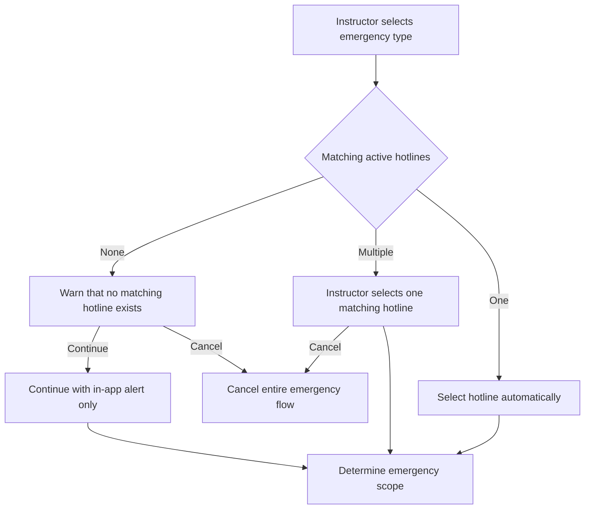
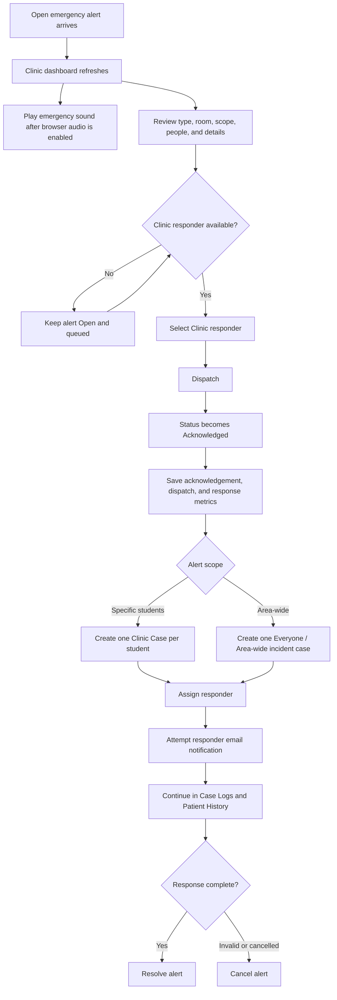
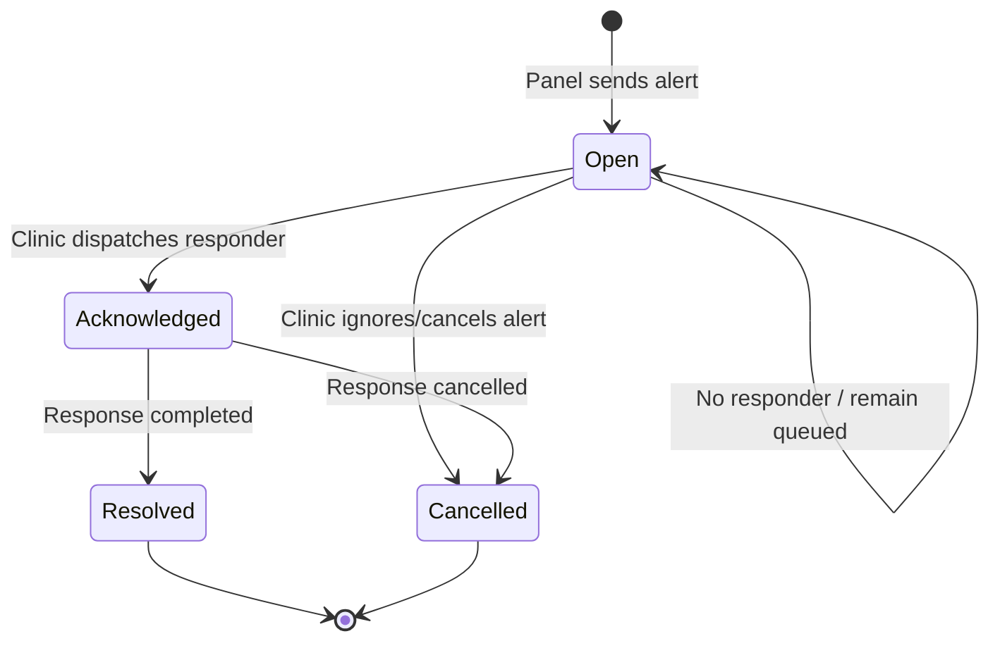

# Emergency Alert and Clinic Response Flow

Documentation home: [Documentation Index and Source-of-Truth Map](DOCUMENTATION_INDEX.md).

This is the canonical reference for emergency alerts sent from the Attendance Control Panel and handled by Clinic. For responder assignment and notification details, also see [Clinic Dispatch Assignment](CLINIC_DISPATCH.md).

## 1. Roles

| Role | Responsibility |
|---|---|
| Instructor | Starts the emergency request from the active Attendance Control Panel session. |
| Console | Provides the authenticated room-bound panel session. |
| Clinic user | Reviews the alert, selects a responder, dispatches the response, and maintains records. |
| Clinic responder | Proceeds to the location and handles the assigned Clinic Case. |

## 2. Complete Emergency Sequence

1. During an active class session, the instructor taps their RFID again.
2. The instructor selects **Emergency Call**.
3. The instructor selects the emergency type.
4. The system resolves the hotline before opening the assistance/details modal:
   - One matching active hotline is selected automatically.
   - Multiple matching active hotlines open a filtered selection prompt.
   - **Cancel** from the multiple-hotline prompt cancels the entire emergency request.
   - No matching hotline opens a warning. The instructor may continue without hotline SMS or cancel.
5. The system determines the information branch:
   - **Fire/disaster:** automatically uses **Everyone / area-wide** and skips student identification.
   - **Other emergency:** opens one **Who needs assistance?** modal.
6. The instructor reviews the emergency information and advances to final confirmation.
7. The final confirmation modal starts a five-second countdown.
8. Unless cancelled, the system saves the in-app alert and attempts hotline SMS when configured.
9. Clinic receives the Open alert on `/clinic/dashboard`.
10. Clinic selects an available Clinic responder and selects **Dispatch**.
11. Dispatch acknowledges the alert, records response metrics, creates the necessary Clinic Case records, assigns the responder, and attempts the responder notification.
12. Clinic continues documentation in **Clinic Case Logs** and **Patient History**.
13. Clinic resolves or cancels the emergency when appropriate.

## 3. Hotline Routing

Clinic configures hotlines using controlled types:

- Clinic
- Medical / Ambulance
- Fire Department
- Police
- School Security
- Disaster Response
- General Emergency
- Other External Hotline

Hotline routing happens immediately after emergency-type selection and before **Who needs assistance?** or the fire/disaster details modal.



## 4. Emergency Scope

### 4A. Fire or Disaster

- Scope is automatically **Everyone / area-wide**.
- The system does not ask for student RFID or student names.
- The instructor may enter optional incident, affected-area, evacuation, or location details.
- A visible 15-second idle timer appears.
- If no action occurs for 15 seconds, the details modal advances to the final confirmation modal.
- The 15-second timer does not send the alert directly.
- Typing pauses the 15-second timer permanently for that modal. It does not restart when typing stops.
- After typing, the instructor must select **Review Emergency** or **Cancel**.

Timer sequence:

```text
15-second idle details timer
        ↓
Final confirmation modal
        ↓
5-second send countdown
        ↓
Alert saved and SMS attempted
```

### 4B. Other Emergency

One **Who needs assistance?** modal contains:

- **Specific person(s)**
- **Everyone / area-wide**
- Optional symptoms or short notes
- **Review Emergency**
- **Cancel**

When **Specific person(s)** is selected:

- Student identification controls are visible.
- The instructor can scan RFID or search by student name or student number.
- Multiple students can be added.
- Incorrect selections can be removed.
- At least one student is required before review.

When **Everyone / area-wide** is selected:

- Student identification controls are hidden.
- No student record is required.
- General incident details remain optional.

```mermaid
flowchart TD
    Scope{Emergency scope}
    Scope -->|Fire or disaster| Area[Everyone / area-wide]
    Area --> Details[Optional details with 15-second idle advance]
    Scope -->|Other type| Modal[Who needs assistance modal]
    Modal -->|Specific person(s)| People[RFID or name/number search]
    People --> Many[Add one or more students]
    Modal -->|Everyone / area-wide| NoPeople[Hide student selection]
    Modal -->|Cancel| Stop[Cancel entire emergency flow]
    Details --> Review[Final confirmation]
    Many --> Review
    NoPeople --> Review
```

## 5. Final Confirmation and Sending

The confirmation modal displays:

- Emergency type
- Laboratory or room
- Selected students or **Everyone / area-wide**
- Student photos, names, numbers, and sections when applicable
- Optional symptoms, incident details, or notes
- Resolved hotline or no-hotline warning state

The final confirmation has its own five-second countdown. This timer is separate from the fire/disaster 15-second idle timer. Selecting **Cancel Alert** stops the request. Otherwise, the alert is sent automatically.

The result reports one of these SMS outcomes:

- Sent successfully
- Failed or provider unavailable
- Not attempted because no hotline was selected
- Duplicate alert suppressed

Alerts with the same emergency type and room inside ten seconds reuse the existing Open alert instead of creating a duplicate.

## 6. Clinic Dashboard Flow



### No Responder Available

- Dispatch remains disabled.
- The alert remains **Open** in the Clinic queue.
- The dashboard explains that a Clinic responder must be activated or created.
- No dispatch timestamp or dispatch-response duration is written.
- Clinic can continue monitoring the alert until a responder is available.

## 7. Clinic Case Creation Rules

| Alert scope | Clinic Case result |
|---|---|
| One selected student | One case linked to that student |
| Multiple selected students | One separate case for every selected student |
| Everyone / area-wide | One generic incident case |

The generic area-wide case uses:

```text
Patient name: Everyone / Area-wide
Patient type: area_wide
Student ID: none
Case type: selected emergency type
Location: emergency-alert room/laboratory
Symptoms/details: submitted incident details or default emergency message
```

## 8. Status and Timestamp Rules

| State or field | Meaning |
|---|---|
| `open` | Alert is waiting in the Clinic queue. |
| `acknowledged` | Clinic dispatched the current response workflow. |
| `resolved` | Emergency response was completed. |
| `cancelled` | Alert was dismissed or cancelled. |
| `acknowledged_at` | Time the current Dispatch action acknowledged the alert. |
| `dispatched_at` | Time the responder was dispatched. |
| `response_seconds` | Seconds from alert creation to Dispatch. |

Current implementation note: acknowledgement and dispatch are recorded together when Clinic selects **Dispatch**. A separate acknowledgement-only action is not currently implemented.



## 9. Stored Alert Information

An emergency alert can retain:

- Emergency type and severity
- Room/laboratory
- Subject and schedule context
- Reporting instructor
- Specific-person or area-wide scope
- Selected student IDs, RFID values, names, numbers, sections, and photos
- Symptoms or incident details
- Selected hotline metadata
- SMS delivery result returned to the panel
- Creation, acknowledgement, dispatch, and resolution timestamps

## 10. Operational Limitations

- In-app alert saving does not prove that external emergency services were contacted.
- SMS requires an active matching hotline, SMS-enabled configuration, a valid number, and a working Semaphore provider.
- Browser emergency audio requires the Clinic user to interact with the page once.
- Physical RFID behavior must be verified with the deployed reader.
- A separate Clinic acknowledgement action before responder dispatch is not currently implemented.

