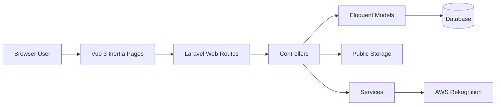
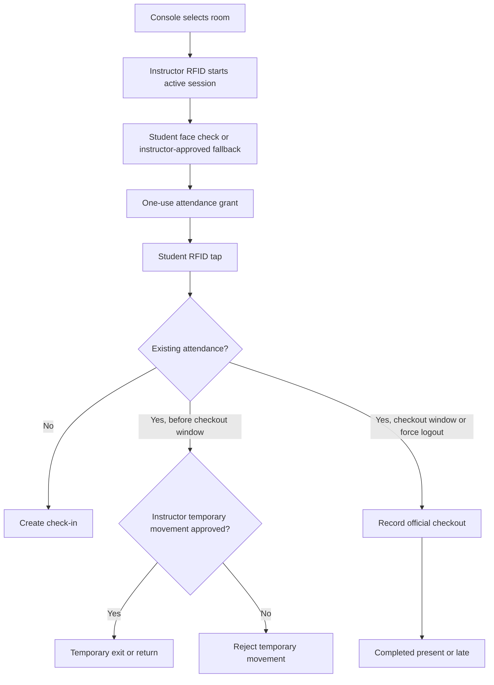
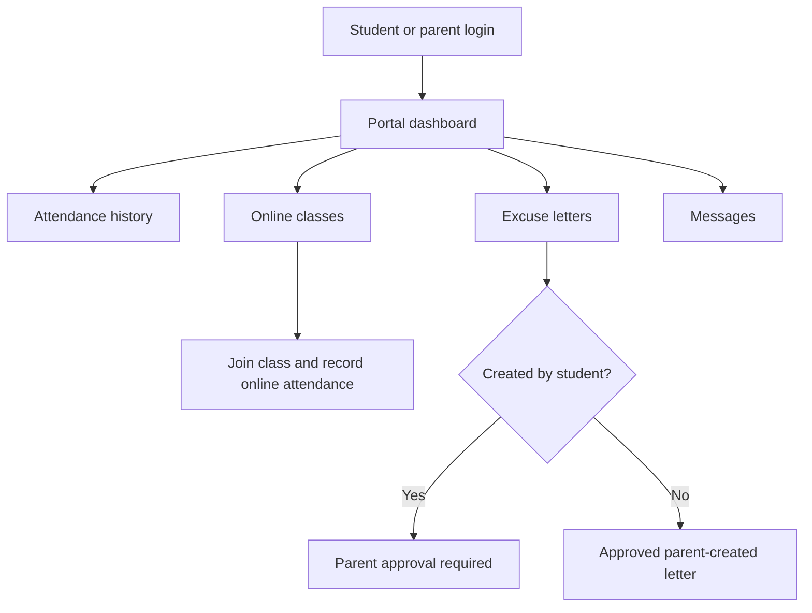
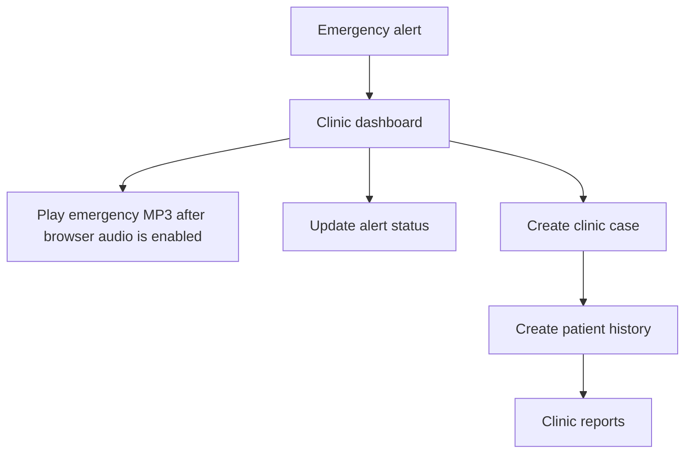

# RFID Borrowing and Attendance System

RFID Borrowing and Attendance System is a Laravel 12, Inertia, and Vue 3 capstone application for senior high school computer laboratory operations. The repository contains a working web application for attendance, borrowing, inventory, registrar biometric enrollment, student/parent self-service, online classes, clinic records, emergency alerts, messaging, reports, and audit logs.

This README is written from the current source code. It intentionally excludes private AI notes, secrets, passwords, software installation instructions, deployment steps, and infrastructure setup.

## Current Status

| Area                                   | Status                                | Evidence                                                                                                                                             |
| -------------------------------------- | ------------------------------------- | ---------------------------------------------------------------------------------------------------------------------------------------------------- |
| Merge conflicts                        | Resolved                              | No unresolved conflict markers were found in tracked source/docs checked during this pass.                                                           |
| Application stack                      | Implemented                           | Laravel backend, Inertia routes, Vue pages, migrations, seeders, tests, Vite build.                                                                  |
| Attendance panel                       | Implemented with complex rules        | `AttendanceController`, `AttendanceControlPanel.vue`, attendance panel feature tests.                                                                |
| Face verification                      | Implemented with provider dependency  | AWS Rekognition service, fallback/override paths, attendance evidence storage.                                                                       |
| Borrowing and inventory                | Implemented                           | Borrow, item, inventory, laboratory controllers/pages/models.                                                                                        |
| Student/parent portal                  | Implemented                           | Dashboard, profile, attendance, online classes, excuse letters, messages, notifications.                                                             |
| Unified Messenger                      | Implemented for all non-console roles | Admin, instructor, clinic, registrar, student, and parent users can search recipients, chat, send attachments, and preview image attachments inline. |
| Clinic and emergency                   | Implemented                           | Clinic dashboard/cases/patient histories/reports; emergency types/hotlines/alerts; clinic dashboard MP3 alert sound for newly received emergencies.  |
| Shared reports                         | Implemented as CSV exports            | Role-specific report payloads and stream downloads.                                                                                                  |
| Schedule conflict detection            | Missing                               | Schedule CRUD validates data but does not reject overlapping schedules.                                                                              |
| Full term/department/course management | Partial                               | Strands, sections, subjects, schedules, and school year fields exist; no dedicated term closing, department, curriculum, or course lifecycle module. |

## Primary Roles

- `admin`: manages the system, academics, laboratories, users, devices, borrowing, inventory, online class logs, reports, and settings.
- `root admin`: an admin flagged as root; can manage admin accounts that normal admins cannot manage.
- `instructor`: views scoped students/schedules, verifies attendance access, manages assigned online classes, replies to messages, and reviews attendance.
- `registrar`: enrolls and updates student/faculty RFID cards and face images.
- `clinic`: manages clinic cases, patient histories, emergency alerts, hotlines, emergency types, and clinic reports.
- `console`: runs the physical attendance control panel for a selected laboratory or room.
- `student`: uses the student/parent portal for attendance, online classes, excuse letters, messages, notifications, and profile updates.
- `parent`: uses linked student portal views and approves student-created excuse letters.

## First Access Flow

The root route `/` is the student/parent login entry when the visitor is not authenticated. Authenticated users are redirected by role:

| Role                  | Destination                 |
| --------------------- | --------------------------- |
| `admin`, `instructor` | `/admin/dashboard`          |
| `clinic`              | `/clinic/dashboard`         |
| `console`             | `/attendance-control-panel` |
| `registrar`           | `/registrar/dashboard`      |
| `student`, `parent`   | `/student-parent/dashboard` |

Staff users authenticate through the configured staff login route. Student and parent users authenticate from the public portal login.

## Database Starting Point

The app can run from a minimal migrated database, but the repository seeders create a demo-rich environment. `DatabaseSeeder` calls:

- `UserSeeder`
- `EmergencySeeder`
- `ComlabUserSeeder`
- `DemoSystemSeeder`
- `StudentParentAccountSeeder`
- `ClinicDashboardSeeder`
- `MessageSeeder`

Because of those seeders, a seeded database contains sample users, console accounts, academic records, students, parent links, clinic data, emergency data, and messages. An unseeded database should be treated as empty except for schema-level defaults and whatever records an operator creates manually.

Seeder shortcuts:

- `php artisan db:seed` runs the normal full seed path.
- `php artisan db:seed --class=SystemSeeder` seeds system reference records and demo operational data.
- `php artisan db:seed --class=DataAccountSeeder` seeds login accounts, console accounts, and student/parent portal account links.

## Initial Configuration Flow

After the app and database are already running, configure the operational data in this order:

1. Confirm system settings for panel access, attendance late threshold, face recognition, inventory availability, and online class defaults.
2. Create or review staff users and role assignments.
3. Define strands, sections, school year values, and semester values.
4. Define subjects and associate them with the intended academic structure.
5. Create instructor profiles and connect them to user accounts.
6. Create laboratories/rooms and panel device access settings.
7. Create schedules by section, subject, instructor, room/laboratory, weekday, start time, and end time.
8. Create student records and link them to sections, strands, and parent accounts as needed.
9. Use registrar enrollment to assign RFID tags and face images for students and instructors.
10. Open the attendance panel using a console account, select a room, and let the assigned instructor start a live session.
11. Review reports, activity logs, attendance logs, and clinic/online-class outputs during daily operation.

There is no dedicated setup wizard in the current codebase.

For a full click-by-click operating tutorial, see [USER_OPERATIONS_TUTORIAL.md](USER_OPERATIONS_TUTORIAL.md).

## Core Modules

### Authentication And Authorization

The application uses Laravel authentication with role middleware and Inertia pages. Admin, instructor, clinic, registrar, console, student, and parent users are routed to separate dashboards. Instructor routes can require an extra verification step through face, OTP, or security questions.

### Admin Dashboard And Master Data

Admin routes under `/admin` cover:

- Dashboard.
- Student records and parent account links.
- Instructors.
- Users for admin, clinic, and registrar roles.
- Strands, sections, subjects, schedules, and laboratories.
- Inventory, items, borrowing, returned items, and availability.
- Active devices and attendance panel access controls.
- System settings.
- Activity logs and CSV export.
- Online class management and online class audit logs.

Root admin protection is implemented for admin-account management.

### Academic Structure

The implemented academic structure is based on:

- `strands`
- `sections`
- `subjects`
- `schedules`
- `students`
- `instructors`
- `laboratories`

Sections store school year and semester information. Subjects also store semester information. The current code does not include separate department, course, curriculum, enrollment period, grading period, or term-closing modules.

### Schedule Management

Schedules connect sections, subjects, instructors, rooms/laboratories, weekdays, and time windows. Admins can create, update, delete, and filter schedules. Instructors can view their assigned schedules.

Current limitation: schedule CRUD validates required fields and foreign keys, but it does not currently block overlapping schedules for the same room, instructor, section, or time range.

### Attendance Control Panel

The attendance panel is used by a `console` account in a selected room. A live attendance session is tied to the current schedule, subject, section, instructor, room, and date.

Student tap behavior:

- Face verification or instructor-approved fallback creates a short-lived one-use attendance grant.
- The first valid student tap records official check-in.
- Late status is based on `attendance.late_threshold_minutes`, defaulting to 15.
- A checked-in student is considered inside the room.
- Before the final checkout window, temporary exit/return taps require instructor RFID approval.
- The final checkout window begins 15 minutes before scheduled end.
- The first valid tap during that window records official checkout.
- Instructor Student Logout mode can force the next student tap to official checkout.
- Taps after official checkout are ignored and logged without changing the completed record.
- When a live class ends, unfinished attendance is finalized according to the implemented session-ending rules.
- Demo attendance buttons are disabled by default and can be enabled from admin settings with configurable professor/student RFID values.

Attendance records keep the main state. Attendance logs keep per-tap evidence, sequence, room/location, validation result, verification method, and remarks.

### Face Verification And Evidence

Student attendance can use AWS Rekognition against registrar-enrolled reference images. Successful camera captures are stored separately as attendance evidence and do not replace registrar reference images.

Fallback behavior exists for:

- Missing student face image.
- Face recognition disabled.
- Camera session override approved by the active instructor.
- AWS Rekognition unavailable with captured evidence.
- Instructor RFID override.

Evidence thumbnails are exposed to authorized users through protected routes.

### Borrowing And Inventory

Admin-facing inventory and borrowing workflows manage laboratory items, borrowing transactions, returned items, and status tracking. The attendance panel also exposes a borrowing-only action path for console workflows.

### Student And Parent Portal

The portal includes:

- Dashboard summary.
- Profile and account update views.
- Attendance history with evidence links when authorized.
- Online class list and join tracking.
- Excuse letter creation, attachments, parent approval, and downloadable generated letters.
- Messages.
- Notifications for online class events.

Parents can be linked to one or more students and can switch context where the portal supports linked student selection.

### Online Classes

Instructors and admins can create, update, cancel, delete, and audit online classes for schedules. Students can join online classes, and attendance is recorded with late/face-verification metadata where required.

Online class notifications are stored in-app and can attempt email delivery. Email failures are preserved on notification records.

### Messages

Admin, instructor, clinic, registrar, student, and parent users can use the unified Messenger at `/messages` for role-to-role conversations. Console accounts are intentionally excluded because they are limited to physical attendance-panel operation.

Messenger supports:

- Recipient search by name, email, or role across message-capable users, excluding the current user and console accounts.
- Existing conversation grouping, so both sent and received messages with the same person appear in one chat thread.
- Text messages, attachment-only messages, or text-plus-attachment messages.
- PDF, Word, image, GIF/WebP, and text file attachments within the configured upload limit.
- Inline image previews for image attachments, with protected download links for all attachment types.
- Read-state updates that only the recipient can apply.

Student/parent portal messages use `student_portal_messages`; staff, student, and parent conversations share the same Messenger page and protected attachment-download route.

### Reports

The shared Reports module serves admin, clinic, registrar, and instructor roles with role-specific summary cards, charts, detail rows, filters, and CSV exports.

Report scope:

- Admin: users, students, attendance, borrowing, inventory, clinic cases.
- Clinic: cases, alerts, patient histories, response metrics.
- Registrar: students by academic grouping and enrollment logs.
- Instructor: assigned schedules, scoped attendance, online classes, and online attendance.

### Clinic And Emergency

Clinic routes support:

- Dashboard counts and emergency view.
- Automatic clinic dashboard refresh for newly received emergency alerts.
- MP3 emergency alert sound when a new emergency appears on the clinic dashboard.
- A small browser-audio notice that disappears after the clinic user clicks or presses a key once to enable alert sound.
- Case logs.
- Patient histories.
- Clinic reports and CSV export.
- Emergency hotlines.
- Emergency types.
- Emergency alert status updates and dispatch actions.

SMS/provider dispatch is not confirmed as a live external integration in the current source.

The clinic emergency sound file is served from `public/sound/emergency-alert.mp3` and loaded in the browser as `/sound/emergency-alert.mp3`.

### Audit Logs

The repository includes activity logging and expanded audit/event structures. Admins can review and export activity logs. The online class module has its own audit log table and export.

Audit records should avoid sensitive request bodies, secrets, tokens, passwords, and face image payloads.

## Important Routes

| Route                                           | Purpose                                                                    |
| ----------------------------------------------- | -------------------------------------------------------------------------- |
| `/`                                             | Student/parent login or role redirect.                                     |
| `/dashboard`                                    | Role-based dashboard redirect.                                             |
| `/messages`                                     | Unified authenticated Messenger for all non-console roles.                 |
| `/messages/new`                                 | Public message creation for inbound public/student-to-instructor messages. |
| `/reports`                                      | Shared role-aware reports.                                                 |
| `/reports/export`                               | Shared role-aware CSV export.                                              |
| `/attendance-control-panel/login`               | Console panel login.                                                       |
| `/attendance-control-panel`                     | Console attendance panel.                                                  |
| `/attendance-evidence/{attendanceLog}/{moment}` | Protected attendance evidence preview.                                     |
| `/admin/dashboard`                              | Admin/instructor dashboard.                                                |
| `/admin/students`                               | Student management and instructor-scoped student view.                     |
| `/admin/schedules`                              | Schedule management/viewing.                                               |
| `/admin/inventory`                              | Inventory management.                                                      |
| `/admin/borrow`                                 | Borrowing workflows.                                                       |
| `/admin/active-devices`                         | Laboratories, panel access, panel monitoring, and force logout.            |
| `/admin/activity-logs`                          | System activity log.                                                       |
| `/admin/online-classes`                         | Online class management.                                                   |
| `/admin/online-class-logs`                      | Online class audit log.                                                    |
| `/registrar/dashboard`                          | Registrar dashboard.                                                       |
| `/registrar/biometric-enrollment`               | Student RFID/face enrollment.                                              |
| `/registrar/instructor-face-enrollment`         | Faculty RFID/face enrollment.                                              |
| `/clinic/dashboard`                             | Clinic dashboard and emergency overview.                                   |
| `/clinic/case-logs`                             | Clinic cases.                                                              |
| `/clinic/patient-history`                       | Patient history records.                                                   |
| `/clinic/reports`                               | Clinic-specific reports.                                                   |
| `/clinic/emergency-hotlines`                    | Emergency hotline CRUD.                                                    |
| `/student-parent/dashboard`                     | Student/parent portal dashboard.                                           |
| `/student-parent/attendance`                    | Student attendance history.                                                |
| `/student-parent/online-classes`                | Student online classes.                                                    |
| `/student-parent/excuse-letters`                | Excuse letters.                                                            |
| `/student-parent/messages`                      | Portal messages.                                                           |
| `/student-parent/notifications`                 | Online class notifications.                                                |

## System Architecture



## Attendance Flow



## Student/Parent Portal Flow



## Clinic/Emergency Flow



## Project Structure

```text
app/
  Http/Controllers/       Laravel module controllers
  Models/                 Eloquent models
  Services/               Face recognition, online class audit, notification services
database/
  migrations/             Database schema
  seeders/                Demo/default data seeders
docs/                     Analysis reports, operating docs, slide content
resources/
  js/pages/               Inertia Vue pages
  js/components/          Shared Vue components
routes/
  web.php                 Main route map
tests/                    Pest/PHPUnit feature and unit tests
```

## Verification Performed

During this documentation and conflict-resolution pass:

- Merge conflict markers were searched in source and documentation paths.
- `private_ai.md` was verified as no longer ignored by `.gitignore`.
- PHP syntax checks were run on merge-touched controllers.
- Prettier format checks were run on merge-touched Vue pages.
- Laravel Pint was run on merge-touched PHP files.
- Targeted attendance/student-parent feature tests were run.
- Frontend production build was run.

See [REPOSITORY_ANALYSIS_AND_FLOW_REPORT.md](REPOSITORY_ANALYSIS_AND_FLOW_REPORT.md) for the deeper feature inventory, flow verification, limitations, and recommendations.

See [CAPSTONE_PRESENTATION.md](CAPSTONE_PRESENTATION.md) for editable presentation slide text. The generated PowerPoint is saved at `capstone-rfid-system-presentation.pptx`.

For a presenter-friendly full demonstration sequence, see [FULL_SYSTEM_DEMONSTRATION_SCRIPT.md](FULL_SYSTEM_DEMONSTRATION_SCRIPT.md).

## Known Limitations And Recommendations

- Add schedule overlap/conflict validation for room, instructor, section, day, and time.
- Add a formal academic year/semester closing workflow if the school needs archival term control.
- Add department/course/curriculum modules only if the institution needs them beyond strand/section/subject scheduling.
- Add a reviewed attendance correction workflow for late administrative corrections.
- Add live SMS or external emergency dispatch integration if required by clinic policy.
- Expand notification coverage beyond online class events to include messages, excuse-letter status changes, and critical attendance events.
- Keep private notes, credentials, production secrets, and AI scratch files out of public documentation.
