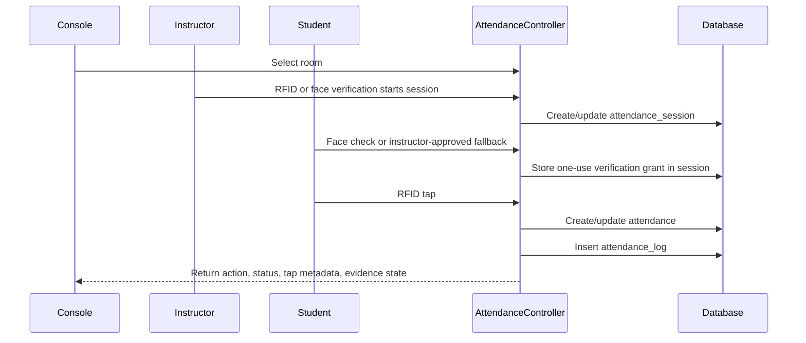
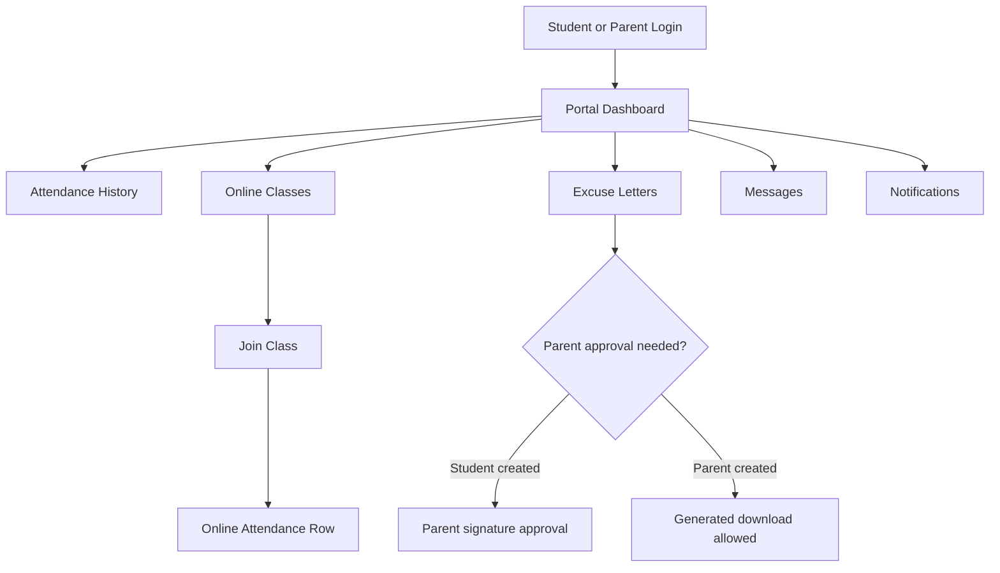

# Repository Analysis And Flow Verification Report

Generated for the current merged repository state.

## Scope

This report summarizes what is implemented in the Laravel, Inertia, Vue, database, route, and test layers. It excludes private AI notes, secrets, passwords, deployment steps, and software installation instructions.

## Executive Summary

The repository is a broad school operations system centered on RFID attendance and laboratory borrowing. It is no longer only an attendance app; it now includes academic master data, biometric enrollment, student/parent portal workflows, online classes, clinic operations, emergency alerts, reports, activity logs, and a unified messenger.

The merge conflict pass preserved the attendance panel work from the attendance-panel branch while keeping the newer face-verification/evidence and portal/message behavior. The important technical risk after the merge was compatibility between schedule-aware RFID tapping and one-use verification grants. That conflict has been resolved and targeted tests pass.

## Source Areas Reviewed

| Area | Files/Directories |
| --- | --- |
| Routes | `routes/web.php` |
| Controllers | `app/Http/Controllers` |
| Models | `app/Models` |
| Seeders | `database/seeders` |
| Migrations | `database/migrations` |
| Frontend pages | `resources/js/pages` |
| Existing docs | `docs/README.md`, `docs/*.md`, `docs/DATABASE.md`, `docs/SYSTEM_FLOW.md` |
| Tests | `tests/Feature`, `tests/Unit` |
| Ignore rules | `.gitignore` |

## Implemented Feature Inventory

| Module | Implemented | Partial/Missing | Main Evidence |
| --- | --- | --- | --- |
| Authentication | Staff login, student/parent login, role redirects, Fortify settings, protected routes. | No public self-registration workflow is described for ordinary operations. | `routes/web.php`, auth controllers/pages. |
| Authorization | Role middleware for admin, instructor, clinic, registrar, console, student, parent. | Fine-grained policies are mixed with route/controller checks. | `routes/web.php`, middleware usage. |
| Admin users | Admin can manage clinic/registrar/admin accounts; root admin restrictions exist. | Admin lifecycle is not a full HR/staff directory module. | `UserController`, admin routes. |
| Students | Admin student CRUD, parent linking, instructor scoped viewing. | Bulk import/export is not confirmed. | `StudentsController`, student pages. |
| Parent accounts | Link, update, unlink parent accounts. | Parent notification coverage is limited. | `StudentsController`, `parent_student_links`. |
| Instructors | Instructor profiles tied to users. | Broader personnel records are not implemented. | `InstructorsController`, `Instructor` model. |
| Registrar biometrics | Student/instructor RFID and face image enrollment. | Face image count is capped; biometric quality workflows are not advanced. | `RegistrarController`, registrar Vue pages. |
| Strands | CRUD and active status. | No department/course/curriculum module. | `StrandController`. |
| Sections | CRUD with strand, year level, school year, semester. | No term closing/archive workflow. | `SectionController`. |
| Subjects | CRUD and filters, optional section/user links, semester field. | No prerequisite/curriculum mapping. | `SubjectController`. |
| Schedules | CRUD with room/lab, instructor, section, subject, weekdays/time. | No overlap/conflict prevention found. | `ScheduleController`. |
| Laboratories/devices | Lab records, active devices, panel access settings, panel monitoring. | Physical hardware integration depends on deployment/device environment. | Lab/device controllers and pages. |
| Attendance panel | Console room selection, instructor session start, RFID lookup, student taps, session state, logs. | Hardware reader behavior is represented by web endpoints; physical reader details are outside repo. | `AttendanceController`, `AttendanceControlPanel.vue`. |
| Attendance rules | Check-in, late threshold, temporary exit/return, final checkout window, force logout, ignored taps. | Administrative correction/appeal flow is missing. | `AttendanceController`, feature tests. |
| Face verification | Student face check, instructor face check, AWS Rekognition integration, fallback grants, evidence storage. | Depends on configured provider and enrolled face images. | `FaceRecognitionService`, `AttendanceController`. |
| Attendance logs | Admin/instructor logs, evidence thumbnails, panel snapshots, per-tap metadata. | Long-term retention policy is not implemented as a workflow. | `AttendanceLog` model, log pages. |
| Borrowing | Borrowing workflows and attendance-panel borrowing-only path. | Hardware/item scanner specifics are outside source. | `BorrowController`, borrowing pages. |
| Inventory/items | Item and inventory CRUD, availability settings. | Advanced procurement/asset depreciation is not implemented. | `InventoryController`, `ItemController`. |
| Online classes | Instructor/admin CRUD, join attendance, notifications, audit logs, exports. | Video meeting itself is external through meeting links. | `OnlineClassController`, services, pages. |
| Student portal | Dashboard, profile, attendance, online classes, excuse letters, messages, notifications. | Notifications mostly focus on online classes. | `StudentsController`, `StudentParent/*` pages. |
| Excuse letters | Create, attach files, parent approval, generated download. | Instructor/admin review workflow is not implemented. | `StudentsController`, portal pages. |
| Messenger | Unified authenticated conversations for all non-console roles; recipient search by name/email/role; text-only, attachment-only, and text-plus-attachment messages; inline image previews; protected attachment downloads; public message creation. | Full moderation/admin inbox tooling is limited. | `MessageController`, message pages, messenger feature tests. |
| Reports | Role-specific report pages and CSV export. | Native spreadsheet/chart export is not implemented. | `ReportController`, clinic reports. |
| Clinic | Dashboard, case logs, patient histories, reports, emergency details. | Clinic scheduling/medicine inventory is not implemented. | `ClinicController`. |
| Emergency | Emergency alert creation, types, hotlines, status updates, dispatch route. | Live SMS/external dispatch is not confirmed. | `EmergencyController`, clinic routes. |
| Activity logs | System activity log and export. | Coverage depends on middleware/controller logging paths. | `ActivityLogController`, model/migrations. |
| Settings | Attendance threshold, panel access, inventory, face recognition, online class defaults. | No school branding/school information module found. | `SystemSettingsController`. |

## Route Map By User Journey

### Public Entry

- `/`: student/parent login for guests; role redirect for authenticated users.
- `/about`: public Inertia About page.
- `/messages/new`: public message creation.
- `/attendance-control-panel/login`: console panel login.

### Authenticated Shared Routes

- `/messages`: unified Messenger.
- `/messages/conversation`: conversation creation and message sending for text, attachments, or both.
- `/messages/{message}/read`: read state.
- `/messages/{message}/attachment`: protected attachment download and authorized inline image preview.
- `/reports`: shared reports for admin, clinic, registrar, instructor.
- `/reports/export`: CSV export for shared reports.

### Attendance Console

- `/attendance-control-panel`: live control panel.
- `/attendance-control-panel/room`: room selection.
- `/attendance-control-panel/status`: panel/session status.
- `/attendance-control-panel/rfid-lookup`: RFID lookup.
- `/attendance-control-panel/student-face-check`: student face/fallback verification.
- `/attendance-control-panel/instructor-face-check`: instructor face verification.
- `/attendance-control-panel/student-tap`: final attendance write after verification grant.
- `/attendance-control-panel/attendance-logs`: live/panel log snapshot.
- `/attendance-control-panel/borrow-items-only`: borrowing path from panel.
- `/attendance-control-panel/emergency-alert`: emergency alert creation.

### Admin/Instructor

- `/admin/dashboard`
- `/admin/attendance/scanner`
- `/admin/attendance/logs`
- `/admin/messages`
- `/admin/online-classes`
- `/admin/students`
- `/admin/schedules`
- Admin-only master data and operations: laboratories, borrow, RFID, sections, subjects, schedules, inventory, activity logs, users, online-class logs, active devices, settings, strands, students, instructors, item CRUD, return items.

### Registrar

- `/registrar/dashboard`
- `/registrar/biometric-enrollment`
- `/registrar/instructor-face-enrollment`
- RFID and face image update/delete endpoints for students/faculty.

### Clinic

- `/clinic/dashboard`
- `/clinic/case-logs`
- `/clinic/patient-history`
- `/clinic/reports`
- `/clinic/reports/export`
- `/clinic/emergency-hotlines`
- `/clinic/emergency-types`
- `/clinic/emergency-alerts/{id}`

### Student/Parent

- `/student-parent/dashboard`
- `/student-parent/profile`
- `/student-parent/attendance`
- `/student-parent/excuse-letters`
- `/student-parent/messages`
- `/student-parent/notifications`
- `/student-parent/online-classes`

## Verified Flow: Attendance Panel



Important verified behavior:

- The attendance-write endpoint requires a one-use verification grant.
- The grant may come from AWS face match or supported instructor/fallback paths.
- Check-in/check-out semantics remain compatible with existing feature tests.
- Tap logs preserve the evidence image path when a capture exists.

## Verified Flow: Student/Parent Portal



## Verified Flow: Reports

```mermaid
flowchart LR
    Role[Authenticated Role] --> Reports[/reports]
    Reports --> Payload[Role-specific reportPayload]
    Payload --> Cards[Summary Cards]
    Payload --> Charts[Chart Rows]
    Payload --> Table[Table Rows]
    Reports --> Export[/reports/export]
    Export --> CSV[CSV Stream Download]
```

## Data Model Highlights

| Model/Table Family | Purpose |
| --- | --- |
| `users`, `instructors`, `students`, `parent_student_links` | Accounts, staff/student profiles, parent-child linkage. |
| `strands`, `sections`, `subjects`, `schedules`, `laboratories` | Academic and room scheduling structure. |
| `attendance_sessions`, `attendances`, `attendance_logs` | Live sessions, official attendance state, tap/evidence audit rows. |
| `inventory_items`, `items`, `borrowings`, `borrowing_items`, `transactions` | Borrowing and inventory operations. |
| `online_classes`, `online_class_attendances`, `online_class_notifications`, `online_class_audit_logs`, `online_class_attachments` | Online class operations and audit trail. |
| `clinic_cases`, `patient_histories`, `emergency_alerts`, `emergency_types`, `emergency_hotlines` | Clinic and emergency workflows. |
| `messages`, `student_portal_messages`, `recipients` | Public, shared, and portal message flows. |
| `activity_logs`, `registrar_enrollment_logs`, `system_settings`, `panel_devices`, `rfid_panel_sessions` | Audit, registrar actions, configuration, and panel state. |

## Implementation Truths To Preserve In Presentations

- The project is operationally broad, but the attendance panel is the most complex feature.
- Face recognition is implemented as a verification and evidence layer, not as the only attendance method.
- The registrar stores reference face images; attendance captures are separate evidence.
- The system uses CSV exports, not native spreadsheet exports.
- Seeded data is for demonstration and testing; credentials should not be documented in public materials.
- Academic structure is present, but advanced school registrar concepts are not complete modules.

## Missing Or Recommended Work

| Priority | Recommendation | Reason |
| --- | --- | --- |
| High | Add schedule overlap detection. | Prevent impossible room/instructor/section assignments. |
| High | Add attendance correction workflow with approval/audit. | Real schools need controlled corrections for missed taps or device issues. |
| Medium | Extend notifications beyond online classes. | Message replies, excuse-letter status, and critical attendance events need visibility. |
| Medium | Add academic term closing/archive tools. | Prevent accidental changes to historical records. |
| Medium | Confirm or implement live emergency dispatch integration. | Current code stores hotlines/alerts; external delivery is not proven. |
| Low | Add native spreadsheet export if required. | CSV works, but capstone panels sometimes ask for spreadsheet files. |
| Low | Add school profile/branding settings. | Useful for generated letters, reports, and formal deployments. |

## Verification Notes

Commands used in this work included:

- Conflict marker search with `rg`.
- Ignore rule verification with `git check-ignore -v private_ai.md`.
- PHP syntax checks for merge-touched controllers.
- Prettier checks for merge-touched Vue files.
- Laravel Pint checks for merge-touched PHP files.
- Targeted feature tests for attendance panel and student/parent portal.
- Frontend production build.

The full repository quality suite may still contain unrelated historical formatting issues outside this conflict/documentation pass.
