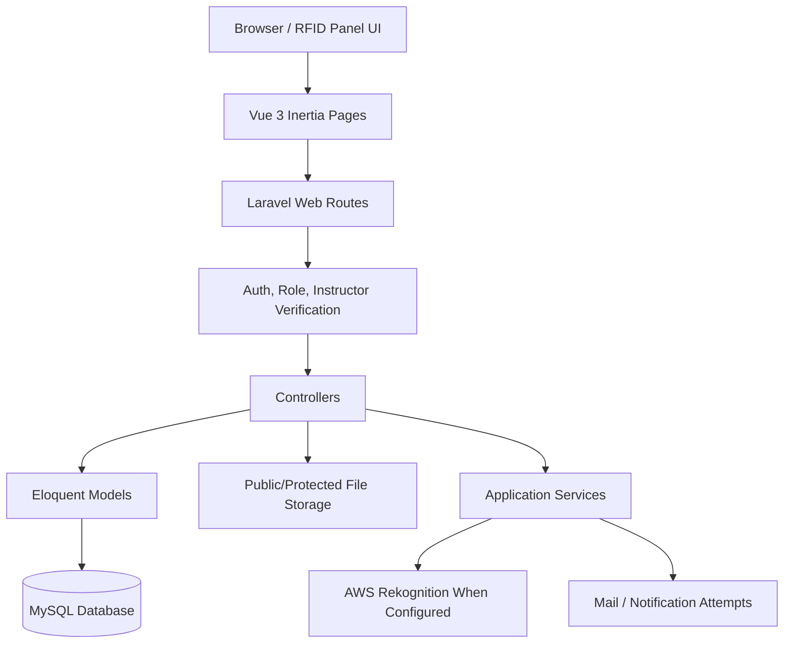
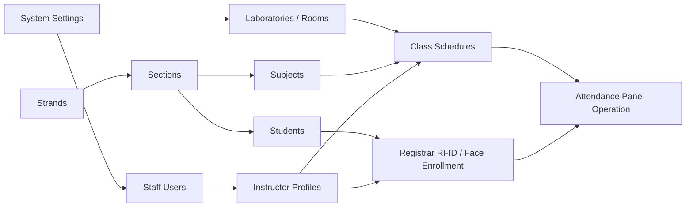
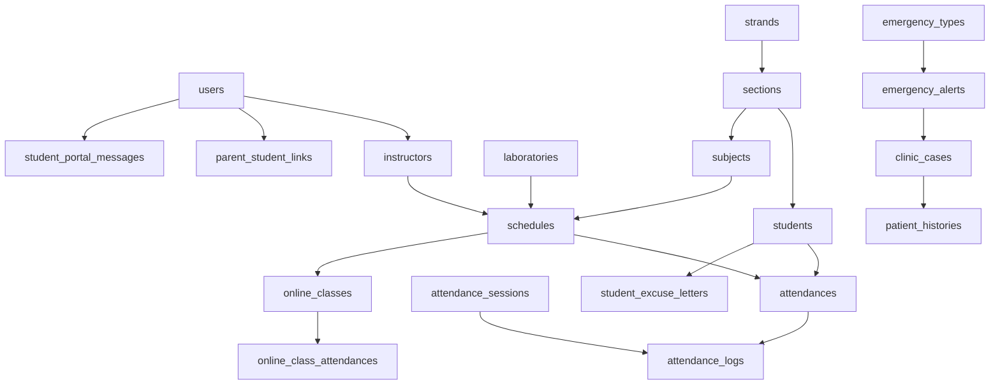
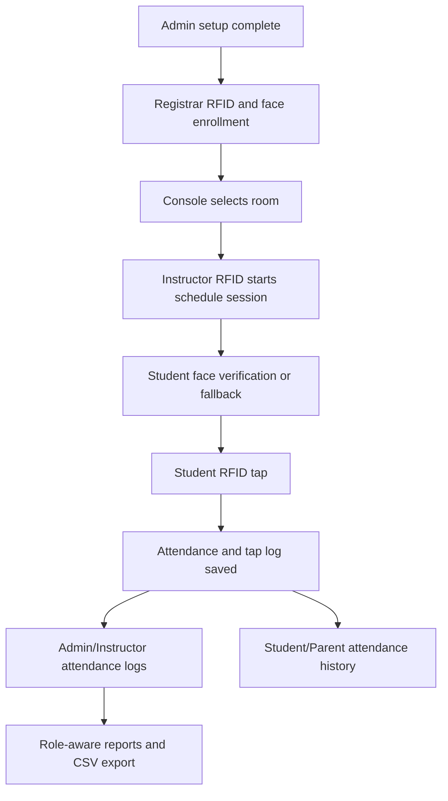
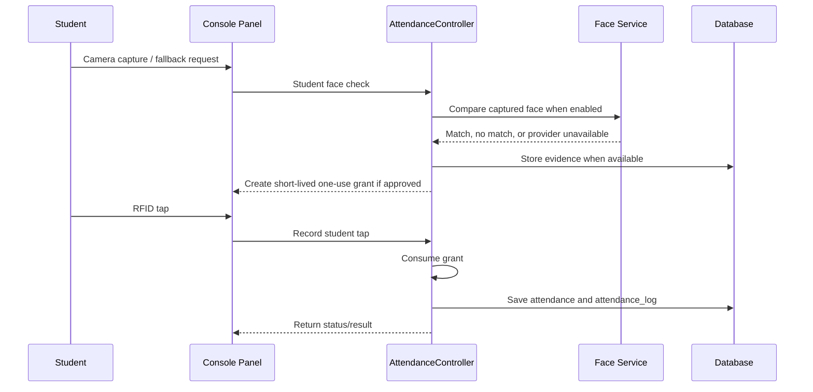
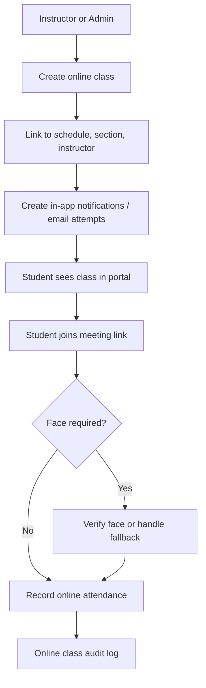
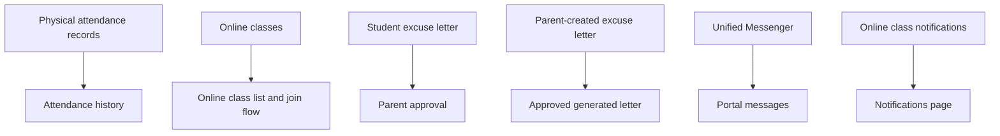
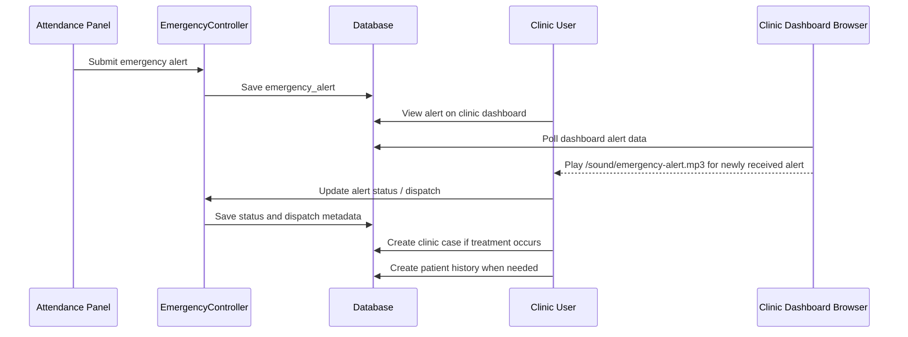
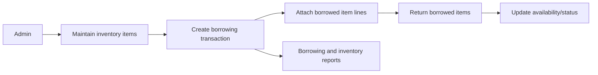

# System Flow

This document is the detailed operating flow for the RFID Borrowing and Attendance System. It connects the user roles, setup records, attendance panel, registrar enrollment, student/parent portal, clinic workflows, reports, and audit records into one readable sequence.

## Whole-System Flow Overview

The system works as a role-based Laravel and Inertia application. Users interact with Vue pages in the browser, requests pass through Laravel web routes and middleware, controllers validate permissions and data, Eloquent models write to the database, and supporting services handle face recognition, notifications, reports, file storage, and audit logging.



### Main User Journey

1. Admin prepares the school structure: laboratories, strands, sections, subjects, instructors, students, users, schedules, inventory, and settings.
2. Registrar enrolls RFID cards and face images for students and instructors.
3. Console user opens the attendance panel and selects the correct room.
4. Instructor taps RFID and starts the scheduled class session.
5. Student verifies face or receives instructor-approved fallback, then taps RFID.
6. Attendance records and tap logs are written with status, time, room, validation, and evidence details.
7. Students and parents view attendance, online classes, messages, notifications, and excuse letters from the portal.
8. Clinic monitors emergency alerts and manages case logs, patient histories, hotlines, and reports.
9. Admin, instructor, registrar, and clinic users review role-aware reports and CSV exports.
10. Activity logs, attendance logs, registrar logs, and online class audit logs preserve accountability.

## Role Entry And Redirect Flow

The public root route `/` is the student/parent login page for guests. Authenticated users are redirected by role.

```mermaid
flowchart TD
    Guest[Visitor opens /] --> Login[Student/Parent Login Page]
    Auth[Authenticated User opens / or /dashboard] --> Role{User role}
    Role -->|admin or instructor| AdminDash[/admin/dashboard]
    Role -->|clinic| ClinicDash[/clinic/dashboard]
    Role -->|console| Panel[/attendance-control-panel]
    Role -->|registrar| RegistrarDash[/registrar/dashboard]
    Role -->|student or parent| Portal[/student-parent/dashboard]
    Role -->|unknown| Login
```

Role access is controlled mostly through route middleware:

- `admin`: broad setup and management.
- `instructor`: scoped class, student, online-class, attendance-log, report, and messaging access after instructor verification.
- `registrar`: RFID and face enrollment.
- `console`: attendance panel only.
- `student` and `parent`: portal self-service.
- `clinic`: clinic dashboard, emergency, case, hotline, patient-history, and clinic report access.
- `root admin`: admin account management privileges on top of admin access.

## Setup Dependency Flow

The system has important setup dependencies. Creating records in this order prevents missing dropdowns, failed schedule creation, and failed attendance scans.



Recommended setup order:

1. Review `/admin/settings`.
2. Create laboratories or rooms from `/admin/active-devices` or `/admin/laboratories`.
3. Create strands from `/admin/strands`.
4. Create sections from `/admin/sections`.
5. Create subjects from `/admin/subjects`.
6. Create staff users from `/admin/users`.
7. Create instructor profiles from `/admin/instructors`.
8. Create student records from `/admin/students`.
9. Link parent accounts from the student management page.
10. Enroll student and instructor RFID/face records from registrar pages.
11. Create schedules from `/admin/schedules`.
12. Prepare inventory from `/admin/inventory`.
13. Open the attendance panel and start daily operation.

Important limitation: schedule creation validates fields, but the current source does not automatically block overlapping room, instructor, section, or time assignments.

## Data Flow By Layer

| Layer       | Main Files Or Tables   | Responsibility                                                                                         |
| ----------- | ---------------------- | ------------------------------------------------------------------------------------------------------ |
| Browser UI  | `resources/js/pages`   | Role dashboards, forms, scanner/panel screens, portal pages, reports, messages.                        |
| Routing     | `routes/web.php`       | Public, authenticated, role-specific, and console endpoints.                                           |
| Controllers | `app/Http/Controllers` | Validation, authorization checks, workflow decisions, database writes, response payloads.              |
| Models      | `app/Models`           | Eloquent access to users, students, schedules, attendance, inventory, clinic, reports, and messages.   |
| Database    | `database/migrations`  | Permanent records for operations and audit trails.                                                     |
| Seeders     | `database/seeders`     | Demo users, academic data, students, parent links, clinic data, emergency data, and messages.          |
| Services    | `app/Services`         | Face recognition, online class audit, notifications, and related business services.                    |
| Storage     | Laravel disks          | Face images, attendance evidence, message attachments, excuse-letter attachments, and generated files. |

Seeder entry points:

- `DatabaseSeeder` is the default full seed path used by normal `php artisan db:seed` and migration refresh commands with `--seed`.
- `SystemSeeder` can be run separately for system reference records and demo operational data.
- `DataAccountSeeder` can be run separately for login accounts, console accounts, and student/parent portal account links.

## Core Database Flow

The operational database centers on these record chains:



The main attendance result is stored in `attendances`. Every RFID tap or validation event is stored separately in `attendance_logs`. This separation lets the system show one final attendance status while still preserving the full tap history.

## Daily Operations Flow



Daily success depends on four matching conditions:

- The panel room must match the scheduled laboratory or room.
- The instructor RFID must belong to the instructor assigned to the active schedule.
- The student RFID must belong to a student in the scheduled section.
- The tap must happen within the active schedule rules and verification requirements.

## Admin Student And Parent Account Flow

Page names:

- `Auth/Admin/Students.vue` - admin and instructor student management page.

Routes:

- `/admin/students` - opens Student Management.
- `POST /admin/students/{id}/parents` - creates or links a parent portal account to a student.
- `PUT /admin/students/{id}/parents/{parent}` - updates a linked parent account and relationship label.
- `DELETE /admin/students/{id}/parents/{parent}` - unlinks a parent account from the student.

### 1. Student List

1. Admins open `/admin/students`.
2. The page loads each student with section, strand, RFID, face image count, status, and linked parent accounts.
3. Instructors can view scoped student records only for handled sections.
4. Only admins can create, update, delete, or manage parent links.
5. Student add/edit uses a School Year dropdown with `2025-2026` through `2030-2031`, plus any existing saved school-year values.

### 2. Parent Account Management

1. An admin selects the `Parents` action on a student row.
2. The modal lists linked parent portal accounts with name, email, relationship, and phone.
3. When the submitted email is new, the system creates a `users` row with role `parent` and requires a password.
4. When the submitted email already belongs to a parent account, the system links that existing account to the selected student and can update the parent profile fields.
5. Emails that belong to non-parent users cannot be linked as parent accounts.
6. The parent-student relationship label is saved on `parent_student_links.relationship`.
7. Unlink removes only the student association. The parent user account remains available for other linked students.

### 3. Section And Schedule School-Year Selection

1. Admin Section add/edit uses the same School Year dropdown: `2025-2026` through `2030-2031`, plus existing saved values.
2. Subject and Schedule add/edit modals do not store school year directly.
3. Subject and Schedule modals display section choices with section name, grade, and school year so admins can select the intended academic year.

## Student/Parent Excuse Letter Flow

Page names:

- `StudentParent/ExcuseLetters.vue` - student and parent excuse letter submission, approval, and download page.

Routes:

- `/student-parent/excuse-letters` - opens the excuse letter page and stores new letters.
- `/student-parent/excuse-letters/{letter}/approve` - linked parent approval endpoint for student-created letters.
- `/student-parent/excuse-letters/{letter}/download` - downloads the approved generated PDF.

### 1. Student-Created Letter

1. A student submits an excuse letter for their own student record.
2. The letter is saved with status `pending_parent_approval`.
3. Each linked parent with a valid email address receives an email notification containing a link to the selected student's Excuse Letter page.
4. PDF download is blocked while parent approval is pending.
5. A linked parent opens the same student's Excuse Letter page.
6. The parent enters a typed parent signature and optional notes, then approves the letter.
7. The letter status becomes `approved`, and the parent signature, approver, and approval timestamp are stored.
8. The system generates a complete signed PDF and sends the details and protected PDF attachment to the selected teachers, or all assigned teachers when none were selected, through Messenger.
9. Each recipient instructor with a valid email address also receives an email notification with the signed PDF attached.
10. The student or linked parent can download the generated `.pdf`.

### 2. Parent-Created Letter

1. A parent selects the linked student and submits an excuse letter.
2. Parent signature is required on submission.
3. The letter is saved immediately as `approved` with the parent signature and approval timestamp.
4. The generated `.pdf` includes the letter content and parent approval block.
5. Selected or assigned instructors receive the approved details and generated PDF through Messenger and email.

### 3. Excuse Letter Attachments

1. A student or parent can upload an optional attachment when submitting an excuse letter.
2. The attachment path and original file name are saved on the letter record.
3. The attachment link uses an authenticated download route.
4. Only the student or linked parent for the selected student can download the attachment.

## Authenticated Messenger Flow

Page names:

- `Messages/Index.vue` - unified messenger for authenticated non-console roles.

Routes:

- `/messages` - unified messenger inbox for admin, instructor, clinic, registrar, student, and parent users.
- `/messages/conversation` - sends a new chat message.
- `/messages/{message}/read` - marks a received message as read.
- `/messages/{message}/attachment` - downloads a message attachment when the current user is sender or recipient; image attachments can also be returned inline for chat preview.
- `/student-parent/messages` - compatibility route that opens the same messenger for student and parent accounts.
- `/admin/messages` - compatibility route that opens the same messenger for admin and instructor accounts.

### 1. User Search And Conversation Start

1. Any authenticated admin, instructor, clinic, registrar, student, or parent opens Messenger.
2. Console users cannot open Messenger because console accounts are reserved for physical attendance-panel operation.
3. The page loads searchable recipient options from message-capable user accounts except the current user.
4. Console accounts are excluded from recipient search results.
5. The user searches by name, email, or role.
6. Selecting a user clears the search field and closes the recipient result list.
7. Selecting a user opens the existing conversation when previous messages exist, showing both sender and recipient history in the same chat room.
8. If no previous conversation exists, selecting a user starts a new conversation draft.
9. Parent accounts keep the selected-student context when a linked student is selected.

### 2. Chat Messages

1. The sender enters a message body, selects an attachment, or sends both.
2. The message is saved in `student_portal_messages` with sender, recipient, sender role, optional student context, encrypted subject/body, and attachment metadata.
3. Conversation lists group messages by the other user so both your sent messages and the other user's replies appear in one room.
4. The chat view displays messages as sender/recipient bubbles newest conversation first and thread messages oldest to newest.
5. A received message can be marked as read only by its recipient.
6. Attachment-only messages are allowed; the sidebar preview falls back to the attachment name when the text body is empty.
7. The first message from a sender to a recipient triggers a Gmail notification with a preview and Messenger link.
8. Further messages in the same sender-to-recipient direction are email-suppressed during the configured cooldown, which defaults to five minutes.
9. The reverse direction has its own cooldown, and a mail-delivery failure releases the cooldown so a later message can retry.

### 3. Message Attachments

1. Messenger accepts PDF, Word, JPG, PNG, WebP, GIF, and text attachment types up to the configured upload limit.
2. Attachments are stored with file path, original file name, MIME type, and file size metadata.
3. Attachments are exposed through an authorized route, not through unrestricted chat access.
4. Only the message sender or recipient can download the attachment.
5. Image attachments render inline in the chat bubble, similar to a photo message, while still linking to the protected download route.

## Shared Reporting Flow

Page names:

- `Reports/Index.vue` - shared report dashboard for all non-console roles.

Routes:

- `/reports` - opens the role-aware report dashboard.
- `/reports/export` - downloads the currently filtered report rows as CSV.
- `/clinic/reports` - keeps the existing clinic-specific report page for compatibility.

### 1. Report Access

1. Admin, clinic, registrar, instructor, student, and parent users can open Reports from authenticated navigation.
2. The shared page resolves the current user's role and returns only the report groups for that role.
3. Console users do not have access to the shared reporting route.

### 2. Role-Specific Report Data

1. Admin reports show system-wide users, students, attendance, borrowing, inventory, and clinic case counts.
2. Clinic reports show clinic cases, patient histories, emergency alerts, statuses, severities, and case types.
3. Registrar reports show student totals, active students, sections, strands, and enrollment log activity.
4. Instructor reports are scoped to the signed-in instructor profile and show assigned schedules, handled sections, attendance, and online class activity.
5. Student reports are scoped to the signed-in student record and show attendance, online class participation, excuse letters, and messages.
6. Parent reports are scoped to linked students and show linked student attendance, online class participation, and excuse letters.

### 3. Filters, Charts, And Download

1. The user can apply `date_from` and `date_to` filters.
2. Summary cards and chart rows refresh from the filtered dataset.
3. Charts are rendered on the page from real database counts using bar, donut, trend, and list styles.
4. The Download CSV button exports the same filtered report rows shown in the detail table.

## Attendance Panel Flow

Page names:

- `AttendancePanelLogin.vue` - attendance panel login page.
- `AttendanceControlPanel.vue` - live RFID attendance panel used by the console account.
- `AttendanceLogs.vue` - admin and instructor attendance log page.
- `AttendanceScanner.vue` - admin and instructor RFID attendance scanner/demo page.
- `Auth/Admin/ActiveDevices.vue` - combined admin Laboratories & Devices page with laboratory management, panel login access, and active panel monitoring.

Routes:

- `/attendance-control-panel/login` - opens the panel login page.
- `/attendance-control-panel` - opens the live attendance control panel.
- `/admin/attendance/logs` - opens the admin/instructor attendance logs.
- `/admin/attendance/scanner` - opens the admin/instructor scanner page.
- `/admin/active-devices` - opens the combined Laboratories & Devices page.

### Attendance Panel Rules Summary

The attendance panel follows strict rules so a tap does not become official attendance unless the room, schedule, instructor, student, verification, and timing conditions are valid.

#### Access And Session Rules

| Rule                     | Behavior                                                                                                                    |
| ------------------------ | --------------------------------------------------------------------------------------------------------------------------- |
| Console-only panel       | Only `console` users operate `/attendance-control-panel`. Other roles use their own dashboards and logs.                    |
| Room required            | The console user must select a room/laboratory before attendance can start.                                                 |
| Panel PIN required       | Panel login checks the selected room's panel-specific PIN when available; otherwise it checks the global default panel PIN. |
| Instructor starts class  | A class session starts only after the assigned instructor taps a valid instructor RFID.                                     |
| Active schedule required | The selected room, instructor, weekday, and current time must match an active schedule.                                     |
| One room context         | The active panel session is tied to one selected room/laboratory.                                                           |
| Session context stored   | The panel stores active instructor, subject, section, room, schedule start time, schedule end time, and date.               |

#### Student Tap Eligibility Rules

| Rule                          | Behavior                                                                                                                 |
| ----------------------------- | ------------------------------------------------------------------------------------------------------------------------ |
| Student RFID required         | The tap must match a registered student RFID.                                                                            |
| Class roster required         | The student must belong to the active schedule's section.                                                                |
| Same schedule/date uniqueness | One main attendance row is kept per student, schedule, and date.                                                         |
| Verification grant required   | The attendance write requires a short-lived one-use student verification grant.                                          |
| Grant is one-use              | A face/fallback grant is consumed by the next valid student tap and cannot be reused for another tap.                    |
| Invalid student tap           | Unknown RFID, wrong section, missing grant, or invalid state is rejected or logged without creating official attendance. |

#### Face Verification And Fallback Rules

| Rule                   | Behavior                                                                                                                                       |
| ---------------------- | ---------------------------------------------------------------------------------------------------------------------------------------------- |
| Face enabled           | When face recognition is enabled, the student must pass face verification or use an approved fallback path before RFID attendance is recorded. |
| Reference image source | Registrar-enrolled face images are the reference images. Attendance camera captures are stored separately as evidence.                         |
| Missing face image     | A student without reference face images may require instructor approval, depending on settings and fallback path.                              |
| Provider unavailable   | Captured evidence may still be stored, but attendance depends on the supported fallback/override rules.                                        |
| Instructor override    | The active instructor can approve supported fallback or exception paths.                                                                       |

#### Check-in And Late Rules

| Rule                       | Behavior                                                                                                     |
| -------------------------- | ------------------------------------------------------------------------------------------------------------ |
| First valid tap            | If no attendance row exists yet, the first valid student tap becomes official `Check-in`.                    |
| Late threshold             | Check-in is on time when it is within the schedule start time plus the configured late threshold.            |
| Default late threshold     | The documented default late threshold is 15 minutes unless changed in system settings.                       |
| Late check-in              | A valid check-in after the threshold is marked `Late` for check-in status.                                   |
| Pending after check-in     | After check-in, the final attendance status stays `Pending` until official checkout or session finalization. |
| Room status after check-in | The student room status becomes `Inside`.                                                                    |

#### Temporary Exit And Return Rules

| Rule                         | Behavior                                                                                                 |
| ---------------------------- | -------------------------------------------------------------------------------------------------------- |
| Temporary movement window    | Temporary exit/return is allowed only after check-in and before the official checkout window.            |
| Instructor approval required | Temporary exit/return requires the active instructor RFID before it is saved.                            |
| Exit from inside             | If the student is `Inside`, an approved temporary tap becomes `Temporary Exit`.                          |
| Return from outside          | If the student is `Outside`, an approved temporary tap becomes `Temporary Return`.                       |
| Alternating movement         | Temporary movement alternates between exit and return based on the current room status.                  |
| Audit-only effect            | Temporary Exit and Temporary Return are audit/tap log records and do not decide final attendance status. |
| No approval                  | Without valid active-instructor approval, the temporary movement is rejected.                            |

#### Checkout And Dismiss Class Rules

| Rule                           | Behavior                                                                                                                |
| ------------------------------ | ----------------------------------------------------------------------------------------------------------------------- |
| Checkout window                | The official checkout window starts 15 minutes before scheduled class end time.                                         |
| Temporary movement disabled    | During the final checkout window, Temporary Exit and Temporary Return are disabled.                                     |
| First checkout-window tap      | The first valid student tap inside the checkout window becomes official `Check-out`.                                    |
| Room status after checkout     | The student room status becomes `Outside`.                                                                              |
| Final present status           | On-time check-in plus official checkout becomes `Present`.                                                              |
| Final late status              | Late check-in plus official checkout becomes `Late`.                                                                    |
| Instructor Dismiss Class mode  | The active instructor can enable persistent class-wide checkout from the instructor action menu.                        |
| Confirmation                   | A confirmation modal states that all checked-in student taps will be official checkout.                                 |
| Checkout instead of check-in   | While active, every student tap is processed as a checkout attempt instead of a check-in attempt.                       |
| Forced early checkout          | If the student already checked in, the tap becomes official `Check-out` even before the normal checkout window.         |
| No prior check-in              | If the student never checked in, Dismiss Class does not create a check-in; it records `Invalid Tap`.                    |
| Already checked out            | If official checkout already exists, the Dismiss Class tap is recorded as `Ignored Tap`.                               |
| Persistent mode                | The mode remains active across all student taps.                                                                         |
| Continue Class                 | A later instructor tap opens the action menu; choosing Continue Class disables Dismiss Class and restores normal rules. |

#### Duplicate, Incomplete, And Absent Rules

| Rule                                      | Behavior                                                                                                                  |
| ----------------------------------------- | ------------------------------------------------------------------------------------------------------------------------- |
| After checkout tap                        | A student tap after official checkout is recorded as `Ignored Tap`.                                                       |
| Ignored tap safety                        | Ignored taps do not change check-in, checkout, room status, or final attendance status.                                   |
| Checked in but no checkout                | A student with check-in but no official checkout becomes `Incomplete Attendance` after the session/allowed period ends.   |
| No valid check-in                         | A student with no valid check-in for the scheduled class is treated as `Absent` after the attendance period.              |
| Temporary movement does not rescue status | Temporary Exit or Temporary Return does not convert an incomplete attendance into present/late without official checkout. |

#### Logging And Evidence Rules

| Rule                | Behavior                                                                                                           |
| ------------------- | ------------------------------------------------------------------------------------------------------------------ |
| Main attendance row | `attendances` stores the official student result for the schedule/date.                                            |
| Tap log row         | `attendance_logs` stores each RFID tap or validation event.                                                        |
| Tap sequence        | Tap logs preserve sequence, tap type, date/time, room/location, device/scanner ID, validation result, and remarks. |
| Evidence storage    | Attendance evidence is stored separately from registrar reference images.                                          |
| Evidence access     | Attendance evidence preview routes are protected and only exposed to authorized users.                             |
| Invalid taps logged | Invalid or rejected taps can be kept as audit evidence without changing official attendance.                       |

#### Emergency Panel Rules

| Rule                     | Behavior                                                                                                          |
| ------------------------ | ----------------------------------------------------------------------------------------------------------------- |
| Console emergency action | Emergency alerts can be created from the attendance panel.                                                        |
| Emergency type required  | The panel uses configured emergency types and default messages.                                                   |
| Hotline metadata         | If a hotline is selected, hotline metadata can be included with the alert.                                        |
| Clinic receives alert    | The clinic dashboard receives and displays the emergency alert.                                                   |
| Clinic sound             | The clinic dashboard plays `/sound/emergency-alert.mp3` for newly received alerts after browser audio is enabled. |
| Clinic follow-up         | Clinic users can update alert status, dispatch response, create clinic cases, and create patient histories.       |

#### Demo Attendance Panel Rules

- Demo attendance buttons are disabled by default.
- Admins can enable Demo Attendance Panel from `/admin/settings`.
- Admins can configure the RFID values for Professor Tap, Student Tap, Second Student Tap, and Second Professor Tap.
- The attendance panel shows those demo buttons only while demo mode is enabled.
- The open attendance panel receives demo enable/disable changes through the panel status refresh.

### 1. Panel Login

1. A console user opens `/attendance-control-panel/login`.
2. The user selects the active room or laboratory first.
3. The user enters the PIN for the selected room.
4. If the selected room maps to an existing panel with its own saved PIN, that panel-specific PIN is checked.
5. If no panel-specific PIN exists, the global default panel PIN is checked.
6. After successful verification, the system opens `/attendance-control-panel`.

### 2. Instructor Starts Attendance

1. The panel waits for an instructor RFID tap.
2. The instructor taps their RFID card.
3. The system looks up the instructor and checks the current schedule for the selected room.
4. If a valid schedule is found, the panel starts attendance mode.
5. The active instructor, subject, section, room, schedule start time, and schedule end time are stored in the panel session.

### 3. Student Check-in

1. A student taps their RFID card.
2. The system verifies that the RFID belongs to a student.
3. The system checks that the student belongs to the active class section.
4. If face recognition is enabled, the student face verification or instructor override flow must pass before attendance is recorded.
5. If the student has no attendance record yet for the same student, schedule, and date, the tap becomes the official check-in.
6. If the check-in happens within the scheduled start time plus 15 minutes, the check-in status is on time.
7. If the check-in happens more than 15 minutes after the scheduled start time, the check-in status is late.
8. The student room status becomes `Inside`.
9. The main attendance status displays as `Pending` until the student completes official check-out or the session ends without checkout.

### 4. Temporary Exit And Return

1. After check-in, a student may tap again before the checkout window.
2. The checkout window starts 15 minutes before the scheduled class end time.
3. Taps before that checkout window do not end attendance automatically.
4. The panel asks for the active instructor RFID before saving a temporary movement.
5. If the instructor RFID is valid and the student is currently `Inside`, the tap is recorded as `Temporary Exit`.
6. If the instructor RFID is valid and the student is currently `Outside`, the tap is recorded as `Temporary Return`.
7. Temporary taps continue alternating between exit and return.
8. Temporary taps are kept as audit records and do not change the final attendance status by themselves.
9. If the instructor RFID is not provided or does not match the active class instructor, the temporary movement is not saved.

### 5. Official Check-out

1. The official checkout window starts 15 minutes before the scheduled end time.
2. During this final 15-minute window, Temporary Exit and Temporary Return are disabled.
3. The first valid student tap inside the checkout window becomes the official logout/check-out.
4. The attendance record saves the check-out time.
5. The student room status becomes `Outside`.
6. If the student checked in on time and checked out, final status becomes `Present`.
7. If the student checked in late and checked out, final status becomes `Late`.

### 6. Instructor Dismiss Class Mode

1. During a live attendance session, the active instructor may tap their RFID again.
2. The panel opens instructor session actions.
3. If the instructor chooses `Dismiss Class`, the panel asks for confirmation.
4. The confirmation states that all checked-in student taps will become official checkout.
5. After confirmation, every student RFID tap is processed as a checkout attempt instead of a check-in attempt.
6. If the student already checked in, the tap is official `Check-out` even if the normal checkout window has not started.
7. If the student never checked in, the system does not create a check-in and records `Invalid Tap`.
8. If the student already checked out, the system records `Ignored Tap` and preserves the completed record.
9. Dismiss Class remains active across all student taps.
10. If the instructor taps again, the instructor action menu appears.
11. Choosing `Continue Class` disables Dismiss Class and restores normal attendance rules.

### 7. Ignored Taps

1. If a student taps again after official check-out, the tap is recorded as `Ignored Tap`.
2. Ignored taps do not change check-in, check-out, room status, or final attendance status.
3. This prevents duplicate checkout records for the same class.

### 8. Incomplete And Absent Attendance

1. If a student checked in but did not complete official check-out, the status remains `Pending` while the session is still active.
2. After the session or allowed attendance period ends, a checked-in student without official check-out is treated as `Incomplete Attendance`.
3. This applies even if the student has Temporary Exit or Temporary Return records.
4. If a student has no valid check-in tap for the scheduled class, the admin/instructor logs show the student as `Absent` after the attendance period ends.

### 9. Attendance Records And Tap Logs

Main attendance record:

- One main attendance row is kept per student, schedule, and date.
- It stores student ID, schedule ID, attendance date, scheduled start and end time, check-in time, check-out time, check-in status, final status, room status, total taps, remarks, created date, and updated date.

Tap log records:

- Each tap creates a separate tap log row.
- Tap logs store attendance ID, student ID, schedule ID, tap date/time, tap type, tap sequence number, device/scanner ID, room/location, validation result, and remarks.
- Tap types include `Check-in`, `Temporary Exit`, `Temporary Return`, `Check-out`, `Ignored Tap`, and `Invalid Tap`.

### 10. Admin And Instructor Attendance Views

`Auth/Admin/ActiveDevices.vue`:

- Admin users manage laboratory records and monitor active attendance panel devices from one Laboratories & Devices sidebar entry.
- The page includes the only sidebar-reachable Panel Login link, default panel device label/PIN settings, per-existing-panel PIN changes, active/waiting device counts, and forced panel logout controls.
- The global panel PIN remains the default/fallback PIN. When an existing panel has its own saved PIN, panel login verifies that selected room against the panel-specific PIN instead.

`AttendanceLogs.vue`:

- Admin users can view attendance logs across instructors.
- Instructor users can view attendance logs only for their assigned classes.
- The page displays subject, date, instructor, student, tap type, tap sequence, check-in, check-out, room status, and attendance status.
- Admin users can filter by instructor or scan instructor RFID to filter logs.

`AttendanceScanner.vue`:

- Admin and instructor users can view the current schedule context and recent attendance scans.
- Instructor users are scoped to their assigned schedules and handled sections.
- The scanner page is useful for checking recent RFID attendance activity outside the full live panel.

`AttendanceControlPanel.vue`:

- Console users use this page for live class attendance.
- The page displays the active instructor, student tap result, temporary movements, official check-out, current room status, and final attendance status.

### 11. Final Attendance Status Priority

1. No valid check-in after the attendance period ends: `Absent`.
2. Valid check-in but no official check-out after the session ends: `Incomplete Attendance`.
3. Valid check-in and valid check-out within the flow: `Present` or `Late`.
4. Active attendance with check-in but no check-out yet: `Pending`.
5. Temporary Exit and Temporary Return records do not override the final status.

### 12. Attendance Verification Grant Flow

The attendance panel uses a two-step student validation flow so a face check or fallback approval cannot be reused indefinitely.



Grant outcomes:

- `face_verified`: AWS Rekognition matched the captured face to an enrolled reference image.
- `instructor_override`: active instructor approved a fallback or exception.
- `face_disabled`: face recognition is disabled in settings, so RFID can continue through the allowed path.
- `missing_reference`: no student face reference exists, so instructor approval is needed when configured.
- `provider_unavailable`: captured evidence may be stored, but the final action depends on fallback rules.

The grant is consumed by the next valid student tap. This prevents one verification from being reused for multiple RFID scans.

### 13. Invalid Or Blocked Attendance Paths

The panel should reject or log taps without changing official attendance when the business rules are not satisfied.

| Situation                                  | System behavior                                                                                |
| ------------------------------------------ | ---------------------------------------------------------------------------------------------- |
| No room selected                           | Panel asks the console user to select a room before attendance can start.                      |
| Instructor RFID not found                  | Session is not started; the tap is treated as invalid.                                         |
| No active schedule                         | Panel reports that no matching class schedule is active for the selected room/instructor/time. |
| Student RFID not found                     | No attendance row is created; invalid tap can be logged.                                       |
| Student not in scheduled section           | Attendance is rejected because the student is outside the active class roster.                 |
| Student has no verification grant          | Attendance write is blocked until face check or approved fallback succeeds.                    |
| Temporary exit without instructor approval | Temporary movement is rejected.                                                                |
| Duplicate tap after official checkout      | Tap is logged as `Ignored Tap`; final attendance does not change.                              |

## Registrar Enrollment Flow

Registrar enrollment connects physical identifiers to system records.

```mermaid
flowchart TD
    Registrar[Registrar Login] --> StudentEnroll[Student Biometric Enrollment<br/>/registrar/biometric-enrollment]
    Registrar --> FacultyEnroll[/registrar/instructor-face-enrollment]
    StudentEnroll --> StudentRfid[Assign student RFID]
    StudentEnroll --> StudentFace[Upload/capture student face images]
    FacultyEnroll --> FacultyRfid[Assign instructor RFID]
    FacultyEnroll --> FacultyFace[Upload/capture instructor face images]
    StudentRfid --> AttendanceReady[Student ready for panel scan]
    StudentFace --> FaceReady[Student ready for face verification]
    FacultyRfid --> SessionReady[Instructor ready to start/approve sessions]
    FacultyFace --> InstructorVerify[Instructor face verification available]
```

Enrollment outputs:

- Student RFID is used for attendance taps.
- Student face images are reference images for attendance verification.
- Instructor RFID starts attendance sessions and approves temporary movements/fallbacks.
- Instructor face images support instructor verification and face-based instructor checks.
- Registrar enrollment actions are available to reporting/audit flows through enrollment logs.

## Online Class Flow



Online class records are connected to schedules, instructors, sections, attendance rows, notifications, attachments, and audit logs. The actual video meeting is external through the meeting link; the system records class metadata, join activity, attendance state, and notification/audit history.

## Student And Parent Portal Handoff

The portal reads official records created by admin, registrar, attendance, online-class, messenger, and excuse-letter workflows.



Student portal visibility:

- Student users see their own linked student record.
- Parent users see records for linked students through `parent_student_links`.
- Attendance evidence routes require authorization before images are shown.
- Student-created excuse letters remain pending until a linked parent approves them.
- Parent-created excuse letters are saved as approved because the parent signs during creation.

## Clinic And Emergency Handoff

Emergency alerts can originate from the console attendance panel and are handled from the clinic module.



Clinic outputs:

- `emergency_alerts` track alert details and status.
- `clinic_cases` track treatment or clinic response records.
- `patient_histories` preserve longer-term medical history.
- `emergency_hotlines` and `emergency_types` support clinic configuration.
- Clinic reports aggregate alerts, cases, patient histories, response states, and severity/case-type data.

Clinic dashboard sound behavior:

- `resources/js/pages/Clinic/Dashboard.vue` polls for refreshed alert data while the clinic dashboard is open.
- The page compares the newest `emergency_alert_id` against the latest alert already seen by the browser.
- When a higher alert ID appears after initial page load, the browser plays `/sound/emergency-alert.mp3`.
- The MP3 file is stored at `public/sound/emergency-alert.mp3`.
- Browsers block audio before user interaction, so the dashboard shows a small note asking the clinic user to click or press any key once.
- After sound is unlocked, the note disappears automatically.

Clinic dashboard emergency action rules:

- The Emergency Details panel shows only `open` emergency alerts so it behaves as the active clinic response queue.
- Dispatch updates the alert to `acknowledged`, creates or updates the linked clinic case, refreshes dashboard counts, and removes the card from the active queue.
- Ignore updates the alert to `cancelled`, refreshes dashboard counts, and removes the card from the active queue.
- The Emergency Types form can add, edit, soft-delete, sort, and activate/deactivate emergency type records used by the attendance panel and clinic flows.

Live SMS or external dispatch should be treated as provider-dependent unless the deployed environment confirms a working integration.

## Borrowing And Inventory Flow



Borrowing can involve student or instructor/user borrowers. The current inventory and borrowing flow is mainly administrative, while the attendance panel also exposes a borrowing-only action path for console-side workflows.

## Reporting And Audit Flow

```mermaid
flowchart TD
    Role[Admin / Clinic / Registrar / Instructor] --> Reports[/reports]
    Reports --> Scope{Role scope}
    Scope --> AdminData[System-wide admin aggregates]
    Scope --> ClinicData[Clinic and emergency aggregates]
    Scope --> RegistrarData[Enrollment and student aggregates]
    Scope --> InstructorData[Assigned schedule and attendance aggregates]
    Reports --> Csv[/reports/export CSV]
    Activity[Activity logs] --> Accountability[Accountability review]
    AttendanceLogs[Attendance logs] --> Accountability
    OnlineLogs[Online class audit logs] --> Accountability
    RegistrarLogs[Registrar enrollment logs] --> Accountability
```

Report data is read from existing operational tables. The shared report module does not create a separate reporting database table. CSV export returns the same filtered rows shown in the report view.

## End-To-End Demo Flow

For a complete demonstration, use this sequence:

1. Admin shows dashboard and settings.
2. Admin shows laboratories, strands, sections, subjects, instructors, students, and parent links.
3. Registrar shows student and instructor RFID/face enrollment.
4. Admin shows schedule setup and notes the overlap limitation.
5. Console selects a room and opens the attendance panel.
6. Instructor taps RFID and starts the active class.
7. Student completes face/fallback verification and taps RFID for check-in.
8. Instructor approves temporary exit/return or activates Dismiss Class when needed.
9. Student checks out during the final checkout window.
10. Admin or instructor opens attendance logs and evidence.
11. Student or parent opens portal attendance history.
12. Student creates an excuse letter and parent approves it.
13. Instructor/admin creates an online class and student joins it.
14. Student and instructor exchange a Messenger conversation.
15. Console submits an emergency alert and clinic handles it.
16. Admin/clinic/registrar/instructor opens reports and exports CSV.

## Operational Caveats

- RFID attendance depends on correct schedule, room, instructor, student section, and enrollment data.
- Face verification depends on enrolled face images and provider configuration.
- Attendance evidence images are separate from registrar reference images.
- Temporary movement records are audit records; they do not decide the final status.
- Schedule overlap prevention is recommended but not currently enforced.
- Attendance correction with approval/audit is recommended for real deployments but is not a dedicated workflow in the current source.
- Reports export CSV files, not native `.xlsx` files.
- Private notes, credentials, and `.env` secrets should stay outside public documentation.
