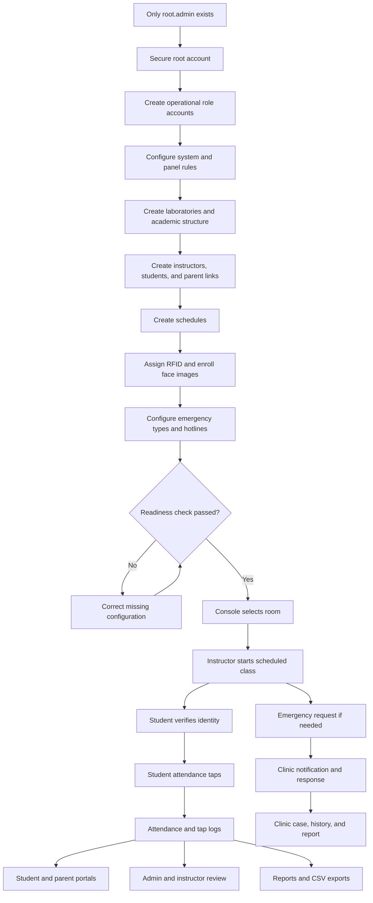
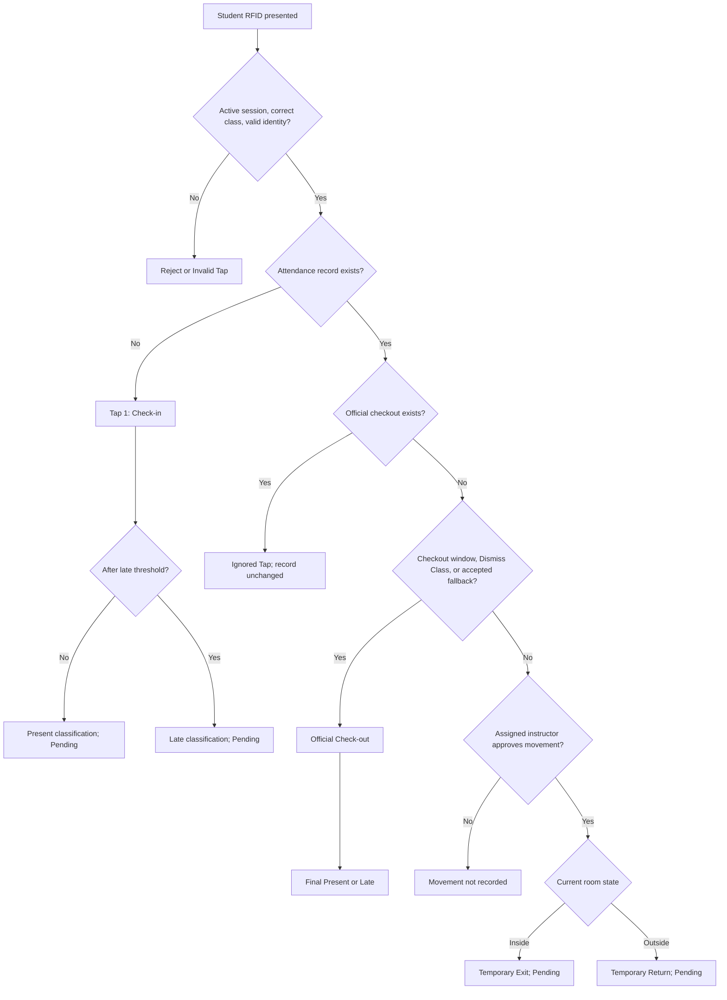
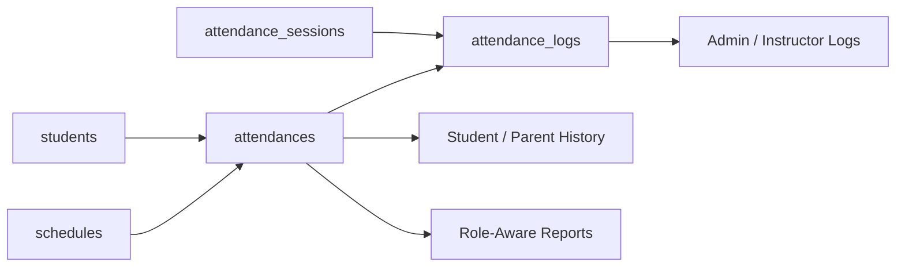
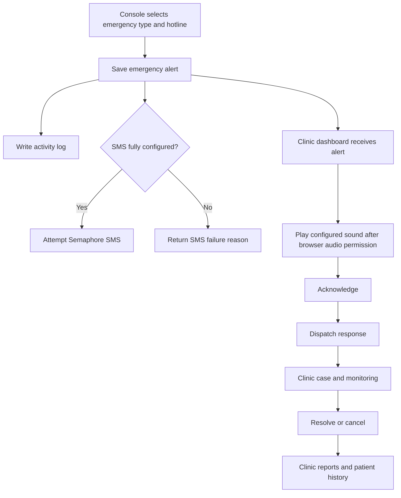
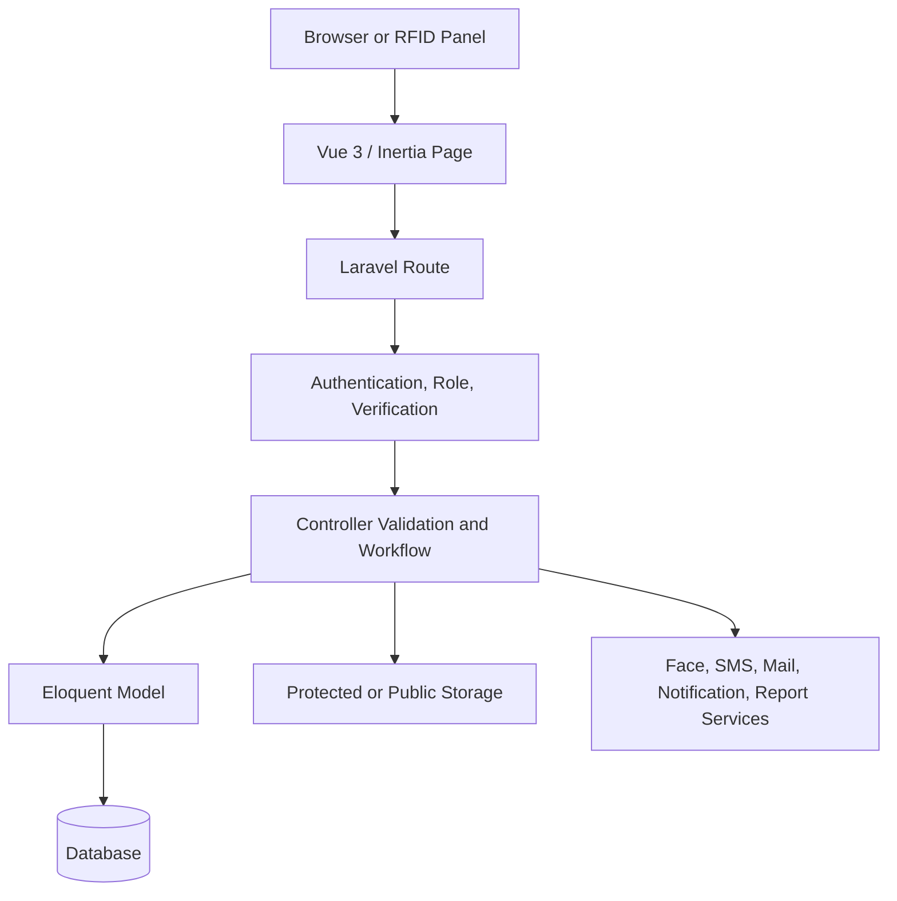

# System Flow Demonstration

Documentation home: [Documentation Index](DOCUMENTATION_INDEX.md). Demonstration family: [Demonstration Documentation Map](DEMONSTRATION_DOCUMENTATION.md).

This document combines the whole-system operating flow from `SYSTEM_FLOW.md` with the blank-state setup and detailed attendance behavior from `ATTENDANCE_SYSTEM_DEMONSTRATION_GUIDE.md`.

It is intended for:

- Capstone defense demonstrations
- Client presentations
- Administrator onboarding
- End-to-end system testing
- Operational readiness checks

## 1. Comparison of the Source Flows

| Area | System Flow | Attendance Demonstration Guide | Reconciled use in this document |
|---|---|---|---|
| Starting state | Supports seeded or manually configured data | Assumes only `root.admin` exists | Start with `root.admin` and no operational data |
| Scope | Whole application and technical architecture | Attendance-centered setup and presentation | Show full system, with attendance as the main operational journey |
| Setup order | Settings, master data, users, enrollment, schedules | Users, settings, master data, people, schedules, enrollment | Create dependencies first, create schedule, then verify identity enrollment before operation |
| Attendance detail | High-level check-in, movement, and checkout flow | Exact first, second, third, and later tap rules | Use the detailed state-based tap rules |
| Portals | Student/parent, messages, online classes, letters, notifications | Attendance history and basic additional features | Demonstrate the complete portal after attendance |
| Clinic | Emergency, cases, histories, hotlines, reports | Panel alert, SMS conditions, response workflow | Configure clinic first, then demonstrate the complete alert lifecycle |
| Reports | Role-aware system-wide reporting | Attendance logs and CSV demonstration | Show operational logs first, then analytical reports |
| Technical flow | Browser, Vue/Inertia, Laravel, models, database, services | Mostly user-facing actions | Include a short architecture explanation after the user journey |
| Known limitations | Includes scheduling, notifications, and integration limitations | Includes QR/NFC and SMS cautions | Preserve all relevant limitations in the final presentation |

## 2. Unified System Objective

The system provides role-based management for:

- Academic records
- RFID and face identity enrollment
- Scheduled laboratory attendance
- Inventory and borrowing
- Student and parent self-service
- Messaging
- Online classes
- Excuse letters
- Notifications
- Clinic cases and patient histories
- Emergency alerts and optional SMS
- Reports and audit logs

The attendance process is the central live demonstration because it connects users, academic records, schedules, rooms, verification, emergency response, portals, reports, and audit evidence.

## 3. Unified End-to-End Flow



## 4. Roles and Entry Points

| Role | Main destination | Responsibility |
|---|---|---|
| Root administrator | `/admin/dashboard` | System ownership and administrator account management |
| Administrator | `/admin/dashboard` | Master data, users, schedules, devices, settings, logs, and reports |
| Registrar | `/registrar/dashboard` | Student and instructor RFID/face enrollment |
| Instructor | `/admin/dashboard` | Assigned classes, attendance scope, temporary movement, and checkout authorization |
| Console | `/attendance-control-panel` | Physical room attendance operation |
| Clinic | `/clinic/dashboard` | Emergency alerts, cases, patient histories, hotlines, and clinic reports |
| Student | `/student-parent/dashboard` | Personal attendance, classes, letters, messages, notifications, and profile |
| Parent | `/student-parent/dashboard` | Linked-student attendance, letters, messages, and related portal features |

Console accounts are restricted to the attendance panel and do not use Messenger or shared Reports.

## 5. Phase 1 — Establish System Ownership

### Screen

Staff login, followed by `/admin/dashboard`.

### Presenter action

1. Log in as `root.admin`.
2. Show the empty dashboard and empty management pages.
3. Change the initial password and review profile/security settings.

### Presenter explanation

“The system begins with one root administrator and no operational data. Every account, class, room, identity record, and emergency configuration will be created manually.”

### Expected result

The root administrator has full administrative access, while operational tables remain empty.

### Rules

- At least one root administrator must remain.
- Only a root administrator can manage administrator accounts.
- Daily operations should use separate role accounts.

## 6. Phase 2 — Create Operational Users

### Screen

`/admin/users`

### Presenter action

Create:

1. A daily administrator
2. A registrar
3. An instructor user
4. A console user
5. A clinic user
6. A student portal user
7. An optional parent user

### Presenter explanation

“Role separation limits each user to the functions needed for their job.”

### Expected result

All required roles appear in User Management.

### Important dependency

The instructor user must exist before its instructor profile can be completed.

## 7. Phase 3 — Configure Global Rules and Panel Access

### Screens

- `/admin/settings`
- `/admin/active-devices`

### Presenter action

Configure:

- Attendance late threshold
- Default absent-report range
- Face-recognition setting
- Online-class verification defaults
- Demo attendance controls, if required
- Clinic emergency sound
- Panel PIN and device access

### Presenter explanation

“Settings define how later attendance and emergency actions are interpreted.”

### Expected result

Rules persist and will be applied by the attendance panel.

### Recommended controls

- Use an institution-approved late threshold.
- Keep the panel PIN protected.
- Enable face recognition only after service testing.
- Disable demo RFID controls outside a controlled presentation.

## 8. Phase 4 — Create Master and Academic Data

Create records in this order:

```text
Laboratory
    |
    +---------------------------> Schedule

Strand -> Section -> Subject ---> Schedule

Instructor user -> Instructor profile -> Schedule

Section -> Student
```

### Step 1. Laboratory

Open `/admin/laboratories`.

Create the physical room used by the console, including:

- Name
- Location
- Description
- Active status

### Step 2. Strand

Open `/admin/strands`.

Create:

- Strand code
- Strand name
- Department
- Active status

### Step 3. Section

Open `/admin/sections`.

Select the strand and enter:

- Section name
- Year level
- Semester
- School year
- Status

### Step 4. Subject

Open `/admin/subjects`.

Enter:

- Subject code
- Subject name
- Section
- Year level
- Semester or description fields supported by the form

### Expected result

The academic selections required for people and schedules are available.

## 9. Phase 5 — Create People and Relationships

### Instructor

Open `/admin/instructors`.

Connect the instructor user to an instructor profile and configure:

- Instructor number
- Strand or department
- Active status

### Students

Open `/admin/students`.

For every student, configure:

- Student number
- Full name
- Strand
- Section
- Year level
- School year
- Active status
- Supported contact or portal data

### Parent links

From Student Management:

1. Create or select a parent user.
2. Link the parent to the student.
3. Set the relationship label.

### Demo dataset recommendation

Create different students for:

- On-time attendance
- Late attendance
- Missed checkout
- Temporary Exit/Return
- Invalid or wrong-section scan

This prevents one demonstration scenario from affecting another.

## 10. Phase 6 — Create and Validate the Schedule

### Screen

`/admin/schedules`

### Required relationship

```text
Schedule =
Laboratory
+ Section
+ Subject
+ Instructor
+ Weekday
+ Start time
+ End time
```

### Presenter action

1. Create the schedule.
2. Select the current demonstration weekday.
3. Use a time window that makes the intended scenario possible.
4. Save and reopen the schedule to confirm values.

### Validation checklist

- Room matches the console room.
- Instructor is assigned to this schedule.
- Subject belongs to the intended section.
- Student belongs to the scheduled section.
- Year levels match when restricted.
- Current weekday matches.
- Current time falls within the usable class period.

### Known limitation

The current schedule CRUD does not automatically prevent overlapping room, instructor, section, or time assignments. The administrator must review conflicts manually.

## 11. Phase 7 — Enroll RFID and Face Identity

### Screens

- `/registrar/biometric-enrollment`
- `/registrar/instructor-face-enrollment`

### Student enrollment

1. Select the student.
2. Assign a unique RFID tag.
3. Capture or upload clear face images.
4. Confirm enrollment.

### Instructor enrollment

1. Select the instructor.
2. Assign a unique instructor RFID.
3. Capture or upload face images.
4. Confirm enrollment.

### Identity rules

- An RFID must not be shared by multiple people.
- Instructor RFID starts class and authorizes controlled actions.
- Face verification depends on system configuration and service availability.
- Successful verification creates a short-lived, one-use attendance grant.
- QR attendance is not implemented.
- NFC is not implemented as a separate attendance workflow.

## 12. Phase 8 — Configure Emergency Readiness

### Screens

- `/clinic/dashboard`
- `/clinic/emergency-hotlines`
- `/admin/settings`

### Presenter action

1. Create emergency types and default messages.
2. Create active hotline records.
3. Enable SMS only for approved recipients.
4. Select or upload the clinic emergency sound.
5. Test browser audio by clicking or pressing a key on the clinic dashboard.

### SMS prerequisites

- Semaphore enabled
- API key configured
- Endpoint configured
- Active selected hotline
- SMS enabled for the hotline
- Valid phone number

An in-app emergency alert is saved even if SMS is unavailable.

## 13. Operational Readiness Gate

Do not start the demonstration until every item is checked:

| Check | Required condition |
|---|---|
| Users | Admin, registrar, instructor, console, clinic, and student accounts exist |
| Room | Active laboratory exists |
| Academic data | Strand, section, and subject exist |
| Instructor | Active profile linked to instructor user |
| Student | Active record in scheduled section |
| Schedule | Correct room, weekday, time, subject, section, and instructor |
| Student RFID | Assigned and unique |
| Instructor RFID | Assigned and belongs to scheduled instructor |
| Verification | Face enrollment works or authorized fallback is prepared |
| Panel | PIN and room access configured |
| Emergency | Type, hotline, clinic dashboard, and sound configured |

## 14. Phase 9 — Start Daily Attendance

### Console action

1. Log in through `/attendance-control-panel/login`.
2. Enter the panel PIN if enabled.
3. Select the correct laboratory.
4. Confirm the panel is Online.

### Instructor action

1. Present the assigned instructor RFID.
2. Start Attendance mode.

### System validation

The panel resolves:

- Room
- Date and weekday
- Current schedule
- Subject
- Section
- Assigned instructor
- Start and end time

### Expected result

An attendance session becomes active and student verification can begin.

## 15. Unified Attendance Tap State Machine



## 16. First Tap Rules

Canonical reference for this and all later-tap sections: [Attendance Control Panel Tapping Rules](ATTENDANCE_CONTROL_PANEL_TAPPING_RULES.md). The content below is presentation-oriented.

The first valid student tap:

- Creates the attendance record.
- Saves the actual `time_in`.
- Sets tap sequence to 1.
- Sets room status to Inside.
- Retains Present or Late check-in classification.
- Leaves the main record Pending until official checkout.

### Time example

For an 8:00 AM start with a 15-minute late threshold:

| First-tap time | Result |
|---|---|
| Before 8:00 AM | Early timestamp stored; on-time classification |
| 8:00 AM through exactly 8:15 AM | On time |
| Later than 8:15 AM | Late |

There is no separate final Early Tap status.

## 17. Second Tap Rules

The second physical tap is evaluated by time, mode, verification method, and current attendance state.

| Second-tap condition | Action | Attendance result |
|---|---|---|
| At or after 15 minutes before scheduled end | Official Check-out | Final Present or Late |
| Before checkout window with instructor approval | Temporary Exit | Pending; Outside |
| Before checkout window without instructor approval | Movement rejected | Unchanged |
| Dismiss Class with prior check-in | Official Check-out | Final Present or Late |
| Dismiss Class without prior check-in | Invalid Tap | No valid attendance |
| Accepted configured verification fallback | May record official Check-out | Final Present or Late |

The Late classification comes from the first tap and cannot be changed to Present by checking out.

### Exact Dismiss Class behavior

Dismiss Class changes **all student taps into checkout attempts instead of check-in attempts** while the mode is active:

- Already checked in: official Check-out is recorded, even before the normal checkout window.
- Never checked in: no check-in is created; the tap is recorded as Invalid Tap.
- Already checked out: the tap is recorded as Ignored Tap and the completed record is unchanged.
- The mode remains active for every student.
- When the instructor taps again, the panel shows the instructor action menu.
- Choosing Continue Class disables Dismiss Class and restores normal attendance rules.

## 18. Third Tap Rules

A third tap is not automatically ignored.

### Third tap as Temporary Return

```text
Tap 1: Check-in -> Inside
Tap 2: Temporary Exit -> Outside
Tap 3 before checkout window + instructor approval
Result: Temporary Return -> Inside -> Pending
```

### Third tap as official checkout

```text
Tap 1: Check-in
Tap 2: Temporary Exit
Tap 3 during checkout window, Dismiss Class, or accepted fallback
Result: Official Check-out -> Present or Late
```

### Third tap after completed attendance

```text
Tap 1: Check-in
Tap 2: Official Check-out
Tap 3: Ignored Tap
Result: Original attendance remains unchanged
```

## 19. Fourth and Later Tap Rules

Before official checkout:

- Approved early movement alternates between Temporary Exit and Temporary Return.
- Attendance remains Pending.
- The next valid tap that satisfies official checkout rules becomes Check-out.

After official checkout:

- Every later tap is an Ignored Tap.
- The tap remains visible in the audit trail.
- Official `time_in` and `time_out` are protected.
- Final Present or Late status does not change.
- A second attendance record is not created for the same student, schedule, and date.

## 20. Missing and Invalid Tap Rules

| Situation | System response |
|---|---|
| One check-in while class is active | Pending |
| Check-in without checkout after session end | Incomplete Attendance display may apply |
| Panel explicitly finalizes an open record | Absent with `cutting` completion reason |
| Eligible student never checks in | Generated Absent/No Tap record |
| Unknown RFID | Student not found |
| No active session | Tap rejected |
| Wrong section | Tap rejected |
| Year-level mismatch | Tap rejected |
| Missing or expired verification | Verification required |
| Unauthorized temporary movement | Instructor authorization requested |
| Tap after official checkout | Ignored Tap |

## 21. Attendance Status and Event Reference

| Label | Type | Meaning |
|---|---|---|
| Checked In | Panel response | First accepted tap saved |
| Pending | Attendance status | Check-in exists, class active, no checkout |
| Present | Final status | On-time check-in and official checkout |
| Late | Final status | Late check-in and official checkout |
| Incomplete Attendance | Display status | Ended session has check-in but no checkout |
| Absent | Final/generated status | No check-in or open record finalized as cutting |
| Temporary Exit | Tap event | Authorized early movement from Inside to Outside |
| Temporary Return | Tap event | Authorized early movement from Outside to Inside |
| Invalid Tap | Tap outcome | Requested action failed a validation/state rule |
| Ignored Tap | Tap outcome | Official checkout already exists |

## 22. Live Attendance Scenario Sequence

### Scenario A — Present

1. Verify Student A.
2. Tap within the grace period.
3. Show Check-in and Pending.
4. Tap during checkout window.
5. Show final Present.

### Scenario B — Late

1. Verify Student B.
2. Tap after the late boundary.
3. Complete official checkout.
4. Show final Late.

### Scenario C — Missed checkout

1. Check in Student C.
2. Do not check out.
3. Show Pending during the active session.
4. End the session and explain Incomplete versus panel-finalized Absent/cutting behavior.

### Scenario D — Temporary movement

1. Check in Student D.
2. Tap before checkout window.
3. Approve with assigned instructor RFID.
4. Show Temporary Exit.
5. Tap again before checkout window and approve.
6. Show Temporary Return.
7. Complete official checkout later.

### Scenario E — Third tap checkout

1. Tap 1: Check-in.
2. Tap 2: Temporary Exit.
3. Tap 3 during checkout window.
4. Show official Check-out.

### Scenario F — Additional taps

1. Use a student with completed attendance.
2. Perform third, fourth, or later taps.
3. Show Ignored Tap entries.
4. Confirm the original result is unchanged.

### Scenario G — Validation failures

Demonstrate:

- Unassigned RFID
- Wrong-section student
- Missing verification
- Dismiss Class checkout without check-in

## 23. Attendance Data and Review Flow



### Attendance Logs

Open `/admin/attendance/logs`.

Show:

- Student
- Subject and section
- Instructor and room
- Session date and time
- Tap timestamp and sequence
- Time in and time out
- Tap type
- Room status
- Validation result
- Verification method
- Remarks
- Attendance status
- Evidence when authorized

### Access scope

- Administrator: broad attendance scope
- Instructor: assigned schedule scope
- Student: own attendance
- Parent: linked-student attendance

## 24. Student and Parent Portal Demonstration

Open:

1. `/student-parent/dashboard`
2. `/student-parent/attendance`
3. `/student-parent/online-classes`
4. `/student-parent/excuse-letters`
5. `/student-parent/messages`
6. `/student-parent/notifications`
7. `/student-parent/profile`

### Demonstrate

- Attendance history
- Linked-student selection for parents
- Online-class joining
- Student-created excuse letter requiring parent approval
- Parent-created approved letter
- Protected attachments
- Unified Messenger
- Notification read state
- Profile management

## 25. Emergency and Clinic Demonstration



### Emergency message information

- Emergency type and subtype
- Urgent or Critical severity
- Room
- Subject and schedule
- Triggering user or name
- Emergency message
- Selected hotline
- Optional student/context metadata
- Timestamp and response status

### Important SMS rule

Do not claim successful delivery unless:

1. The API result reports `sent: true`.
2. The recipient confirms receipt.

The clinic's in-app alert remains available when SMS fails.

## 26. Reports, Analytics, and Audit Demonstration

### Reports

Open `/reports`.

1. Set `date_from` and `date_to`.
2. Review summary cards.
3. Review status, subject, and trend views.
4. Download CSV.

### Role-aware reporting

- Admin: system-wide users, students, attendance, inventory, borrowing, and clinic
- Clinic: alerts, cases, patient histories, response data
- Registrar: enrollment and academic grouping
- Instructor: assigned schedules and attendance
- Student: personal attendance and portal activity
- Parent: linked-student activity

### Audit sources

- Activity logs
- Attendance tap logs
- Registrar enrollment logs
- Online-class audit logs
- Emergency alert and clinic-case histories

## 27. Other System Modules

### Inventory and borrowing

Administrators manage inventory, availability, borrowing, returns, and related status. The attendance panel also contains a borrowing-only path where enabled.

### Online classes

Administrators and instructors create scheduled online classes. Students join through the portal. Attendance, verification metadata, notifications, and audit events are recorded.

### Messenger

Admin, instructor, clinic, registrar, student, and parent users can exchange:

- Text
- Images
- Documents
- Attachment-only messages

Console users are excluded. Attachments use protected download routes.

### Excuse letters

- Student-created letters require linked-parent approval.
- Linked parents receive an email link to review and sign student-created letters.
- Parent-created letters can be approved at submission.
- Approved letters can be generated as PDF.
- Selected or assigned instructors receive the signed PDF through Gmail and protected Messenger attachment delivery.
- Attachments remain access-controlled.

## 28. Technical Request and Data Flow



### Presenter explanation

“The browser does not write directly to the database. Requests pass through authentication, role middleware, validation, workflow rules, models, storage, and external services. This is why an RFID value alone cannot create valid attendance.”

## 29. Presenter-Ready Demonstration Script

### Opening

“The system begins with only `root.admin`. There are no seeded accounts, classes, students, devices, emergency records, or attendance history.”

### Setup

“First, the root administrator creates operational roles and configures attendance, verification, device, and emergency settings.”

“Next, the administrator creates the laboratory, strand, section, subject, instructor profile, students, parent links, and class schedule.”

### Enrollment

“The registrar assigns unique RFID tags and enrolls face images for students and the assigned instructor.”

### Readiness

“Before opening attendance, we confirm the room, schedule, weekday, time, section, instructor RFID, student RFID, verification method, and emergency configuration.”

### Attendance

“The console selects the room and the assigned instructor starts the class.”

“The first accepted student tap is Check-in. It records the actual time and retains an on-time or Late classification, but the record remains Pending.”

“The second tap during the checkout window becomes official Check-out. Before that window, it normally requests instructor authorization and becomes Temporary Exit.”

“A third tap may become Temporary Return or official Check-out, depending on timing and mode. Once official checkout exists, every additional tap is Ignored but remains auditable.”

### Records and portal

“Administrators and instructors review detailed tap logs. Students and parents view only their authorized attendance history and portal services.”

### Emergency

“The attendance panel can create a room-aware emergency request. The clinic receives it, plays the configured sound, acknowledges the event, dispatches a response, and maintains the resulting case.”

### Reports

“Role-aware reports convert operational records into summaries, trends, and downloadable CSV data, while audit logs preserve accountability.”

### Closing

“The system is more than an RFID reader. It connects identity, schedule, location, role, timing, movement, emergency response, reporting, and audit evidence into one controlled workflow.”

## 30. Presenter Recovery Guide

| Problem | Check |
|---|---|
| No schedule on console | Room, weekday, current time, schedule status, instructor |
| Instructor RFID rejected | RFID assignment and scheduled instructor |
| Student rejected | RFID, active status, section, year level, verification |
| Second tap becomes Temporary Exit | Current time is before checkout window |
| Attendance remains Pending | Official checkout does not exist |
| Third tap becomes Temporary Return | Student was Outside and checkout rule was not satisfied |
| Extra taps appear | They are Ignored Tap audit events after completion |
| Face verification unavailable | Use approved instructor fallback |
| No clinic sound | Click or press a key on clinic dashboard |
| SMS fails | Verify provider configuration, hotline, SMS flag, and number |
| Report appears empty | Verify date filter, role scope, and operational records |

## 31. Known Limitations to State Accurately

- No dedicated first-run setup wizard exists.
- Schedule overlap conflicts are not automatically blocked.
- QR attendance is not implemented.
- NFC is not a separate application workflow.
- Face recognition depends on service configuration and availability.
- SMS depends on the configured external provider and selected hotline.
- Browser audio requires user interaction before emergency sound can play.
- Attendance correction does not provide a complete formal approval workflow.
- Notifications are stronger for online-class events than for every system event.

## 32. Final Demonstration Checklist

- [ ] Root administrator secured
- [ ] Operational accounts created
- [ ] Attendance and device settings saved
- [ ] Laboratory created
- [ ] Strand, section, and subject created
- [ ] Instructor profile completed
- [ ] Students created in correct section
- [ ] Parent links created where needed
- [ ] Schedule matches current demonstration
- [ ] Student and instructor RFID assigned
- [ ] Face verification or approved fallback tested
- [ ] Emergency type and hotline configured
- [ ] Clinic sound enabled
- [ ] Console room selected
- [ ] Instructor starts the class
- [ ] Present scenario demonstrated
- [ ] Late scenario demonstrated
- [ ] Missing checkout demonstrated
- [ ] Temporary Exit/Return demonstrated
- [ ] Third and later taps demonstrated
- [ ] Invalid and ignored taps demonstrated
- [ ] Attendance logs reviewed
- [ ] Student/parent portal reviewed
- [ ] Emergency response demonstrated
- [ ] Reports and CSV export demonstrated
- [ ] Known limitations stated
