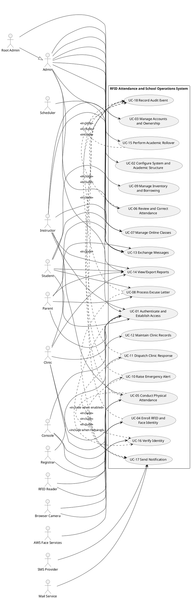

# System Use-Case Model and Specifications

## Document control

| Field | Value |
| --- | --- |
| System | RFID Attendance and School Operations System |
| Artifact | UML use-case model and specifications |
| Version | 1.0 |
| Date | 2026-10-10 |
| Status | Baseline derived from current project documentation |
| Method | UML modeling with an ISO/IEC/IEEE 29148-inspired use-case template |

## 1. Purpose and boundary

This document defines externally observable system behavior: actors, goals,
preconditions, normal flows, alternatives, exceptions, postconditions, business
rules, and requirement traceability. It covers active routed behavior. Legacy or
unwired pages are outside the boundary unless an active route exposes them.

## 2. Actors

| Actor | Description |
| --- | --- |
| Root Admin | Specializes Admin and controls privileged accounts and ownership |
| Admin | Configures academic structure, people, rooms, devices, and operations |
| Instructor | Conducts and reviews assigned attendance and online classes |
| Registrar | Enrolls RFID and face identities |
| Clinic | Handles emergencies, dispatches responders, and maintains cases |
| Console | Restricted operator of a room/device attendance panel |
| Student | Uses personal attendance, class, message, and excuse-letter services |
| Parent | Acts only for explicitly linked Students |

Supporting actors are the RFID Reader, Browser Camera, AWS Face Services, Mail
Service, SMS Provider, Scheduler, and File Storage.

## 3. UML use-case diagram

The PlantUML source below is the normative diagram. Root Admin is an Admin
specialization. Verification, notification, and audit are reusable included
behavior.

## 4. Use-case catalog

| ID | Use case | Primary actor(s) | Successful outcome | Priority |
| --- | --- | --- | --- | --- |
| UC-01 | Authenticate and Establish Access | All human actors | Correct scoped workspace or safe denial | Critical |
| UC-02 | Configure System and Academic Structure | Admin | Valid settings, rooms, devices, academic context, and schedules | Critical |
| UC-03 | Manage Accounts and Ownership | Root Admin, Admin | Authorized accounts, links, roles, and ownership | High |
| UC-04 | Enroll RFID and Face Identity | Registrar | Identity is linked to the correct person and audited | Critical |
| UC-05 | Conduct Physical Attendance | Console, Instructor | Verified events and official attendance are recorded | Critical |
| UC-06 | Review and Correct Attendance | Instructor, Admin | Scoped review/export and audited allowed corrections | High |
| UC-07 | Manage Online Classes | Instructor | Class access and attendance are managed/finalized | High |
| UC-08 | Process Excuse Letter | Student, Parent, Instructor | Signed letter reaches authorized Instructors for decision | High |
| UC-09 | Manage Inventory and Borrowing | Admin, Console | Item and transaction state remains traceable | Medium |
| UC-10 | Raise Emergency Alert | Instructor through Console | Durable alert and recorded delivery attempts | Critical |
| UC-11 | Dispatch Clinic Response | Clinic | Active responder owns an acknowledged monitoring case | Critical |
| UC-12 | Maintain Clinic Records | Clinic | Protected case logs and patient history | High |
| UC-13 | Exchange Messages | Authorized non-Console users | Scoped message/attachment delivery | Medium |
| UC-14 | View and Export Reports | Authorized roles | Role- and academic-context-scoped output | High |
| UC-15 | Perform Academic Rollover | Admin | Reviewed placement moves forward without copying history | Critical |
| UC-16 | Verify Identity | System and supporting actors | Required OTP/question/face identity is verified | Critical |
| UC-17 | Send Notification | System, Mail, SMS | Delivery attempt and safe result are recorded | Supporting |
| UC-18 | Record Audit Event | System | Accountability data is retained without secrets | Supporting |

## 5. Common guarantees

Preconditions common to protected use cases:

- the actor has an active account and valid server-side session;
- role, ownership, feature switch, record state, and academic context authorize
  the request; and
- required infrastructure for the core operation is available.

Success guarantees:

- committed changes are visible to intended downstream workflows;
- role and data-scope boundaries remain intact; and
- required audit data identifies action, actor, time, and relevant record.

Failure guarantees:

- validation or authorization failure does not partially commit the operation;
- sensitive credentials and provider responses are not exposed; and
- a secondary notification outage does not erase a durable local record.

## 6. Fully dressed critical use cases

### UC-01 — Authenticate and Establish Access

| Field | Specification |
| --- | --- |
| Goal | Establish a session and enter the correct protected workspace |
| Trigger | Actor submits credentials at the role-appropriate entry point |
| Preconditions | Active account; Console also has valid room/device access |
| Postconditions | Regenerated session is identity-bound and all required gates are complete |

Main flow:

1. Actor opens the public, staff, or Console login.
2. System validates credentials and throttling limits.
3. System regenerates and binds the authenticated session.
4. System forces first-login password replacement when required.
5. Admin/Root Admin completes a per-login email OTP.
6. Instructor completes face, email OTP, or security-question verification.
7. Console selects a laboratory and supplies the enabled Device PIN.
8. System authorizes the role and opens the scoped workspace.

Alternatives/exceptions:

- Invalid credentials receive a neutral error; five failures per email/IP per
  minute trigger throttling.
- Failed OTP delivery leaves protected access blocked.
- Unknown and Console reset requests return the same neutral response.
- A disabled managed Device rejects access without global-PIN fallback.
- A session-identity mismatch invalidates the session.
- Parent login is rejected while Parent Portal is disabled.

### UC-04 — Enroll RFID and Face Identity

| Field | Specification |
| --- | --- |
| Goal | Bind verified RFID/face data to the correct person |
| Primary actor | Registrar |
| Preconditions | Target exists and is eligible; Registrar is authenticated |
| Postconditions | Valid identity data and enrollment audit record exist |

Main flow:

1. Registrar searches for and confirms the target person.
2. System shows the applicable enrollment state.
3. Registrar scans RFID and/or captures face images.
4. System validates uniqueness, files, and eligibility.
5. System stores accepted identity data and an audit record.
6. System confirms the result.

Exceptions: duplicate RFID, invalid capture, or ineligible target is rejected
without replacing valid evidence. Student Biometric Enrollment cannot enroll an
Instructor.

### UC-05 — Conduct Physical Attendance

| Field | Specification |
| --- | --- |
| Goal | Produce trustworthy room-aware attendance from verified RFID events |
| Primary actors | Console, Instructor |
| Preconditions | Active year/semester, eligible schedule, room, enabled Device, and enrollment |
| Postconditions | Session/evidence exists; at most one official result per Student/schedule/date |

Main flow:

1. Console authenticates the panel for a laboratory/device.
2. Instructor RFID resolves and starts/resumes an assigned live schedule.
3. Student taps RFID and completes required verification or allowed fallback.
4. System confirms Student placement in the schedule.
5. First valid tap records Pending plus the Present/Late basis.
6. Later authorized taps record temporary movement or official checkout.
7. System finalizes the session while retaining every event/evidence record.

Alternatives/exceptions:

- Before the final 15 minutes, movement requires scheduled-Instructor approval
  and becomes Temporary Exit or Temporary Return.
- During the final 15 minutes, Dismiss Class, or an accepted fallback, the next
  valid tap becomes official checkout.
- Continue Class restores normal rules after Dismiss Class.
- No checkout after session end displays Incomplete Attendance.
- Temporary exit without return is finalized Absent with a cutting reason.
- Post-checkout taps are logged as Ignored and do not alter the result.
- Unknown RFID, wrong scope, wrong Instructor, or failed verification creates an
  Invalid event or safe rejection.

### UC-08 — Process Excuse Letter

| Field | Specification |
| --- | --- |
| Goal | Deliver a validated, signed letter to authorized Instructors |
| Primary actors | Student, Parent, Instructor |
| Preconditions | Portal access; Parent link and feature switches when applicable |
| Postconditions | Letter, signature, recipients, document, decision, and notifications are traceable |

Main flow:

1. Student creates a letter with reason, dates, recipients, and optional file.
2. System validates dates, recipient scope, and attachment.
3. Linked Parent reviews, signs, and approves.
4. System generates the document and delivers it to authorized Instructors.
5. Instructor opens the explicit delivery and records a decision.
6. System audits the decision and sends the result notification.

Alternatives: Parent may create the letter directly. Disabled Parent features
block Parent action. Approval never changes attendance directly; UC-06 is
required. Rejected uploads are cleaned up.

### UC-10 — Raise Emergency Alert

| Field | Specification |
| --- | --- |
| Goal | Save a room-aware alert and attempt appropriate notifications |
| Primary actor | Instructor through Console |
| Preconditions | Authenticated room panel and active class context |
| Postconditions | Open alert, scope, subjects, hotline, results, and timestamps exist |

Main flow:

1. Instructor selects emergency type.
2. System resolves one matching hotline or requests a selection.
3. System determines area-wide or specific-person scope.
4. Instructor identifies Students when needed and enters optional details.
5. System shows final review and a five-second cancelable countdown.
6. System saves the Open alert.
7. System attempts hotline SMS and applicable linked-Parent email/SMS.
8. System reports safe delivery counts and exposes the alert to Clinic.

Alternatives/exceptions:

- Fire/disaster is area-wide and has a 15-second idle advance before confirmation.
- With no hotline, Instructor may explicitly continue without hotline SMS.
- Cancellation before sending creates no alert.
- Same type/room within ten seconds reuses the Open alert and suppresses sending.
- Area-wide alerts do not notify every Parent.
- Provider/contact failure is recorded without deleting the alert.

### UC-11 — Dispatch Clinic Response

| Field | Specification |
| --- | --- |
| Goal | Assign an active responder and establish accountable case ownership |
| Primary actor | Clinic |
| Preconditions | Open alert and selected active Clinic responder |
| Postconditions | Acknowledged alert, dispatch metrics, responder, and monitoring case(s) exist |

Main flow:

1. Clinic reviews alert context and selects an active responder.
2. System acknowledges the alert and records dispatch timing.
3. System creates/updates one case per Student or one area-wide case.
4. System assigns the responder and audits the action.
5. System emails location, patient context, and limited recent history.
6. Responder sees the assignment and maintains Case Logs/Patient History.

Exceptions: without an active responder, Dispatch remains disabled and the alert
stays Open. Email failure does not undo assignment. Dispatch is internal and
does not claim external emergency services were contacted.

### UC-15 — Perform Academic Rollover

| Field | Specification |
| --- | --- |
| Goal | Move reviewed placement/structure forward while preserving history |
| Primary actor | Admin |
| Preconditions | Valid source; full rollover has a valid draft destination year |
| Postconditions | Selected structure/enrollments and rollover history are committed |

Main flow:

1. Admin chooses rollover mode and contexts.
2. System previews sections, offerings, mappings, promotions, retention, archive,
   drop, and review outcomes.
3. Admin reviews selections and resolves Student placement.
4. System validates grade, semester, section compatibility, and completeness.
5. Admin confirms execution.
6. System commits transactionally and safely handles a retry.
7. Admin reviews results, then separately assigns Instructors and schedules.

Alternatives/exceptions:

- Semester-only rollover moves first to second semester without changing grade.
- Full rollover promotes Grade 11 unless retained and archives Grade 12 as
  graduated by default unless reviewed.
- Inactive/dropped/transferred enrollments do not create destination placement.
- Missing/incompatible mappings block execution.
- Historical operations, evidence, audit, accounts, and settings are never copied.

## 7. Brief specifications for remaining use cases

| ID | Normal result | Important boundary |
| --- | --- | --- |
| UC-02 | Settings, rooms/devices, strands, sections, offerings, and schedules are valid | Laboratory availability and Device access are separate; overlap detection is absent |
| UC-03 | Authorized accounts, links, resets, transfer/override state are maintained | Standard Admin cannot perform Root-only actions |
| UC-06 | Scoped attendance review/export and corrections | Assignment/time-window restricted; Excused needs a note; evidence remains |
| UC-07 | Online class and attendance state are saved/finalized | Visibility switch does not consistently block every direct route |
| UC-09 | Item, borrower, due, return, and damage state is traceable | Disabled feature requests are rejected; history remains |
| UC-12 | Cases, handlers, status, and Patient History are maintained | Health information is role-protected |
| UC-13 | Message and permitted attachment reach valid recipients | Console excluded; email notice is rate-limited |
| UC-14 | Scoped dashboard/report and CSV/PDF/XLSX output | URL/filter manipulation never expands actor scope |

## 8. Business rules

| ID | Rule |
| --- | --- |
| BR-01 | Server authorization, not navigation visibility, controls access. |
| BR-02 | One academic year should be active for daily operations with an explicit active semester. |
| BR-03 | Laboratory is the room context; Device owns PIN, enablement, and panel access. |
| BR-04 | A disabled managed Device never falls back to the global PIN. |
| BR-05 | One official attendance row exists per Student/schedule/date; all events remain auditable. |
| BR-06 | Corrections are assignment/time restricted and never erase evidence. |
| BR-07 | Parent access requires a link; letter approval does not change attendance. |
| BR-08 | Emergency persistence and external delivery are separate outcomes. |
| BR-09 | Clinic Dispatch requires explicit assignment to an active Clinic account. |
| BR-10 | Rollover copies reviewed structure/placement, never historical operations. |
| BR-11 | Passwords, PINs, OTPs, tokens, and raw sensitive responses never appear in logs/UI. |
| BR-12 | External-service failures receive bounded feedback and safe logging. |

## 9. Special requirements

- Security: session regeneration, CSRF, hashing, secret protection, and server-side
  data scoping are mandatory.
- Privacy: face, Clinic, message, and contact data are disclosed only to authorized
  actors and excluded from unnecessary logs.
- Auditability: enrollment, attendance, corrections, emergencies, dispatch,
  attachments, rollover, accounts, and privileged settings retain accountability.
- Reliability: multi-record core operations are transactional; secondary delivery
  failure does not corrupt the core record.
- Usability: actionable validation, deliberate destructive confirmation, and
  duplicate-submit prevention are required.
- Interoperability: RFID, camera, AWS, SMTP, and SMS require deployment-specific
  configuration and manual acceptance tests.

## 10. Traceability

| Use cases | Canonical sources |
| --- | --- |
| UC-01, UC-03, UC-16 | [Authentication Rules](../System%20Explanation/AUTHENTICATION_PASSWORD_RULES.md), [Roles](../System%20Explanation/ROLES_AND_FUNCTIONALITY.md) |
| UC-02, UC-15 | [Academic Rollover](../System%20Explanation/ACADEMIC_YEAR_LEVELING_GUIDE.md), [Architecture Flows](ARCHITECTURE_AND_FEATURE_FLOWS.md) |
| UC-04 | [Pages and Features](../System%20Explanation/PAGES_AND_FEATURES.md), [System Flow](SYSTEM_FLOW.md) |
| UC-05, UC-06 | [Attendance Tapping Rules](../System%20Explanation/ATTENDANCE_CONTROL_PANEL_TAPPING_RULES.md) |
| UC-07, UC-13, UC-17 | [Automatic Behavior](../System%20Explanation/AUTOMATIC_AND_CONDITIONAL_BEHAVIOR.md) |
| UC-08 | [Excuse-Letter Review](EXCUSE_LETTER_INSTRUCTOR_REVIEW.md) |
| UC-09 | [Pages and Features](../System%20Explanation/PAGES_AND_FEATURES.md), [System Flow](SYSTEM_FLOW.md) |
| UC-10, UC-11, UC-12 | [Emergency Flow](../System%20Explanation/EMERGENCY_FLOW.md), [Clinic Dispatch](../System%20Explanation/CLINIC_DISPATCH.md) |
| UC-14, UC-18 | [Routes](ROUTES_AND_ENDPOINTS.md), [Error Handling](ERROR_HANDLING.md) |

## 11. Baseline acceptance criteria

1. Stakeholders confirm actors, responsibilities, and scope.
2. Every Critical use case has positive, authorization, validation, persistence-
   failure, and applicable provider-failure test scenarios.
3. Every active route/UI goal maps to a use case or is explicitly legacy/unwired.
4. Known constraints are accepted, corrected, or tracked.
5. Behavior changes update this model and the canonical feature source together.
